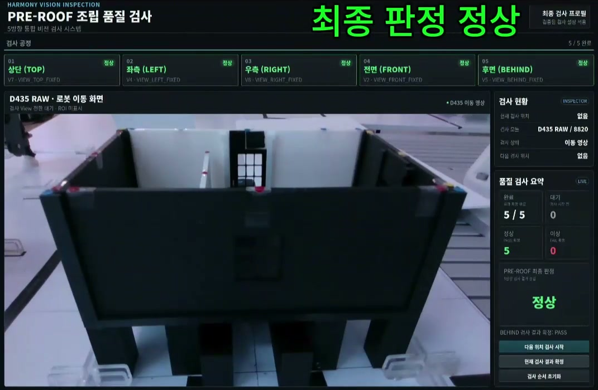
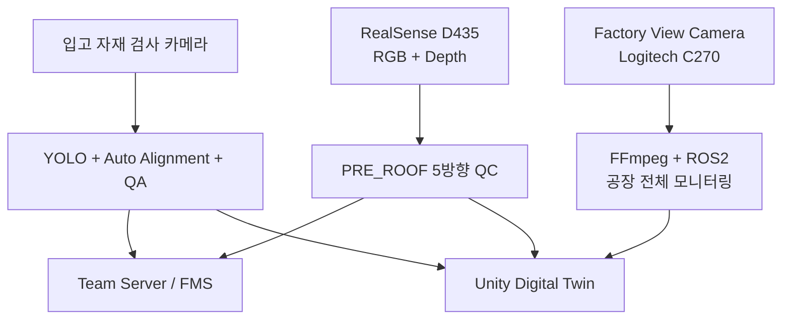
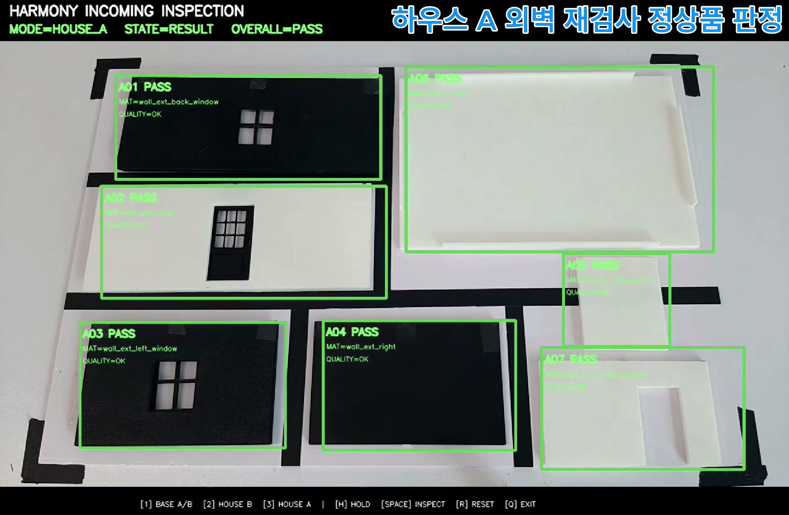
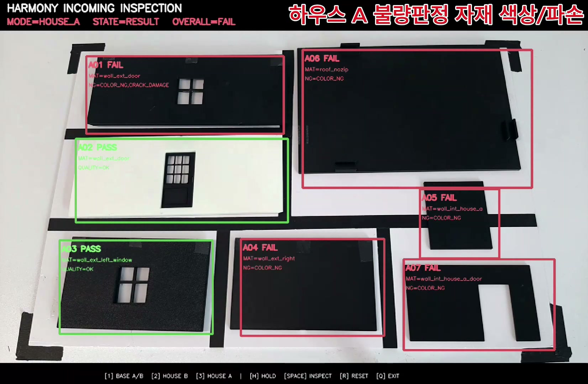
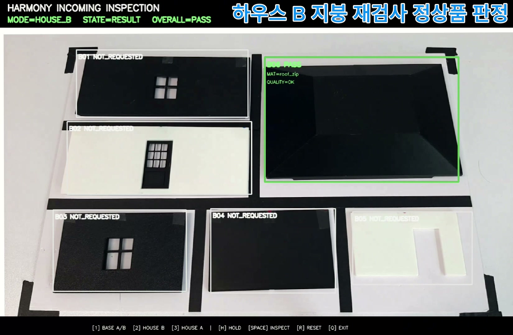
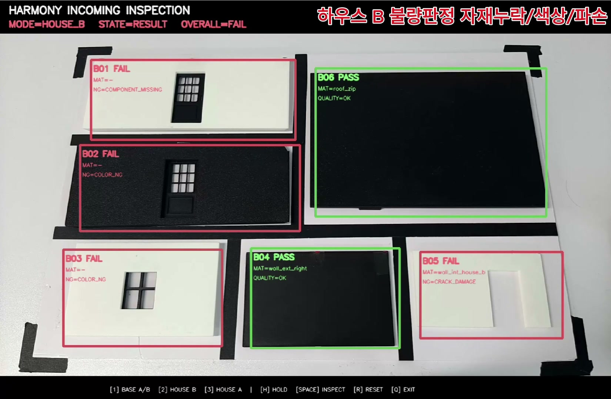
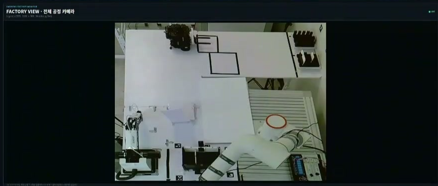
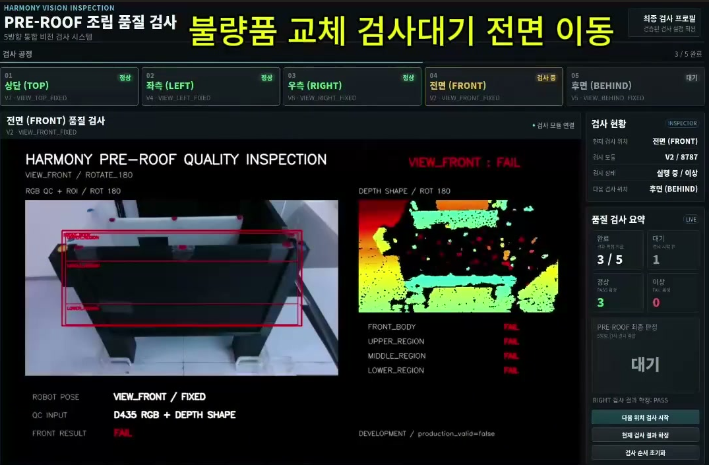
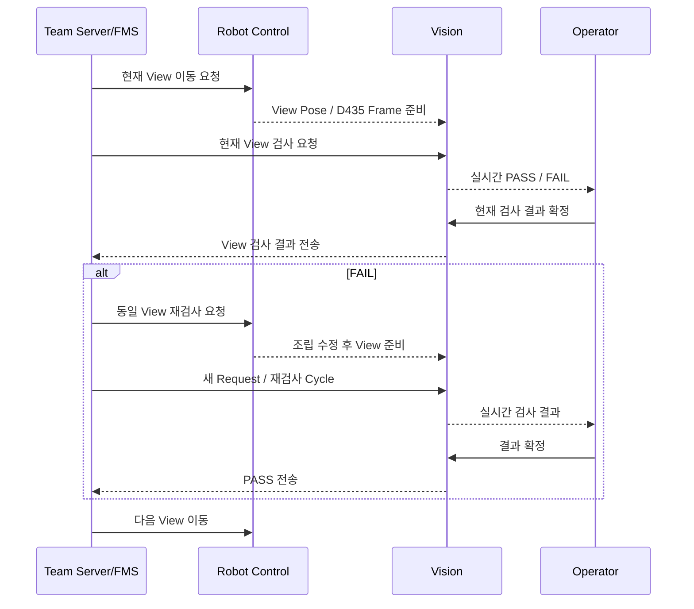

# AI Perception / Vision

> **AI 기반 조립식 주택 자동화 공정의 비전 파트**
> 입고 자재 검사 → 공장 전체 모니터링 → PRE_ROOF 조립 품질검사를 3개의 카메라 파이프라인으로 분리하고, Team Server/FMS · Robot Control · Unity와 연동했습니다.



---

## 1. 핵심 요약

| 항목 | 내용 |
|:---|:---|
| 담당 영역 | AI Perception / Vision |
| 미들웨어 | ROS2 Jazzy |
| 개발 환경 | Ubuntu 24.04 / Python |
| AI / 비전 | YOLO, PyTorch, OpenCV, NumPy |
| 카메라 | Incoming Inspection Camera / Logitech C270 / Intel RealSense D435 |
| 연동 시스템 | Team Server/FMS / Robot Control / Unity Digital Twin |
| 통신 | ROS2 Topic / UDP / HTTP |
| 영상 전송 | HMV1 JPEG Chunked UDP |
| 데이터 관리 | JSON / SQLite |
| 데이터 구축 | 실제 STL 기반 Blender 합성 데이터 + 실물 데이터 |

### 핵심 결과

- **입고 자재 검사**: HOUSE A / HOUSE B 실제 정상·불량 검사 및 4개 검증 영상 확보
- **Factory View**: Logitech C270 기반 공장 전체 모니터링 영상을 Unity `21030`으로 전송하고 Robot Control PC로 인계
- **PRE_ROOF 품질검사**: D435 기반 TOP / LEFT / RIGHT / FRONT / BEHIND 5방향 조립검사와 정상·불량 검증 완료
- **합성 데이터 → 실환경 개선**: 실제 STL 기반 합성 데이터 계보를 누적 약 5만 장 규모로 확장하고 실카메라 도메인 차이를 반복 보정
- **시스템 연동**: Vision ↔ Team Server/FMS ↔ Robot Control ↔ Unity 간 실제 E2E 흐름 검증

### 담당 범위

- Incoming Inspection Camera 수신 및 ROS2 파이프라인
- YOLO 기반 자재 인식 및 Incoming QA 런타임
- HOUSE A / HOUSE B 정상·불량 검사
- 작업대 위치 편차 보정을 위한 Auto Alignment
- Blender 기반 합성 데이터 생성 및 모델 학습
- 합성 데이터 ↔ 실카메라 도메인 차이 분석 및 실물 데이터 보강
- Logitech C270 기반 Factory View 구축
- Intel RealSense D435 기반 PRE_ROOF 5방향 조립 품질검사
- TOP / LEFT / RIGHT / FRONT / BEHIND 방향별 QC 런타임
- Vision ↔ Team Server/FMS UDP 인터페이스
- Vision ↔ Unity HMV1 영상 인터페이스
- 실제 정상·불량 실물 검증 및 E2E 검증

> Robot Motion Planning, FR5 제어, TurtleBot Navigation, Team Server/FMS 내부 로직, Unity 내부 구현은 각 담당자가 수행했습니다.
> 본 영역에서는 각 시스템과 연결되는 **Vision 런타임, 검사 로직, 영상·결과 인터페이스**를 담당했습니다.

---

## 2. 비전 시스템 구성

최종 시스템에서는 검사 목적에 따라 카메라 역할을 분리했습니다.
입고 자재 검사, 공장 전체 모니터링, 근접 조립 품질검사를 각각 독립된 파이프라인으로 운영합니다.

| 카메라 | 최종 역할 | 주요 처리 |
|:---|:---|:---|
| **Incoming Inspection Camera** | 입고 자재 AI 검사 | RTSP → ROS2 → YOLO / QA |
| **Factory View Camera** | 공장 전체 모니터링 | C270 → FFmpeg → ROS2 → Unity |
| **RealSense D435** | PRE_ROOF 근접 조립 품질검사 | RGB / Depth → 5방향 QC |



> Robot Control과 D435의 View 이동 흐름은 아래 **서버·로봇·Unity 연동** 절에서 별도로 설명합니다.

---

## 3. 입고 자재 검사

Incoming Inspection은 공장에 투입되는 HOUSE A / HOUSE B 자재의 상태를 검사합니다.

### 주요 기능

- RTSP Camera 영상 수신
- FFmpeg Low-Latency Direct Pipe
- ROS2 Image Publish
- YOLO 기반 자재 인식
- Slot / ROI 기반 품질판정
- HOUSE A / HOUSE B 검사 모드
- ECC 기반 Auto Alignment
- Annotated Image 생성
- Team Server Request / ACK / Result Transaction
- SQLite 기반 Transaction 보호
- Unity HMV1 영상 전송

### HOUSE A 실제 검증

| 정상 판정 | 불량 판정 |
|:---:|:---:|
|  |  |

**HOUSE A 정상 판정 영상**

https://github.com/user-attachments/assets/d4fe6eab-78e1-4c12-b795-b144971dad1f

**HOUSE A 불량 판정 영상**

https://github.com/user-attachments/assets/1475b359-8920-4c33-a93a-550d2caf4a83

### HOUSE B 실제 검증

| 정상 판정 | 불량 판정 |
|:---:|:---:|
|  |  |

**HOUSE B 정상 판정 영상**

https://github.com/user-attachments/assets/8568c3e3-7e25-4f02-8cb6-c659a05fa915

**HOUSE B 불량 판정 영상**

https://github.com/user-attachments/assets/5fd878ed-f8ff-4fef-872c-ecb6a15aa08e

### Auto Alignment

실제 작업에서는 자재 자체보다 **작업대 위치가 조금씩 이동하면서 고정 ROI가 흔들리는 문제**가 발생했습니다.

```text
Raw Camera Frame
→ Fixed Structure Anchor
→ ECC Alignment
→ Alignment Gate
→ Aligned Frame
→ Inspection
```

작업대의 고정 구조를 Anchor로 사용해 ECC Alignment를 수행하고, 허용 범위를 벗어난 Frame은 검사 입력으로 사용하지 않도록 구성했습니다.

---

## 4. Factory View

Factory View는 검사 카메라와 별도로 **공장 전체 상황을 한눈에 확인하기 위한 모니터링 파이프라인**입니다.



### 최종 구성

```text
Logitech C270
→ MJPEG 1280×960 @ 30 FPS
→ FFmpeg Perspective / Crop / Image Tuning
→ ROS2 /vision/factory_camera/image_view
→ HMV1 stream_id=3
→ Unity UDP 21030
```

### 설계 목적

- 공장 전체 설비 모니터링
- TurtleBot / FR5 / Conveyor / Assembly Area 확인
- Unity Digital Twin 실영상 연동
- Incoming Inspection Camera와 역할 분리
- PRE_ROOF D435와 역할 분리

카메라 제어값과 Perspective / Crop / Color Filter는 실제 공장 배치에 맞춰 최종값을 고정했습니다.

Factory View 실행 패키지는 **Vision PC에 종속되지 않도록 독립화**한 뒤 Robot Control PC로 인계했습니다.

---

## 5. PRE_ROOF 5방향 조립 품질검사

PRE_ROOF 검사는 지붕 조립 전 단계에서 구조물이 정상적으로 조립됐는지 RealSense D435로 확인합니다.

### 검사 방향

`TOP` · `LEFT` · `RIGHT` · `FRONT` · `BEHIND`

각 방향은 시야와 검출 대상이 다르기 때문에 **Golden / ROI / Threshold / Metric을 독립적으로 관리**했습니다.

### 최종 런타임

| 검사 방향 | 최종 버전 |
|:---|:---|
| TOP | V7 |
| LEFT | V4 |
| RIGHT | V8 |
| FRONT | V2 |
| BEHIND | V5 |
| Dashboard | V17 |

### 실제 정상 판정


**PRE_ROOF 정상 판정 영상**

https://github.com/user-attachments/assets/4b866fdb-ac78-4951-bcdf-b03d5bad8572

### 실제 불량 판정



**PRE_ROOF 불량 판정 영상**

https://github.com/user-attachments/assets/d1e2b7ba-336d-4712-9728-73fd8633b090

### 방향별 재검사 흐름



Server가 검사 순서와 재검사를 관리하고, Vision은 현재 View의 실제 검사 결과 생성에 집중하도록 역할을 분리했습니다.

---

## 6. 서버·로봇·Unity 연동

### Team Server / FMS

| 인터페이스 | 포트 |
|:---|:---:|
| Incoming Request / Result | UDP `20051 / 20052` |
| PRE_ROOF Request / Result | UDP `20061 / 20062` |

Incoming QA에서는 Request 수신과 실제 검사 완료를 분리해 관리합니다.

```text
ACK
= Request 수신 / Transaction 수락

Result
= 실제 검사 완료 후 생성
```

### Unity 영상 전송

ROS2 Image를 JPEG로 압축한 뒤 HMV1 Header와 함께 UDP Chunk로 전송합니다.

```text
ROS2 Image
→ JPEG Encode
→ HMV1 32-byte Header
→ Payload ≤ 1200 bytes
→ UDP
→ Unity Reassembly
```

| 영상 스트림 | Stream ID | UDP Port |
|:---|---:|---:|
| Incoming Inspection | `1` | `21010` |
| PRE_ROOF QC | `2` | `21020` |
| Factory View | `3` | `21030` |

---

## 7. 문제 해결 과정

모델 실행뿐 아니라 실제 물리 환경에서 발생한 문제를 반복적으로 분석하고 수정했습니다.

| 문제 | 원인 | 해결 |
|:---|:---|:---|
| 실물 학습 데이터 부족 | 클래스별 거리·각도·조명 조합 확보가 어려움 | 실제 STL 기반 Blender 합성 데이터를 누적 약 5만 장 규모로 확장 |
| 합성 데이터에서는 높았지만 실카메라에서 성능 저하 | 조명, 재질, 반사, 색상, Camera Geometry 차이 | Lighting Canary / Camera Geometry / 실물 데이터 보강 |
| 고정 ROI 위치 흔들림 | 작업대 / Camera 위치 편차 | ECC 기반 Auto Alignment + Gate |
| Base A/B 구분 불안정 | 색상, 슬롯, 홀 Pattern 차이 | 실제 형상·색상 정책과 Hole Pattern 반영 |
| PRE_ROOF 정상품 오검출 | 몇 px 위치 변화, 그림자, 반사 | View별 Reference / Threshold / Position Tolerance 적용 |
| FAIL 이후 공정 재개가 불명확 | 재검사 Transaction 흐름 필요 | Server 주도 동일 View 재요청 → 수정 → PASS → Next View |
| Unity 실시간 영상 전달 | ROS2 Image를 Unity에서 직접 사용하기 어려움 | HMV1 JPEG Chunked UDP Protocol 구현 |

### 합성 데이터에서 실환경까지

합성 데이터만 사용한 단계에서는 높은 검증 성능을 확보했지만, 실제 카메라에서는 표면 반사·조명·색상·거리·각도 차이 때문에 도메인 차이가 발생했습니다.

```text
Physical STL
→ Blender Rendering
→ Synthetic Dataset
→ Model Training
→ Real Camera Validation
→ Failure Analysis
→ Lighting / Geometry / Physical Diversity 보강
→ Fine-Tuning
```

따라서 합성 데이터 성능을 최종 성능으로 간주하지 않고, **실카메라 실패 사례를 다시 데이터 설계에 반영하는 반복 개선 방식**으로 전환했습니다.

---

## 8. 검증 결과

최종 검증에서는 통신 연결 여부와 실제 실물 검사를 구분했습니다.

| 검증 항목 | 결과 |
|:---|:---:|
| Incoming Camera → ROS2 | PASS |
| HOUSE A 정상 / 불량 실물 검사 | PASS |
| HOUSE B 정상 / 불량 실물 검사 | PASS |
| Incoming Team Server Request / ACK / Result | PASS |
| Incoming Unity HMV1 Video | PASS |
| Factory View → ROS2 | PASS |
| Factory View → Unity UDP `21030` | PASS |
| D435 RGB / Depth Input | PASS |
| PRE_ROOF 5방향 런타임 | PASS |
| PRE_ROOF 정상 실물 검사 | PASS |
| PRE_ROOF 불량 실물 검사 | PASS |
| FAIL → 동일 View 재검사 → PASS 흐름 | PASS |
| PRE_ROOF Unity HMV1 Video | PASS |

### 실제 검증 영상

각 기능 설명에서 아래 **6개 실제 검증 영상**을 바로 확인할 수 있습니다.

1. HOUSE A 정상 판정
2. HOUSE A 불량 판정
3. HOUSE B 정상 판정
4. HOUSE B 불량 판정
5. PRE_ROOF 정상 판정
6. PRE_ROOF 불량 판정

---

## 9. 기술 스택

| 영역 | 기술 |
|:---|:---|
| OS | Ubuntu 24.04 |
| Middleware | ROS2 Jazzy |
| Language | Python |
| AI | YOLO / PyTorch |
| Vision | OpenCV / NumPy |
| Synthetic Data | Blender |
| Camera | RTSP / Logitech C270 / Intel RealSense D435 |
| Video | FFmpeg / JPEG |
| Communication | ROS2 Topic / UDP / HTTP |
| Data | JSON / SQLite |
| Visualization | Unity / HMV1 Video |

---

## 10. 저장소 구성

공개 저장소에는 Vision 런타임, 인터페이스 계약, 주요 설정, 최종 검증 이미지와 영상 링크를 포함합니다.

대용량 Raw Dataset, 전체 Synthetic Dataset, Model Weight, Runtime DB, Backup / Probe / Canary Artifact는 저장소 용량과 운영 정보 보호를 위해 제외합니다.

```text
ai_perception/
├── README.md
├── config/
├── scripts/
├── docs/
│   ├── assets/
│   │   └── final/
│   └── ...
└── .gitignore
```

---

## 최종 결과

본 AI Perception 시스템은 **입고 자재 검사 → 공장 전체 모니터링 → 조립 품질검사**를 하나의 Vision 영역에서 담당하면서도, 세 카메라 파이프라인의 책임을 분리했습니다.

합성 데이터에서 시작한 모델과 검사 로직을 실제 카메라 환경에 맞게 반복 보정하고, Server / Robot / Unity와 연결해 실제 정상·불량 시나리오까지 검증했습니다.

---

## 전체 문서 목차

> 모든 상세 문서 하단에 동일한 목차를 배치해 페이지 간 이동이 가능하도록 구성합니다.

1. **현재 문서 — AI Perception / Vision**
2. [프로젝트 개요](docs/01_project_overview.md)
3. [시스템 아키텍처](docs/02_system_architecture.md)
4. [입고 자재 검사](docs/03_incoming_inspection.md)
5. [Factory View](docs/04_factory_view.md)
6. [PRE_ROOF 조립 품질검사](docs/05_pre_roof_qc.md)
7. [서버·로봇·Unity 연동](docs/06_integration.md)
8. [검증 결과](docs/07_validation.md)
9. [문제 해결 과정](docs/08_problem_solving.md)
10. [프로젝트 구조](docs/09_project_structure.md)
