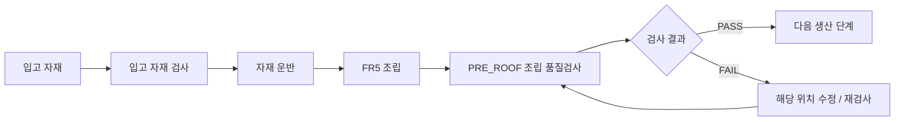
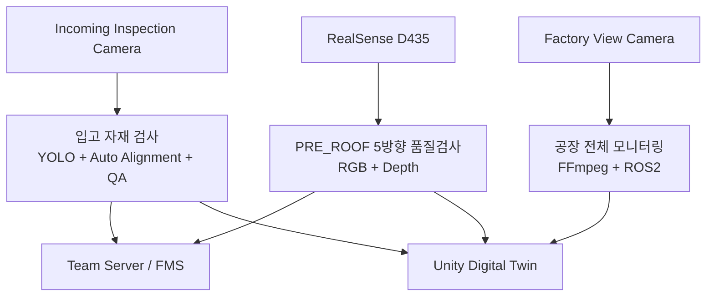
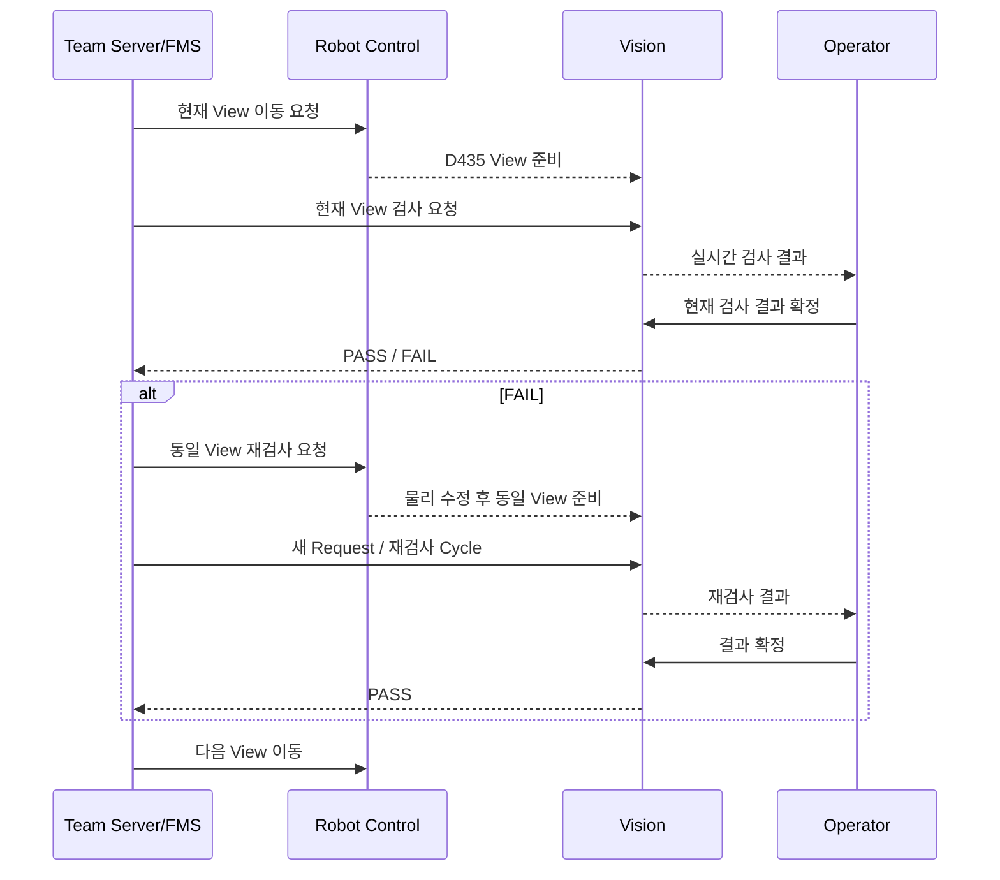

# 프로젝트 개요

> **AI 기반 조립식 주택 자동화 공정의 AI Perception / Vision 파트 개요**
> 프로젝트 전체 흐름에서 Vision의 역할, 카메라 구성, 검사 파이프라인과 시스템 연동 범위를 정리했습니다.

---

## 1. 프로젝트 목표

본 프로젝트는 **터틀봇과 FR5 협동로봇을 이용해 조립식 주택 생산 공정을 자동화**하는 것을 목표로 합니다.

공정은 **입고 자재 상태 확인 → 운반 → 조립 → 조립 품질검사 → 다음 공정 진행**이 연결되도록 구성했습니다.



Vision 파트는 이 전체 공정에서 다음 세 가지 역할을 담당합니다.

1. **입고 자재가 정상적으로 준비됐는지 검사**
2. **공장 전체 상황을 실영상으로 모니터링**
3. **조립된 구조물이 정상 상태인지 5방향으로 검사**

---

## 2. Vision 파트의 문제 정의

실제 자동화 공정에서 Vision은 단순 객체 인식만으로 끝나지 않았습니다.

프로젝트 진행 과정에서 다음 문제가 반복적으로 발생했습니다.

| 문제 | 실제 영향 |
|:---|:---|
| 실물 학습 데이터 부족 | 다양한 자재·거리·각도·조명 조건을 충분히 확보하기 어려움 |
| 합성 데이터와 실카메라 차이 | Synthetic 환경에서 높은 성능을 보여도 실제 카메라에서 성능이 흔들림 |
| 작업대 위치 편차 | 고정 ROI가 몇 px만 이동해도 검사 결과가 불안정해짐 |
| Base A / B 형상 유사성 | 색상뿐 아니라 슬롯·홀 패턴까지 함께 봐야 안정적으로 구분 가능 |
| 조명·반사·그림자 | 정상 부품도 불량으로 판단되는 경우 발생 |
| PRE_ROOF 방향별 시야 차이 | 하나의 기준값으로 TOP / LEFT / RIGHT / FRONT / BEHIND를 모두 처리하기 어려움 |
| FAIL 이후 재검사 흐름 | 단순 PASS / FAIL 출력만으로는 실제 생산 공정에 연결하기 어려움 |
| Unity 영상 연동 | ROS2 Image를 Unity에서 직접 사용할 수 없어 별도 영상 전송 계층 필요 |

따라서 최종 시스템은 **AI 모델, 전처리, 정렬, 검사 기준, 서버 연동, 실시간 영상 전송을 하나의 Vision Pipeline으로 설계**했습니다.

---

## 3. 최종 Vision 구성

최종 Vision 시스템은 검사 목적에 따라 세 개의 카메라 역할로 분리했습니다.

| 카메라 | 역할 | 주요 처리 |
|:---|:---|:---|
| **Incoming Inspection Camera** | 입고 자재 AI 검사 | RTSP → ROS2 → YOLO / QA |
| **Factory View Camera** | 공장 전체 모니터링 | Logitech C270 → FFmpeg → ROS2 → Unity |
| **Intel RealSense D435** | PRE_ROOF 근접 조립 품질검사 | RGB / Depth → 5방향 QC |



각 카메라를 분리한 이유는 **같은 영상이라도 요구되는 시야, 거리, 처리 방식, 출력 목적이 서로 다르기 때문**입니다.

---

## 4. 입고 자재 검사

입고 자재 검사는 생산 시작 전에 HOUSE A / HOUSE B에 필요한 자재가 정상적으로 준비됐는지 확인합니다.

### 주요 처리 흐름

```text
RTSP Camera
→ FFmpeg Low-Latency 수신
→ ROS2 Image
→ Auto Alignment
→ YOLO / ROI 기반 검사
→ 정상·불량 판정
→ Team Server/FMS
→ Unity 실영상
```

### 주요 검사 대상

프로젝트의 최종 Vision 클래스는 조립식 주택 생산에 필요한 구조물과 가구, Base, Roof 등을 포함하도록 구성했습니다.

대표적으로 다음과 같은 자재를 검사합니다.

- 외벽
- 내벽
- Window / Door
- HOUSE A / HOUSE B Base
- Roof

초기 Synthetic 학습 단계에서는 Furniture 7종도 별도 클래스로 포함했지만, 최종 조립 검사 운영 범위에서는 제외했습니다.

HOUSE A와 HOUSE B의 Base는 전체 크기가 유사하지만 다음 특징을 함께 사용해 구분했습니다.

- 실제 출력 색상
- 조립 슬롯 구조
- 상면 홀 패턴
- 내부 벽 조립 구조 차이

### 실제 검증

다음 네 가지 실물 시나리오를 영상으로 검증했습니다.

- HOUSE A 정상
- HOUSE A 불량
- HOUSE B 정상
- HOUSE B 불량

상세 검사 방식과 실제 검증 이미지는 [입고 자재 검사](03_incoming_inspection.md)에서 설명합니다.

---

## 5. Factory View

Factory View는 AI 판정용 카메라가 아니라 **공장 전체 상황을 실시간으로 확인하기 위한 모니터링 카메라**입니다.

최종 장비는 Logitech C270을 사용했습니다.

### 주요 역할

- FR5 작업 영역 확인
- TurtleBot 이동 상황 확인
- Conveyor / Assembly Area 확인
- Unity Digital Twin에 공장 전체 실영상 제공

### 최종 영상 흐름

```text
Logitech C270
→ MJPEG 1280×960 @ 30 FPS
→ FFmpeg Perspective / Crop / Image Tuning
→ ROS2 /vision/factory_camera/image_view
→ HMV1 stream_id=3
→ Unity UDP 21030
```

Factory View는 최종 운영 단계에서 Vision PC에 종속되지 않도록 실행 구성을 독립화하고, **Robot Control PC에서 실행할 수 있도록 인계 패키지로 분리**했습니다.

상세 내용은 [Factory View](04_factory_view.md)에서 설명합니다.

---

## 6. PRE_ROOF 5방향 조립 품질검사

PRE_ROOF 검사는 지붕을 조립하기 전, 현재 조립된 구조물이 정상인지 확인하는 단계입니다.

Intel RealSense D435의 **RGB와 Depth 정보**를 사용하며, 로봇이 카메라를 각 검사 위치로 이동시켜 다음 다섯 방향을 검사합니다.

```text
TOP
LEFT
RIGHT
FRONT
BEHIND
```

### 방향별 독립 검사

각 방향은 보이는 구조와 조명 조건이 다르기 때문에 하나의 공통 기준값을 사용하지 않았습니다.

방향별로 다음 항목을 독립적으로 관리했습니다.

- Reference / Golden
- ROI
- Threshold
- Position Tolerance
- 구조 검사 Metric
- Depth 검사 기준

### 최종 런타임 버전

| 검사 방향 | 최종 런타임 |
|:---|:---|
| TOP | V7 |
| LEFT | V4 |
| RIGHT | V8 |
| FRONT | V2 |
| BEHIND | V5 |
| Dashboard | V17 |

정상 구조물과 불량 구조물을 실제로 구성해 **실물 검증**을 수행했습니다.

상세 검사 로직과 재검사 방식은 [PRE_ROOF 조립 품질검사](05_pre_roof_qc.md)에서 설명합니다.

---

## 7. 데이터 구축과 모델 개선

프로젝트 초기에는 실제 부품을 충분히 촬영하기 어려웠기 때문에 **실제 STL Asset을 이용한 Blender Synthetic Dataset**을 먼저 구축했습니다.

### 초기 접근

```text
실제 STL
→ Blender 자동 렌더링
→ YOLO Dataset
→ Model Training
→ Synthetic Validation
```

Synthetic-only 단계에서는 높은 검증 성능을 확보할 수 있었습니다.

하지만 실제 카메라를 연결하자 다음과 같은 Domain Gap이 확인됐습니다.

- 실제 출력물의 표면 반사
- 조명 방향
- 그림자
- 실제 색상
- 카메라 거리
- 카메라 각도
- Base의 홀과 자석 형태
- 실제 배경

### 개선 방향

Synthetic 데이터만으로 끝내지 않고 다음 방식으로 반복 개선했습니다.

```text
Synthetic Dataset
→ Model Training
→ Real Camera Validation
→ 실패 사례 분석
→ Lighting / Geometry / Physical Diversity 추가
→ Fine-Tuning
→ 재검증
```

최종 데이터 계보는 여러 Synthetic / Physical 보강 단계를 거치며 **누적 약 5만 장 규모**까지 확장했습니다.

학습 이미지 수만 늘리지 않고, **실카메라에서 실패한 조건을 다시 데이터 설계에 반영**했습니다.

---

## 8. 시스템 연동

Vision은 독립된 검사 프로그램이 아니라 Team Server/FMS, Robot Control, Unity와 연결됩니다.

### Team Server / FMS

Server는 검사 요청과 생산 공정 순서를 관리합니다.

Vision은 요청을 수신한 뒤 검사 결과를 반환합니다.

대표 UDP 포트는 다음과 같습니다.

| 기능 | 포트 |
|:---|:---:|
| Incoming Request / Result | `20051 / 20052` |
| PRE_ROOF Request / Result | `20061 / 20062` |

### Robot Control

PRE_ROOF에서는 Server가 현재 검사 방향을 결정하고 Robot Control이 D435를 해당 View Pose로 이동시킵니다.

Vision은 해당 View의 RGB / Depth 입력을 검사합니다.

### Unity

Vision 영상은 HMV1 방식으로 JPEG Chunk를 UDP 전송합니다.

| 영상 | Stream ID | UDP Port |
|:---|---:|---:|
| Incoming Inspection | `1` | `21010` |
| PRE_ROOF QC | `2` | `21020` |
| Factory View | `3` | `21030` |

상세 인터페이스는 [서버·로봇·Unity 연동](06_integration.md)에서 설명합니다.

---

## 9. 실제 재검사 흐름

PRE_ROOF 검사는 전체 5방향을 한 번에 판정하는 방식이 아니라, **현재 View를 하나씩 검사하는 Server 주도 방식**으로 구성했습니다.



이 구조를 통해 실제 제조 공정에서 필요한 다음 흐름을 구현했습니다.

```text
불량 발견
→ 물리적 조립 상태 수정
→ 같은 View 재검사
→ PASS 확인
→ 다음 View 진행
```

---

## 10. 최종 검증 범위

최종 단계에서는 단순 프로그램 실행 여부가 아니라 실제 장비와 물리 시나리오 기준으로 검증했습니다.

| 검증 항목 | 결과 |
|:---|:---:|
| Incoming Camera → ROS2 | PASS |
| HOUSE A 정상 / 불량 실물 검사 | PASS |
| HOUSE B 정상 / 불량 실물 검사 | PASS |
| Incoming Server Request / ACK / Result | PASS |
| Incoming Unity Video | PASS |
| Factory View → ROS2 | PASS |
| Factory View → Unity | PASS |
| D435 RGB / Depth 입력 | PASS |
| PRE_ROOF 5방향 런타임 | PASS |
| PRE_ROOF 정상 실물 검사 | PASS |
| PRE_ROOF 불량 실물 검사 | PASS |
| FAIL → 동일 View 재검사 → PASS 흐름 | PASS |
| PRE_ROOF Unity Video | PASS |

---

## 11. Vision 담당 범위와 팀 역할 경계

본 저장소의 `ai_perception` 영역은 Vision 파트를 중심으로 정리합니다.

### 직접 담당

- Camera Input Pipeline
- YOLO 기반 Incoming Inspection
- Auto Alignment
- Synthetic Dataset Pipeline
- Real Camera Validation
- PRE_ROOF RGB / Depth QC
- View별 검사 Runtime
- Vision ↔ Server UDP Interface
- Vision ↔ Unity HMV1 Video Interface
- SQLite / JSON 기반 검사 Transaction 및 Config
- Physical Validation

### 다른 팀 담당

- FR5 Motion Planning / Robot Motion
- TurtleBot Navigation
- Team Server/FMS 내부 생산 로직
- Unity 내부 UI / Digital Twin 구현

Vision 파트에서는 위 시스템을 직접 구현한 것으로 표현하지 않고, **각 시스템과 연결되는 Vision 측 Interface와 Runtime을 구현한 범위**만 문서화합니다.

---

## 12. 최종 결과

최종 Vision 시스템은 다음 세 단계의 역할을 하나의 AI Perception 영역에서 연결했습니다.

```text
입고 자재 검사
        ↓
공장 전체 모니터링
        ↓
PRE_ROOF 조립 품질검사
```

단일 AI 모델의 정확도만 높이는 것이 아니라,

- 실제 STL 기반 Synthetic Data 구축
- 실카메라 Domain Gap 분석
- Auto Alignment
- RGB / Depth 기반 방향별 검사
- 실제 FAIL → 수정 → 재검사
- Server / Robot / Unity 연동

까지 포함해 **실제 자동화 공정에서 동작할 수 있는 Vision Pipeline**을 완성하는 것을 목표로 구현했습니다.

---

## 전체 문서 목차

1. [AI Perception / Vision](../README.md)
2. **현재 문서 — 프로젝트 개요**
3. [시스템 아키텍처](02_system_architecture.md)
4. [입고 자재 검사](03_incoming_inspection.md)
5. [Factory View](04_factory_view.md)
6. [PRE_ROOF 조립 품질검사](05_pre_roof_qc.md)
7. [서버·로봇·Unity 연동](06_integration.md)
8. [검증 결과](07_validation.md)
9. [문제 해결 과정](08_problem_solving.md)
10. [프로젝트 구조](09_project_structure.md)
