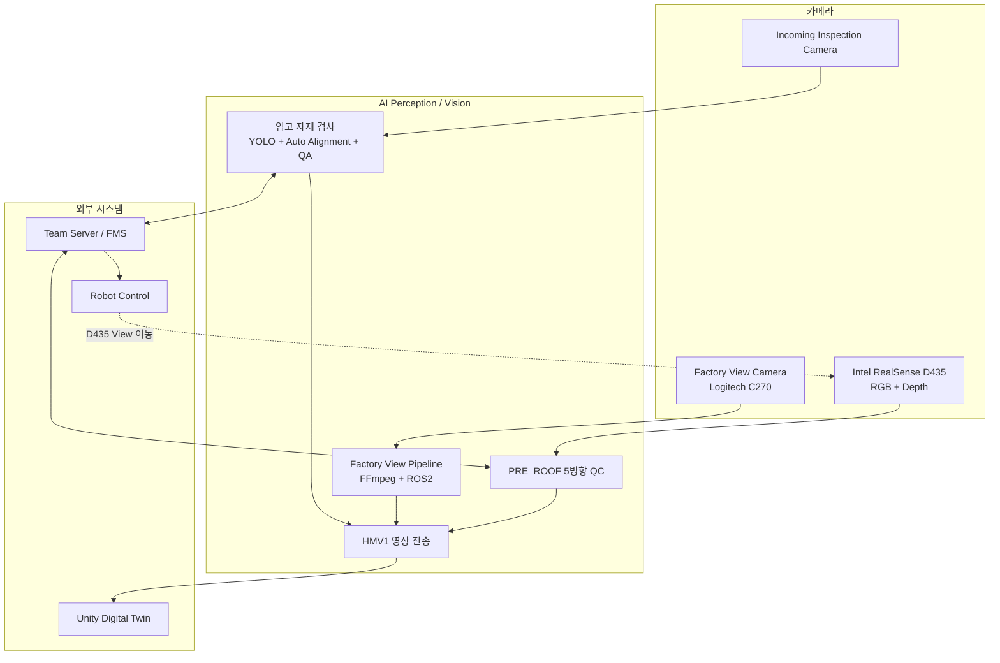
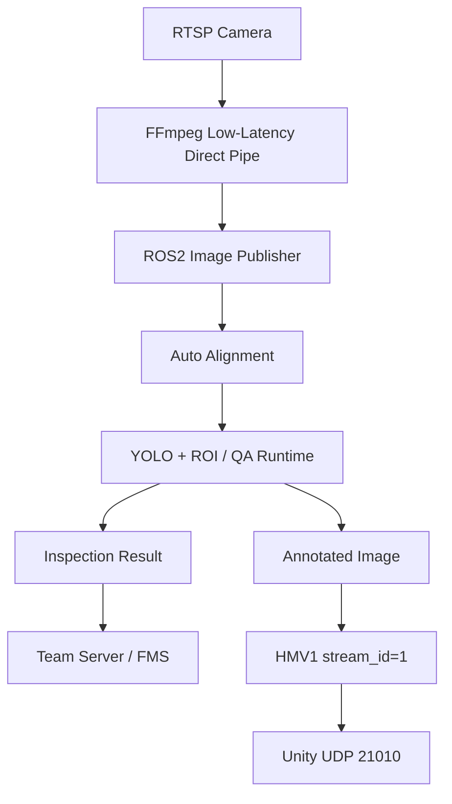
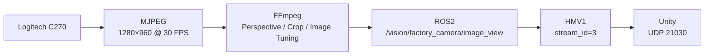
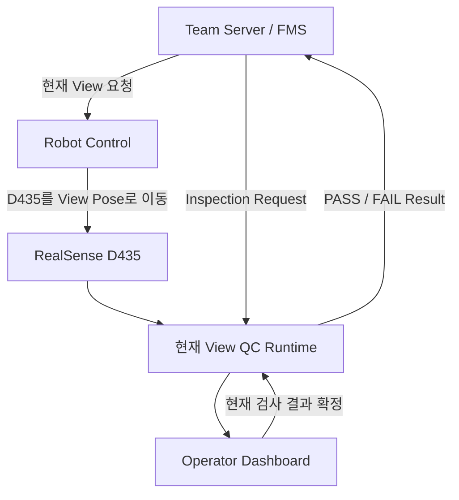
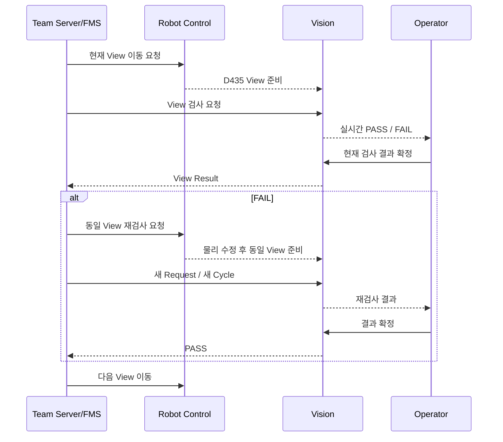
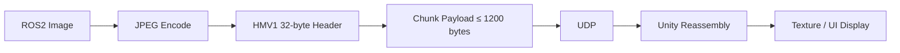

# 시스템 아키텍처

> **AI Perception / Vision의 최종 시스템 구성과 데이터 흐름**
> Incoming Inspection, Factory View, PRE_ROOF 5방향 품질검사의 카메라·런타임·통신 경로를 정리했습니다.

---

## 1. 아키텍처 설계 원칙

최종 Vision 시스템은 하나의 카메라나 하나의 Runtime에 모든 기능을 넣지 않고, **검사 목적과 운영 책임에 따라 파이프라인을 분리**했습니다.

핵심 원칙은 다음과 같습니다.

- **입고 검사 / 공장 모니터링 / 조립 품질검사 역할 분리**
- Camera Input과 검사 Runtime 분리
- ROS2 Topic을 중심으로 내부 데이터 연결
- Team Server/FMS와는 UDP 기반 Request / Result 연동
- Unity에는 HMV1 JPEG Chunked UDP로 실영상 전송
- PRE_ROOF는 Server 주도 View-by-View 검사
- FAIL 발생 시 같은 View를 새 Request로 재검사
- Factory View는 Robot Control PC에서 독립 실행 가능하도록 분리

---

## 2. 전체 시스템 구성

Vision은 다음 네 시스템 사이에서 동작합니다.

1. **Camera Layer**
2. **AI Perception / Vision**
3. **Team Server/FMS**
4. **Robot Control / Unity**



전체 아키텍처에서 Vision은 **검사 결과 생성과 실영상 제공**에 집중하고, 생산 순서와 로봇 이동은 각 담당 시스템이 관리합니다.

---

## 3. 카메라 역할 분리

### 3.1 Incoming Inspection Camera

입고 자재 검사를 위한 카메라입니다.

주요 목적은 다음과 같습니다.

- HOUSE A / HOUSE B 자재 인식
- 정상·불량 판정
- 작업대 위치 편차 보정
- Team Server 검사 결과 전송
- Unity에 Annotated Image 제공

Camera Source는 RTSP 기반이며, ROS2 Pipeline으로 전달됩니다.

---

### 3.2 Factory View Camera

공장 전체 모니터링을 위한 카메라입니다.

최종 장비는 **Logitech C270**이며 AI 판정용 카메라가 아니라 **Global Overview 전용**입니다.

주요 목적은 다음과 같습니다.

- FR5 작업 영역 확인
- TurtleBot 이동 확인
- Conveyor / Assembly Area 확인
- Unity Digital Twin 실영상 제공

최종 ROS2 Topic:

```text
/vision/factory_camera/image_view
```

Factory View는 Vision PC에 종속되지 않도록 실행 구성을 독립화하고, Robot Control PC에서 실행 가능한 형태로 인계했습니다.

---

### 3.3 Intel RealSense D435

PRE_ROOF 조립 품질검사를 담당합니다.

입력은 다음 두 정보를 사용합니다.

- RGB
- Depth

PRE_ROOF에서는 하나의 고정 위치가 아니라 Robot Control이 D435를 각 검사 Pose로 이동시키고, Vision은 현재 View의 Frame을 검사합니다.

검사 방향:

```text
TOP
LEFT
RIGHT
FRONT
BEHIND
```

---

## 4. Incoming Inspection 아키텍처

Incoming Inspection은 다음 순서로 동작합니다.



### 내부 ROS2 주요 Topic

Incoming Camera 계보에서 사용한 대표 Topic은 다음과 같습니다.

```text
/vision/global_camera/image_raw
/vision/global_camera/image_aligned
/vision/global_camera/detections
/vision/global_camera/vision_status
```

최종 문서에서는 이 Camera의 역할을 **Incoming Inspection Camera**로 설명하지만, 코드와 Topic에는 기존 `global_camera` 이름이 일부 남아 있습니다.

이는 구현 계보를 보존하기 위한 것으로, 최종 역할 정의는 다음과 같습니다.

```text
기존 이름: Global Camera
최종 역할: Incoming Inspection Camera
```

---

## 5. Auto Alignment 위치

Incoming Inspection에서 Auto Alignment는 YOLO 전단에 위치합니다.

```text
Raw Frame
→ Fixed Structure Anchor
→ ECC Alignment
→ Alignment Gate
→ Aligned Frame
→ Inspection Runtime
```

작업대 위치가 조금씩 이동하면 고정 ROI가 흔들릴 수 있기 때문에, 검사 대상 자재가 아니라 **작업대의 고정 구조를 기준으로 Frame을 정렬**했습니다.

Alignment 결과가 허용 범위를 벗어난 경우에는 잘못 정렬된 영상을 그대로 검사에 사용하지 않도록 Gate를 둡니다.

---

## 6. Factory View 아키텍처

Factory View는 검사 결과를 생성하지 않습니다.

목적은 **공장 전체 실영상 제공**입니다.



### 최종 영상 보정

실제 설치된 카메라는 공장 전체를 바로 정면으로 촬영하지 않기 때문에 다음 보정을 적용했습니다.

- Perspective Correction
- Crop
- Scale
- Brightness / Contrast / Gamma
- Saturation
- Sharpening

카메라 제어값과 FFmpeg Filter는 실제 설비 배치에서 최종값을 고정해 사용했습니다.

---

## 7. PRE_ROOF 아키텍처

PRE_ROOF는 전체 5방향을 한 요청으로 검사하지 않고, **현재 View 하나씩 검사하는 구조**입니다.



### 최종 View Runtime

| View | Runtime | Service Port |
|:---|:---:|---:|
| TOP | V7 | `8775` |
| LEFT | V4 | `8777` |
| RIGHT | V8 | `8785` |
| FRONT | V2 | `8787` |
| BEHIND | V5 | `8792` |
| Dashboard | V17 | `8811` |

각 Runtime은 하나의 공통 Threshold를 공유하지 않고, View 특성에 맞는 Reference와 검사 조건을 사용합니다.

---

## 8. PRE_ROOF 데이터 경로

PRE_ROOF 내부 데이터 흐름은 다음과 같이 구성됩니다.

```text
Robot Control
→ D435 View Pose 이동
→ RGB / Depth Frame
→ 현재 View Runtime
→ Live Inspection
→ Dashboard
→ Operator Commit
→ Gateway
→ Team Server Result
```

최종 통합에서는 다음 구성 요소가 연결됩니다.

- TOP V7
- LEFT V4
- RIGHT V8
- FRONT V2
- BEHIND V5
- Dashboard V17
- UDP Gateway V4
- D435 Raw MJPEG Bridge V3
- Active View Annotated Publisher V3
- Unity Video Sender V3

---

## 9. PRE_ROOF Server 연동

PRE_ROOF Gateway는 Team Server와 UDP로 연동합니다.

| 구분 | Port |
|:---|:---:|
| Vision Request 수신 | `20061` |
| Team Server Result 전송 | `20062` |

최종 흐름은 다음과 같습니다.



FAIL이 발생하면 Vision은 다음 View로 자동 진행하지 않습니다. 동일 View의 물리적 수정과 재검사는 Team Server/FMS가 관리합니다.

다음 View 선택과 재검사 여부는 Server가 관리합니다.

---

## 10. Operator 역할

PRE_ROOF Dashboard의 Operator는 생산 순서를 직접 바꾸지 않습니다.

Server 주도 흐름에서 Operator의 핵심 동작은 다음 하나입니다.

```text
현재 검사 결과 확정
```

Operator는 Live 검사 결과를 확인한 뒤 현재 View의 결과를 Commit합니다.

FAIL이면 Server가 같은 View를 새로운 Request / Cycle로 다시 요청합니다.

따라서 Vision UI와 Server의 책임은 다음과 같이 분리했습니다.

| 시스템 | 책임 |
|:---|:---|
| Vision Runtime | 현재 View 검사 |
| Operator | 현재 결과 Commit |
| Team Server/FMS | View 순서 / 재검사 관리 |
| Robot Control | D435 View Pose 이동 |

---

## 11. Unity 영상 아키텍처

Unity에는 세 종류의 Vision 영상을 전달합니다.

| 영상 | Stream ID | UDP Port |
|:---|---:|---:|
| Incoming Inspection | `1` | `21010` |
| PRE_ROOF QC | `2` | `21020` |
| Factory View | `3` | `21030` |

영상 전송 구조는 공통적으로 다음과 같습니다.



### HMV1 설계 이유

ROS2 Image 전체를 하나의 UDP Packet으로 보내기에는 크기가 너무 크기 때문에 다음 방식을 사용했습니다.

- JPEG 압축
- Frame ID 부여
- Chunk 단위 분할
- HMV1 Header 추가
- Unity에서 Frame 재조립

HMV1은 실시간 영상 표시를 위한 경량 구조이며, ACK / 재전송 기반의 파일 전송 프로토콜이 아닙니다.

---

## 12. Incoming Server 연동

Incoming Inspection도 Team Server와 Request / Result 방식으로 연결됩니다.

| 구분 | Port |
|:---|:---:|
| Incoming Request | `20051` |
| Incoming Result | `20052` |

Incoming QA에서는 다음 두 이벤트를 구분했습니다.

```text
ACK
= Request를 정상적으로 수신하고 Transaction을 수락

Result
= 실제 검사 완료 후 생성된 최종 검사 결과
```

이를 분리함으로써 Server가 **요청 수신 성공**과 **검사 완료**를 같은 의미로 처리하지 않도록 구성했습니다.

---

## 13. 데이터와 설정 관리

Vision Runtime의 주요 설정과 상태는 다음 형식으로 관리합니다.

| 형식 | 용도 |
|:---|:---|
| JSON | Model Contract / Threshold / Camera / Runtime Config |
| SQLite | 검사 Transaction / Runtime State |
| ROS2 Topic | 실시간 Image / Detection / Status |
| UDP | Server Request / Result |
| HTTP | Dashboard / Runtime Service |
| HMV1 UDP | Unity 실영상 |

대용량 Dataset과 Model Weight는 GitHub 공개 저장소에 포함하지 않고, 공개에 필요한 Runtime / Interface / Config 중심으로 정리합니다.

---

## 14. PC별 책임 분리

최종 구성에서는 모든 기능을 한 PC에 강제로 집중하지 않습니다.

### Vision PC

- Incoming Inspection
- PRE_ROOF 검사 Runtime
- Server / Unity Vision Interface

### Robot Control PC

- FR5 제어
- D435 Source
- PRE_ROOF View Pose 이동
- Factory View 실행 패키지 운영 가능

### Team Server PC

- 생산 흐름
- 검사 Request
- View 순서
- FAIL 재검사 요청
- 최종 결과 관리

### Unity PC

- Incoming 영상
- PRE_ROOF 영상
- Factory View 영상
- Digital Twin UI

이 분리를 통해 Vision Runtime의 책임과 Robot / Server / Unity의 책임을 명확하게 유지했습니다.

---

## 15. 최종 아키텍처 요약

최종 구조를 기능별로 정리하면 다음과 같습니다.

```text
[Incoming Inspection]
RTSP Camera
→ FFmpeg
→ ROS2
→ Auto Alignment
→ YOLO / QA
→ Server Result
→ Unity stream 1


[Factory View]
Logitech C270
→ FFmpeg
→ ROS2
→ Unity stream 3


[PRE_ROOF]
Robot Control
→ D435 View Pose
→ RGB / Depth
→ View Runtime
→ Operator Commit
→ Server Result
→ Unity stream 2
```

세 카메라는 목적과 처리 책임을 분리한 뒤 동일한 Server / Unity 시스템에 연결했습니다.

---

## 전체 문서 목차

1. [AI Perception / Vision](../README.md)
2. [프로젝트 개요](01_project_overview.md)
3. **현재 문서 — 시스템 아키텍처**
4. [입고 자재 검사](03_incoming_inspection.md)
5. [Factory View](04_factory_view.md)
6. [PRE_ROOF 조립 품질검사](05_pre_roof_qc.md)
7. [서버·로봇·Unity 연동](06_integration.md)
8. [검증 결과](07_validation.md)
9. [문제 해결 과정](08_problem_solving.md)
10. [프로젝트 구조](09_project_structure.md)
