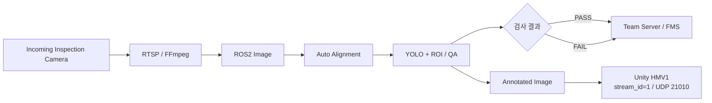
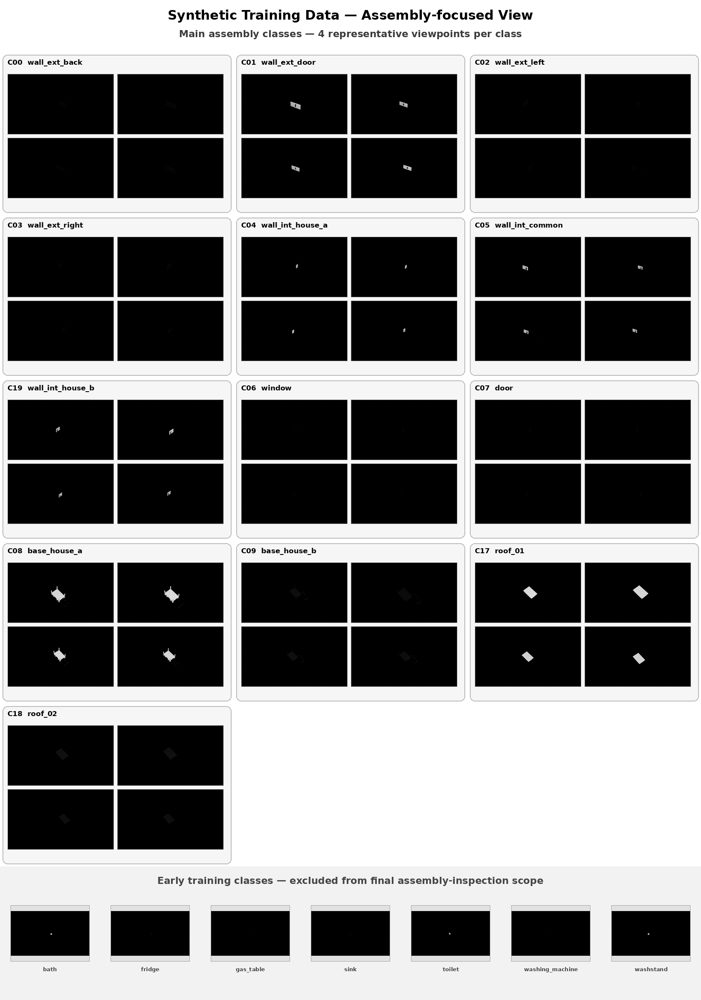
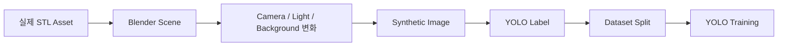

# 입고 자재 검사

> **HOUSE A / HOUSE B 생산 시작 전 자재 상태를 검사하는 AI Vision 파이프라인**
> Incoming Inspection Camera의 RTSP 영상을 ROS2로 수신하고, Auto Alignment와 YOLO 기반 자재 인식, ROI 기반 품질판정, Team Server/FMS 결과 전송, Unity 실영상 연동까지 하나의 검사 흐름으로 구성했습니다.

---

## 1. 검사 목적

입고 자재 검사의 목적은 생산 공정이 시작되기 전에 필요한 자재가 정상적으로 준비됐는지 확인하는 것입니다.

검사 대상은 HOUSE A / HOUSE B 생산에 필요한 구조물과 가구, Base, Roof 등이며, 단순 객체 존재 여부뿐 아니라 실제 배치와 상태까지 확인할 수 있도록 구성했습니다.

최종 검사 흐름은 다음과 같습니다.



---

## 2. 카메라 입력 파이프라인

Incoming Inspection Camera는 RTSP 영상을 사용합니다.

### 처리 순서

```text
RTSP Camera
→ FFmpeg Low-Latency Direct Pipe
→ OpenCV / NumPy Frame
→ ROS2 Image Publisher
→ Auto Alignment
→ Inspection Runtime
```

네트워크 카메라 특성상 지연과 Decode 안정성이 중요했기 때문에, 단순 OpenCV URL 수신보다 FFmpeg Direct Pipe 구조를 사용해 실제 운영 안정성을 확보했습니다.

---

## 3. ROS2 Topic

Incoming Camera 계보에서 사용한 대표 Topic은 다음과 같습니다.

```text
/vision/global_camera/image_raw
/vision/global_camera/image_aligned
/vision/global_camera/detections
/vision/global_camera/vision_status
```

코드와 Topic에는 초기 개발 당시 사용한 `global_camera` 이름이 남아 있지만, 최종 시스템에서 이 카메라의 역할은 **Incoming Inspection Camera**입니다.

역할 정의는 다음과 같이 고정합니다.

```text
legacy code/topic name : global_camera
final system role      : Incoming Inspection Camera
```

Factory View가 별도의 Logitech C270 기반 Global Overview 역할을 담당하기 때문에, 최종 문서에서는 두 카메라를 구분해 설명합니다.

---

## 4. 학습 클래스와 최종 운영 범위

초기 Synthetic 학습 단계에서는 **exact20** 분류 체계를 사용했습니다.

### 최종 조립 검사 중심 클래스 13종

```text
wall_ext_back
wall_ext_door
wall_ext_left
wall_ext_right
wall_int_house_a
wall_int_common
wall_int_house_b
window
door
base_house_a
base_house_b
roof_01
roof_02
```

### 초기 학습 포함 클래스

Furniture 7종은 초기 20-class 학습 데이터에 포함해 모델의 부품 분류 범위를 넓혔습니다. 이후 실제 생산 시나리오와 검사 범위를 정리하면서 Furniture는 최종 조립 검사 운영 대상에서 제외했습니다.

따라서 문서에서는 다음과 같이 구분합니다.

| 구분 | 범위 |
|:---|:---|
| 초기 Synthetic 학습 | 20 classes |
| 최종 조립 검사 중심 | 구조 부품 13종 |
| Furniture 7종 | 초기 학습 포함, 최종 조립 검사 제외 |

### Synthetic 학습 이미지 예시

아래 이미지는 주요 조립 부품은 여러 시점의 샘플을 크게 배치하고, Furniture는 초기 학습 이력을 보여주는 대표 이미지로 작게 구성한 것입니다.



Zone 위치만으로 클래스를 결정하지 않고 실제 부품의 형상과 검사 조건을 함께 사용했습니다.

---

## 5. HOUSE A / HOUSE B Base 구분

Base A와 Base B는 전체 크기와 상면 형태가 유사해 단순 외곽 Shape만으로는 안정적으로 구분하기 어려웠습니다.

최종 검사에서는 다음 특징을 함께 고려했습니다.

### HOUSE A — `base_house_a`

- 실제 출력 색상: WHITE
- 내부 벽 조립용 추가 Slot / Groove 존재
- HOUSE A 고유의 상면 Hole Pattern

### HOUSE B — `base_house_b`

- 실제 출력 색상: BLACK
- HOUSE A와 다른 내부 구조
- HOUSE B 고유의 상면 Hole Pattern

따라서 Base 판별은 단순 색상이나 하나의 작은 Feature에만 의존하지 않고 다음 요소를 함께 보도록 데이터와 검사 기준을 수정했습니다.

```text
Color
+ Assembly Slot Layout
+ Top Hole Pattern
+ Overall Shape
```

---

## 6. Synthetic Dataset 구축

프로젝트 초기에는 실물 자재를 충분히 확보하기 어려웠고, 다양한 거리·각도·조명 조건을 실제 촬영만으로 만들기에도 한계가 있었습니다.

그래서 실제 STL Asset을 기반으로 Blender Synthetic Dataset을 구축했습니다.

### 기본 생성 흐름



### 데이터 다양화 요소

- Camera Distance
- Camera View / Angle
- Lighting
- Brightness
- Background
- 실제 Base 색상
- Hole / Slot Pattern
- 실제 Camera Geometry를 고려한 배치

최종 데이터 계보는 여러 보강 단계를 거치며 **누적 약 5만 장 규모**까지 확장했습니다.

---

## 7. Synthetic-only 성능과 실제 카메라 차이

Synthetic-only 단계에서는 높은 검증 성능을 확보했습니다.

하지만 실카메라 연결 후 다음 Domain Gap이 확인됐습니다.

| Synthetic 환경 | 실제 환경 |
|:---|:---|
| 일정한 Material | 실제 출력물 표면 반사 |
| 통제된 조명 | 공장 조명과 그림자 |
| 정확한 Camera Pose | 실제 설치 높이·각도 편차 |
| 이상적인 색상 | WHITE / BLACK 실제 출력색 차이 |
| Clean Background | 실제 작업대와 주변 설비 |
| CAD 기반 Hole | 실물 자석 / Hole 표현 차이 |

이 때문에 Synthetic 성능을 최종 성능으로 간주하지 않고 실제 카메라 실패 조건을 다시 데이터 설계에 반영했습니다.

```text
Synthetic Training
→ Real Camera Validation
→ Failure Case 수집
→ Lighting / Geometry / Physical Diversity 보강
→ Fine-Tuning
→ 재검증
```

---

## 8. Global Camera Geometry 보정

실제 Incoming Inspection Camera의 설치 조건을 기준으로 Synthetic Rendering과 실제 검증 범위를 맞추기 위해 Camera Geometry를 별도로 정리했습니다.

주요 고려 항목은 다음과 같습니다.

- 설치 높이
- Lens / FOV
- Near / Mid / Far 거리
- Assembly Zone
- Conveyor Zone
- Incoming Zone
- Shipping Zone

Geometry 검증에서는 실제 카메라에서 기대되는 물체 크기와 위치 범위를 합성 데이터셋에서도 재현하도록 했습니다.

Zone은 검사 범위를 설명하기 위한 Geometry 기준으로 사용하며 **Zone만으로 Class를 결정하지 않습니다.**

---

## 9. Auto Alignment가 필요한 이유

고정 카메라를 사용해도 작업대나 자재 배치가 매번 완전히 같은 위치에 놓이지는 않았습니다.

몇 px 수준의 위치 편차만 발생해도 다음 문제가 생길 수 있었습니다.

- ROI가 실제 대상에서 벗어남
- 정상 자재가 불량으로 판정됨
- Hole / Slot 비교 위치가 흔들림
- 동일 자재의 재검사 결과가 달라짐

이를 해결하기 위해 검사 전에 Auto Alignment를 수행했습니다.

### 처리 구조

```text
Raw Frame
→ Fixed Structure Anchor
→ ECC Alignment
→ Alignment Gate
→ Aligned Frame
→ YOLO / ROI Inspection
```

### 설계 핵심

검사 대상 자재 자체를 Anchor로 사용하면 자재가 누락되거나 불량일 때 Alignment가 흔들릴 수 있습니다.

따라서 **작업대의 고정 구조를 기준 Anchor로 사용**했습니다.

Alignment 결과가 허용 범위를 벗어나면 잘못 정렬된 Frame을 그대로 검사에 사용하지 않도록 Gate를 둡니다.

---

## 10. 검사 Runtime

입고 자재 검사 Runtime은 크게 다음 기능을 수행합니다.

1. Aligned Frame 수신
2. YOLO Detection
3. HOUSE A / HOUSE B 검사 Mode 적용
4. Slot / ROI 기준 검사
5. 정상·불량 상태 계산
6. Annotated Image 생성
7. Team Server 결과 전송
8. Unity 영상 전송

### 결과 예시

```text
HOUSE_A
├── base_house_a : PASS
├── wall_*       : PASS
└── overall      : PASS
```

또는

```text
HOUSE_B
├── base_house_b : PASS
├── wall_*       : FAIL
└── overall      : FAIL
```

최종 결과는 하나의 객체 검출 Confidence만으로 결정하지 않고, 검사 Mode와 요구 자재 상태를 함께 반영합니다.

---

## 11. Team Server / FMS 연동

Incoming Inspection은 Team Server와 UDP Request / Result 방식으로 연동합니다.

| 구분 | Port |
|:---|:---:|
| Incoming Request | `20051` |
| Incoming Result | `20052` |

### ACK와 Result 분리

Server Integration에서는 `ACK`와 실제 검사 결과를 별도 상태로 처리합니다.

```text
ACK
= Request 수신 및 Transaction 수락

Result
= 실제 검사 완료 후 생성된 최종 검사 결과
```

이 구조를 통해 Server는 다음 두 상태를 구분할 수 있습니다.

```text
요청이 정상적으로 도착했는가?
≠
검사가 실제로 완료됐는가?
```

검사 Transaction과 Runtime State는 SQLite 기반으로 관리해 중복 요청과 상태 추적에 대응했습니다.

---

## 12. Unity 영상 전송

입고 자재 검사의 Annotated Image는 Unity에 별도 Video Stream으로 전송합니다.

```text
Incoming Annotated Image
→ JPEG Encode
→ HMV1 Header
→ UDP Chunk
→ Unity Reassembly
```

최종 Stream 기준:

| 항목 | 값 |
|:---|:---:|
| Stream ID | `1` |
| UDP Port | `21010` |
| Protocol | HMV1 |
| Header | 32 bytes |
| Chunk Payload | 최대 1200 bytes |

HMV1은 실시간 모니터링을 위한 경량 영상 전송 구조이며 파일 전송용 ACK / 재전송 프로토콜이 아닙니다.

---

## 13. 실제 정상·불량 검증

최종 Incoming Inspection은 HOUSE A / HOUSE B 각각 정상과 불량 시나리오를 실제 영상으로 검증했습니다.

### HOUSE A

| 정상 판정 | 불량 판정 |
|:---:|:---:|
|  |  |

**HOUSE A 정상 판정 영상**

https://github.com/user-attachments/assets/d4fe6eab-78e1-4c12-b795-b144971dad1f

**HOUSE A 불량 판정 영상**

https://github.com/user-attachments/assets/1475b359-8920-4c33-a93a-550d2caf4a83

### HOUSE B

| 정상 판정 | 불량 판정 |
|:---:|:---:|
|  |  |

**HOUSE B 정상 판정 영상**

https://github.com/user-attachments/assets/8568c3e3-7e25-4f02-8cb6-c659a05fa915

**HOUSE B 불량 판정 영상**

https://github.com/user-attachments/assets/5fd878ed-f8ff-4fef-872c-ecb6a15aa08e

---

## 14. 검증 결과

| 검증 항목 | 결과 |
|:---|:---:|
| RTSP Camera 수신 | PASS |
| FFmpeg → ROS2 Image | PASS |
| Auto Alignment | PASS |
| HOUSE A 정상 실물 검사 | PASS |
| HOUSE A 불량 실물 검사 | PASS |
| HOUSE B 정상 실물 검사 | PASS |
| HOUSE B 불량 실물 검사 | PASS |
| Team Server Request / ACK / Result | PASS |
| Annotated Image 생성 | PASS |
| Unity HMV1 Video | PASS |

---

## 15. 해결한 핵심 문제

입고 자재 검사에서 가장 중요했던 문제 해결 과정을 정리하면 다음과 같습니다.

| 문제 | 해결 |
|:---|:---|
| 실물 데이터 부족 | 실제 STL 기반 Blender Synthetic Dataset 구축 |
| Synthetic ↔ Real 차이 | 실카메라 실패 조건을 데이터 설계에 재반영 |
| Base A/B 유사성 | 색상 + Slot + Hole Pattern을 함께 반영 |
| 작업대 위치 편차 | ECC Auto Alignment + Gate |
| 통신 수신과 검사 완료 혼동 | ACK / Result 의미 분리 |
| Unity 실영상 필요 | HMV1 JPEG Chunked UDP 적용 |

---

## 16. 최종 구조 요약

```text
Incoming Inspection Camera
        ↓
RTSP / FFmpeg
        ↓
ROS2 Image
        ↓
Auto Alignment
        ↓
YOLO + ROI / QA
        ↓
 ┌───────────────┬────────────────┐
 ↓               ↓                ↓
PASS / FAIL   Annotated Image   Runtime State
 ↓               ↓                ↓
Server/FMS    Unity HMV1        SQLite
20051/20052   stream 1 / 21010
```

이 파이프라인의 핵심은 객체 검출 모델만 실행하는 것이 아니라, **실제 작업대 정렬, 실물 도메인 차이, 검사 Transaction, Server 결과 전달, Unity 실영상까지 하나의 검사 시스템으로 연결한 것**입니다.

---

## 전체 문서 목차

1. [AI Perception / Vision](../README.md)
2. [프로젝트 개요](01_project_overview.md)
3. [시스템 아키텍처](02_system_architecture.md)
4. **현재 문서 — 입고 자재 검사**
5. [Factory View](04_factory_view.md)
6. [PRE_ROOF 조립 품질검사](05_pre_roof_qc.md)
7. [서버·로봇·Unity 연동](06_integration.md)
8. [검증 결과](07_validation.md)
9. [문제 해결 과정](08_problem_solving.md)
10. [프로젝트 구조](09_project_structure.md)
