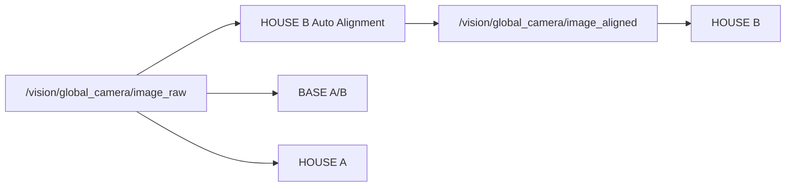
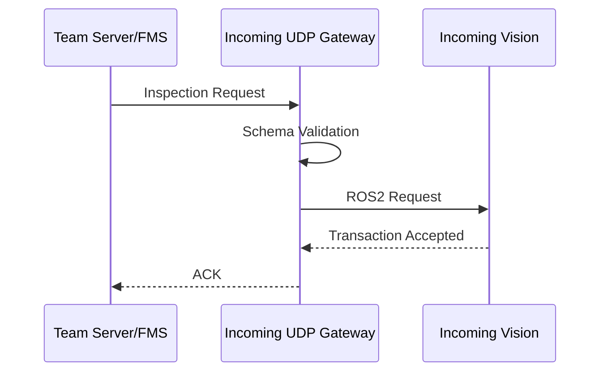
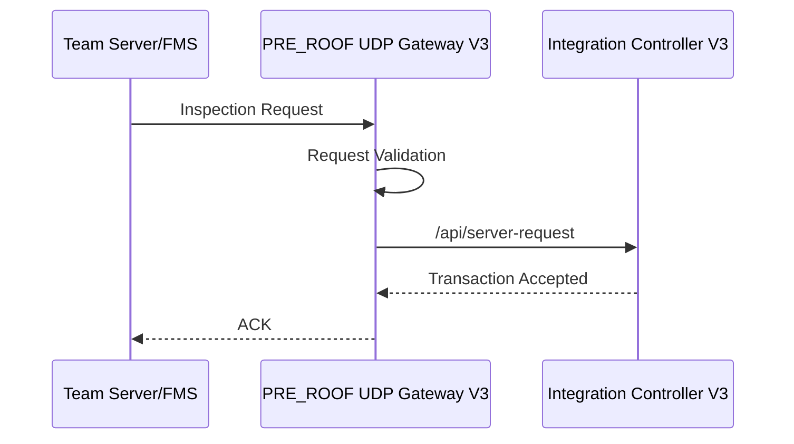

# 04. 데이터 흐름

AI Perception 시스템의 Runtime 데이터 흐름을 **Global Vision**과 **Depth Vision**으로 구분해 정리합니다.

세부 구성은 [02. 시스템 아키텍처](02_architecture.md), 기능 설명은 [03. 주요 기능](03_features.md), 실제 검증 상태는 [05. 검증](05_validation.md)에서 확인할 수 있습니다.

---

## 1. Global Vision 데이터 흐름

### 1.1 Global Camera 입력

Global Camera는 스마트폰 RTSP 영상을 Ubuntu Vision PC에서 FFmpeg로 수신한 뒤 ROS2 Image Topic으로 변환합니다.

```text
Smartphone Camera
→ RTSP/RTP
→ FFmpeg Low-Latency Direct Pipe
→ BGR Frame
→ ROS2 Global Camera Node
→ /vision/global_camera/image_raw
```

기준:

| 항목 | 값 |
|:---|:---|
| Resolution | `1280x720` |
| Encoding | `BGR8` |
| QoS | `BEST_EFFORT` |
| History | `KEEP_LAST 1` |

---

### 1.2 Raw / Aligned 분기

Incoming QA는 검사 Mode에 따라 Raw 또는 Aligned Frame을 사용합니다.



| Mode | Camera Source |
|:---|:---|
| BASE A/B | Raw |
| HOUSE A | Raw |
| HOUSE B | Aligned |

---

### 1.3 HOUSE B Alignment Flow

```text
Raw Frame
→ Reference 비교
→ ECC / Shift / Rotation 계산
→ Gate 판정
```

Gate PASS:

```text
Aligned Frame
→ /vision/global_camera/image_aligned
→ HOUSE B Inspection
```

Gate FAIL:

```text
Aligned Topic 미생성
→ HOUSE B WAITING
→ 검사 결과 생성 차단
```

Material ROI 내부는 Alignment 계산에서 제외합니다.

---

### 1.4 Incoming Inspection Flow

```text
Camera Frame
→ Inspection Mode
→ Slot ROI
→ AI / Rule-based 검사
→ 상태 안정화
→ Slot Result
→ Inspection Result
```

지원 Mode:

```text
BASE A/B
HOUSE B
HOUSE A
```

단일 Frame의 순간 판정만으로 Final Result를 확정하지 않고 Runtime 안정화 상태를 거칩니다.

---

### 1.5 UI / Annotated Image Flow

```text
Incoming QA Runtime
→ UI Canvas 1280x840
→ Camera Area Crop
→ 1280x720 BGR8
→ /vision/incoming_qa/annotated_image
```

Unity에는 전체 UI Canvas가 아니라 Camera 영역만 전달합니다.

---

### 1.6 Server Request / ACK Flow



ACK 의미:

```text
Request 수신
+
Transaction 수락
```

ACK는 검사 완료를 의미하지 않습니다.

---

### 1.7 HOLD Flow

HOLD 상태에서도 Camera와 통신 계층은 유지합니다.

```text
HOLD
├─ Camera 입력 유지
├─ Annotated Image 유지
├─ Unity Video 유지
├─ Server Gateway Listen 유지
└─ 실제 Inspection / Final Result 생성만 중지
```

통신 상태와 검사 실행 상태를 분리합니다.

---

### 1.8 Final Result Flow

```text
Inspection Start
→ Runtime 검사
→ 안정화
→ Result 생성
→ ROS2 Result Topic
→ UDP Gateway
→ Final Result
→ Team Server/FMS
```

ACK와 Final Result는 서로 다른 의미를 가집니다.

```text
ACK
= Transaction Accepted

Final Result
= Inspection Completed
```

---

### 1.9 Transaction Persistence Flow

```text
UDP Request
→ Validation
→ Transaction Store
→ ACK 상태 저장
→ Result Correlation
→ Final Result 상태 저장
```

SQLite는 Vision 측 Transaction 보호에 사용하고, 공정 전체 Source of Truth는 Team Server/FMS가 담당합니다.

---

### 1.10 Global Unity Video Flow

```text
/vision/incoming_qa/annotated_image
→ JPEG Encoding
→ HMV1 Header
→ Chunk 분할
→ stream_id=1
→ UDP
→ Unity Receiver
→ JPEG Reassembly
→ 화면 표시
```

주요 Wire 기준:

| 항목 | 값 |
|:---|:---|
| Version | `1` |
| Header | `32 bytes` |
| JPEG Quality | `80` |
| Target FPS | `10` |
| Payload Max | `1200 bytes` |
| Datagram Max | `1232 bytes` |

---

## 2. Depth Vision 데이터 흐름

### 2.1 D435 Input Flow

Intel RealSense D435는 Robot Control PC에 연결되어 있습니다.

```text
Intel RealSense D435
→ Robot Control PC
→ RGB / Depth Image Endpoint
→ Vision PC
→ PRE_ROOF Runtime
```

현재 입력:

| 입력 | 형식 |
|:---|:---|
| RGB | JPEG `1280x720` |
| Depth Image | JPEG `1280x720` |

현재 Depth Image는 시각화용 JPEG이며 metric 16-bit Raw Depth와 동일한 데이터로 취급하지 않습니다.

---

### 2.2 PRE_ROOF Transaction 단위

```text
1 Request
=
1 inspection_request_id
=
1 inspection_cycle
=
TOP / LEFT / RIGHT / FRONT / BEHIND
=
1 Final Result
```

Transport Retry:

```text
same inspection_request_id
+
same inspection_cycle
```

실제 Reinspection:

```text
new inspection_request_id
+
next inspection_cycle
```

---

### 2.3 PRE_ROOF Server Request / ACK Flow



Controller가 Request를 정상적으로 수락한 뒤 ACK를 반환합니다.

---

### 2.4 5-View Inspection Flow

```text
Server Request
→ HOLD / expected_view=TOP
→ TOP
→ HOLD / expected_view=LEFT
→ LEFT
→ HOLD / expected_view=RIGHT
→ RIGHT
→ HOLD / expected_view=FRONT
→ FRONT
→ HOLD / expected_view=BEHIND
→ BEHIND
→ Overall
→ Final Result
```

현재 실제 장비 통합 운용 기준에서는 Robot View Pose를 수동으로 전환합니다.

---

### 2.5 View Runtime 공통 Flow

각 View Runtime은 동일한 큰 흐름을 가지며, View별 Transform과 Profile만 다릅니다.

```text
Robot Pose Ready
→ RGB / Depth Image
→ View Transform
→ ROI
→ Golden 비교
→ Threshold / Metric
→ Runtime Result
```

| View | Transform | 주요 Profile |
|:---|:---|:---|
| TOP | `IDENTITY` | Base Hole |
| LEFT | `ROTATE_180` | Lift |
| RIGHT | `ROTATE_180` | Wall / Lift |
| FRONT | `ROTATE_180` | Front Structure |
| BEHIND | `IDENTITY` | CENTER_STRUCTURE |

각 View의 Golden / ROI / Threshold는 독립적으로 관리합니다.

---

### 2.6 Runtime Result Normalize Flow

```text
Runtime PASS
→ PASS

Runtime FAIL
→ FAIL

Runtime NOT_EVALUATED
→ NOT_EVALUATED

Runtime ERROR
→ NOT_EVALUATED

RUNTIME_OFFLINE
→ Commit 차단

RESULT_NOT_READY
→ Commit 차단
```

Offline 또는 Result Not Ready 상태에서는 현재 `expected_view`를 유지합니다.

---

### 2.7 View Commit Flow

```text
Current View Result
→ Normalize
→ View Commit
→ Persistent State
→ expected_view 갱신
→ Next View
```

Controller가 View 순서와 Commit 상태를 관리합니다.

---

### 2.8 Overall Flow

```text
TOP
LEFT
RIGHT
FRONT
BEHIND
↓
Overall
```

규칙:

```text
5/5 PASS
→ PASS

FAIL 1개 이상
→ FAIL

NOT_EVALUATED 1개 이상
→ NOT_EVALUATED

5개 View 미완료
→ Final Result 생성 안 함
```

---

### 2.9 PRE_ROOF Final Result Flow

```text
5-View 완료
→ Overall
→ Final Result Ready
→ Gateway Result Watcher
→ Final Result UDP
→ Team Server/FMS
```

동일 Result 재처리는 Idempotency로 보호하고, 동일 Transaction에 다른 Result가 들어오면 Conflict로 차단합니다.

---

### 2.10 PRE_ROOF Unity Video Flow

```text
/vision/pre_roof/annotated_image
→ JPEG Encoding
→ HMV1
→ stream_id=2
→ UDP
→ Unity Receiver
```

주요 Wire 기준:

| 항목 | 값 |
|:---|:---|
| Version | `1` |
| Stream ID | `2` |
| Resolution | `1280x720` |
| JPEG Quality | `80` |
| Target FPS | `10` |
| Payload Max | `1200 bytes` |
| Datagram Max | `1232 bytes` |

Global과 PRE_ROOF는 HMV1 Wire Format을 공유하고 Stream ID와 Port Profile을 분리합니다.

---

## 3. 공통 상태 흐름

### 3.1 ACK / Final Result 분리

Global과 PRE_ROOF 모두 다음 의미를 사용합니다.

```text
ACK
= Request 수신 / Transaction 수락

Final Result
= Inspection 완료 결과
```

Network Retry와 실제 검사 결과를 분리하기 위한 핵심 규칙입니다.

---

### 3.2 Vision / Server 책임 분리

```text
Vision
→ Camera
→ Inspection
→ Result
→ Annotated Video

Team Server/FMS
→ Request
→ 공정 상태
→ Transaction 관리
→ Result 저장
→ Source of Truth
```

Vision DB는 Vision-side Runtime 보호용입니다.

---

### 3.3 Vision / Unity 책임 분리

```text
Vision
→ Annotated Video

Unity
→ Digital Twin / Visualization
→ Server 기반 공정 상태 표현
```

Vision → Unity 직접 연결은 Video 전용입니다.

---

### 3.4 Vision / Robot 책임 분리

```text
Robot
→ View Pose 이동

Vision
→ 해당 View 검사
→ View Result 생성
```

Vision은 Robot Motion Command를 직접 생성하지 않습니다.

---

## 4. Production Validity

Dummy E2E, Local Wire E2E, Communication E2E를 실제 Production Acceptance와 구분합니다.

```text
production_valid=false
vision_production_valid=false
```

실제 검증 단계별 결과는 [05. 검증](05_validation.md)에 별도로 기록합니다.
