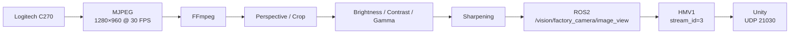
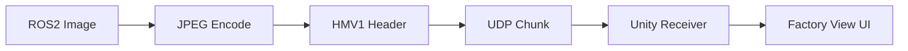
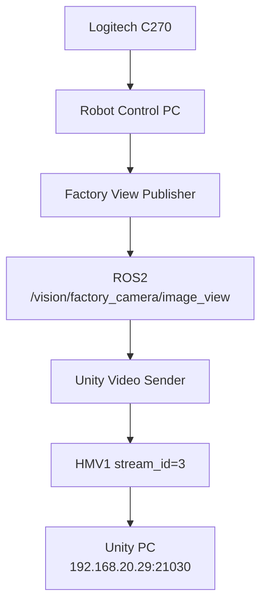

# Factory View

> **공장 전체 작업 상황을 Unity Digital Twin에 전달하는 전역 모니터링 영상 파이프라인**
> Factory View는 AI 판정용 카메라가 아니라, FR5·TurtleBot·Conveyor·Assembly Area를 한 화면에서 확인하기 위한 공장 전체 실영상 모니터링 기능입니다.

---

## 1. 역할

Factory View의 목적은 다음과 같습니다.

- 공장 전체 작업 상황 확인
- FR5 작업 영역 모니터링
- TurtleBot 이동 상황 확인
- Conveyor / Assembly Area 확인
- Unity Digital Twin에 실영상 제공
- Incoming Inspection Camera와 역할 분리
- PRE_ROOF D435와 역할 분리

최종 시스템에서 Factory View는 **Global Overview 전용 카메라**로 정의합니다.

```text
Incoming Inspection Camera
= 입고 자재 AI 검사

Factory View Camera
= 공장 전체 모니터링

RealSense D435
= PRE_ROOF 근접 조립 품질검사
```

---

## 2. 최종 카메라

Factory View 최종 장비는 **Logitech C270**입니다.

### 최종 캡처 기준

| 항목 | 값 |
|:---|:---|
| Camera | Logitech C270 |
| Capture Format | MJPEG |
| Resolution | `1280 × 960` |
| FPS | `30` |
| ROS2 Topic | `/vision/factory_camera/image_view` |
| Unity Stream ID | `3` |
| Unity UDP Port | `21030` |

최종 카메라 연결은 안정적인 by-id 경로를 기준으로 사용합니다.

```text
/dev/v4l/by-id/usb-046d_C270_HD_WEBCAM_200901010001-video-index0
```

장치 번호 `/dev/video0`, `/dev/video2`처럼 실행 시점에 바뀔 수 있는 경로보다 by-id를 사용해 재부팅 후에도 같은 카메라를 안정적으로 선택하도록 했습니다.

---

## 3. 최종 영상 파이프라인

Factory View는 다음 순서로 처리됩니다.



Factory View는 AI Detection이나 품질판정을 수행하지 않고, **보정된 전체 공장 영상을 안정적으로 제공하는 것**에 집중합니다.

---

## 4. 왜 별도 카메라로 분리했는가

프로젝트 초반에는 하나의 Global Camera 개념으로 여러 역할을 처리하려 했지만, 실제 운영에서는 요구사항이 서로 달랐습니다.

### Incoming Inspection Camera

- 자재 검사에 적합한 시야 필요
- YOLO / ROI / Auto Alignment 필요
- 자재 크기와 위치가 중요

### Factory View Camera

- 공장 전체가 한눈에 보여야 함
- AI 판정보다 넓은 시야가 중요
- Unity 모니터링이 주요 목적

### RealSense D435

- 구조물 근접 검사 필요
- RGB와 Depth 동시 사용
- Robot View Pose와 연동 필요

이 차이를 반영해 세 카메라의 책임을 분리했습니다.

---

## 5. 설치 후 발생한 문제

Factory View는 카메라를 연결하는 것만으로 원하는 화면이 바로 나오지 않았습니다.

실제 설치 후 다음 문제가 있었습니다.

- 카메라 설치 각도 때문에 화면 원근 왜곡 발생
- 공장 중앙 작업 영역이 화면에서 기울어져 보임
- 필요 없는 주변 영역이 많이 포함됨
- 실제 설비가 화면 안에서 작게 보임
- 조명 때문에 밝기와 색감이 불안정함
- 기본 Sharpness만으로는 멀리 있는 설비가 흐리게 보임

따라서 카메라 하드웨어 제어와 FFmpeg 영상 보정을 함께 사용했습니다.

---

## 6. 최종 Camera Control

Factory View 최종 영상에서 사용한 카메라 제어값은 다음과 같습니다.

| 항목 | 최종값 |
|:---|---:|
| `auto_exposure` | `3` |
| `exposure_dynamic_framerate` | `0` |
| `white_balance_automatic` | `1` |
| `brightness` | `150` |
| `contrast` | `43` |
| `saturation` | `34` |
| `sharpness` | `72` |
| `backlight_compensation` | `1` |

이 값은 실제 공장 배치와 조명에서 반복 확인한 뒤 최종값으로 고정했습니다.

최종 운영에서는 불필요한 재튜닝으로 영상 기준이 달라지지 않도록 설정을 고정해 사용합니다.

---

## 7. Perspective 보정

카메라가 공장 상부에서 완전히 수직으로 내려다보는 구조가 아니기 때문에 원근 왜곡이 발생했습니다.

이를 보정하기 위해 FFmpeg `perspective` 필터를 사용했습니다.

최종 기준:

```text
x0=250:y0=0
x1=1170:y1=0
x2=135:y2=960
x3=1170:y3=960
```

이를 통해 공장 작업 영역의 좌우 왜곡을 줄이고, Unity에서 공장 전체 레이아웃을 더 자연스럽게 볼 수 있도록 조정했습니다.

---

## 8. Crop / Scale

Perspective 보정 이후에는 실제로 필요한 공장 영역만 남기기 위해 Crop을 적용했습니다.

```text
crop=1170:860:100:50
```

이후 Unity 표시와 ROS2 영상 처리에서 일관된 해상도를 사용하기 위해 다음 Scale을 적용했습니다.

```text
scale=1280:960
```

Crop / Scale은 **공장 중심 영역이 Unity 화면에서 충분히 크게 보이도록** 조정했습니다.

---

## 9. 밝기·색감 보정

실제 공장 조명 아래에서는 기본 카메라 출력만으로는 일부 영역이 어둡거나 대비가 부족했습니다.

최종 FFmpeg 영상 보정값은 다음과 같습니다.

```text
brightness = 0.060
contrast   = 1.04
gamma      = 1.045
saturation = 0.98
```

밝기를 과도하게 높이면 흰색 구조물이나 조명 반사 영역이 날아갈 수 있기 때문에, 단순 밝기 증가보다 Contrast와 Gamma를 함께 조정했습니다.

---

## 10. Sharpening

멀리 있는 FR5, Conveyor, 작업대 경계가 흐리게 보이는 문제를 줄이기 위해 Unsharp Filter를 적용했습니다.

최종 기준:

```text
unsharp=7:7:0.65:5:5:0.0
```

Sharpening은 물체 인식을 위한 전처리가 아니라 **사람이 모니터링할 때 설비 경계를 더 쉽게 확인하기 위한 영상 품질 보정**입니다.

---

## 11. 최종 FFmpeg Filter

최종 Factory View Filter는 다음과 같습니다.

```text
perspective=
x0=250:y0=0:
x1=1170:y1=0:
x2=135:y2=960:
x3=1170:y3=960:
sense=source:
interpolation=cubic,

crop=1170:860:100:50,

scale=1280:960:flags=lanczos,

eq=
brightness=0.060:
contrast=1.04:
gamma=1.045:
saturation=0.98,

unsharp=7:7:0.65:5:5:0.0
```

실제 구현에서는 위 내용을 한 줄의 FFmpeg Filter Chain으로 사용합니다.

---

## 12. ROS2 Publisher

보정된 Factory View Frame은 ROS2 Topic으로 Publish합니다.

최종 Topic:

```text
/vision/factory_camera/image_view
```

Factory View Publisher의 역할은 다음과 같습니다.

1. C270 Device Open
2. Camera Control 적용
3. MJPEG Capture
4. FFmpeg Filter 적용
5. ROS2 Image Publish
6. Runtime 상태 확인

Factory View는 검사 결과를 생성하지 않기 때문에 Detection Topic이나 품질판정 결과는 별도로 만들지 않습니다.

---

## 13. Unity 영상 전송

Factory View ROS2 Image는 Unity Video Sender를 통해 HMV1 형식으로 전송합니다.



최종 기준:

| 항목 | 값 |
|:---|:---:|
| Stream ID | `3` |
| UDP Port | `21030` |
| HMV1 Header | `32 bytes` |
| Chunk Payload | `≤ 1200 bytes` |
| Transport | UDP |

Unity에서는 Chunk를 Frame 단위로 재조립해 Factory View 화면에 표시합니다.

---

## 14. HMV1을 사용한 이유

ROS2 Image는 한 Frame 크기가 크기 때문에 전체 Frame을 하나의 UDP Datagram으로 보낼 수 없습니다.

따라서 다음 구조를 사용했습니다.

```text
ROS2 Image
→ JPEG 압축
→ Frame ID 생성
→ HMV1 Header 추가
→ Payload Chunk 분할
→ UDP 전송
→ Unity Frame 재조립
```

HMV1은 실시간 모니터링 목적의 경량 프로토콜입니다.

따라서 다음 기능은 포함하지 않습니다.

- ACK 기반 재전송
- 파일 전송 보장
- 손실 Packet 재요청

실시간 영상에서는 최신 Frame을 빠르게 보여주는 것을 우선했습니다.

---

## 15. 최종 실제 화면


최종 화면에서는 다음 영역을 한 번에 확인할 수 있도록 구성했습니다.

- FR5 작업 영역
- 조립 작업대
- Conveyor
- 이동 로봇 동선
- 공장 주요 설비

이 화면은 AI 검사 결과가 아니라 **작업 상황을 사람이 확인하기 위한 전역 모니터링 영상**입니다.

---

## 16. Vision PC 의존성 제거

Factory View는 초기에는 Vision PC에서 실행했지만, 최종 운영 구조에서는 Factory View 때문에 Vision PC를 항상 유지할 필요가 없도록 분리했습니다.

최종 방향:

```text
Logitech C270
        ↓
Robot Control PC
        ↓
Factory View Publisher
        ↓
ROS2 Image
        ↓
Unity Video Sender
        ↓
Unity PC
```

이 구조를 통해 Robot Control PC가 Factory View의 운영 주체가 될 수 있습니다.

---

## 17. Robot Control PC 인계

Factory View는 실행 파일과 설정을 별도로 묶어 Robot Control 담당자에게 전달할 수 있도록 패키지화했습니다.

최종 인계 Archive:

```text
factory_view_robot_control_v1.tar.gz
```

SHA256:

```text
90c7a6f50540c9629e9c509c365268ce2ce4920cc7c311036d03282971d4c1ad
```

인계 패키지에는 다음 요소를 포함합니다.

- Factory View Publisher
- Unity Video Sender
- 최종 Camera Config
- Start Script
- Stop Script
- Verify Script
- README

목적은 Robot Control PC에서 별도 튜닝 없이 **동일한 Factory View 기준으로 실행**할 수 있게 하는 것입니다.

---

## 18. 최종 네트워크 기준

Factory View 운영에 필요한 주요 네트워크 기준은 다음과 같습니다.

| 시스템 | IP / Port |
|:---|:---|
| Robot Control PC | `192.168.20.10` |
| Unity PC | `192.168.20.29` |
| Unity Factory View Port | `21030` |
| ROS Domain | `90` |

Factory View Sender의 최종 목적지는 다음과 같습니다.

```text
192.168.20.29:21030
```

Unity Receiver가 Port만 Bind하는 구조라면 Sender PC가 Vision PC에서 Robot Control PC로 바뀌어도 Unity 코드는 변경할 필요가 없습니다.

반대로 Sender IP를 별도로 제한하는 경우에는 허용 IP를 Robot Control PC 기준으로 수정해야 합니다.

---

## 19. 최종 운영 구조

Factory View 최종 운영 흐름은 다음과 같습니다.



Factory View를 Robot Control PC에 분리하면서 다음 장점이 생겼습니다.

- Vision PC 의존성 감소
- 카메라와 로봇 제어 PC의 물리적 배치 단순화
- 공장 전체 영상 전송 경로 단순화
- Vision 검사 Runtime과 모니터링 Runtime 책임 분리

---

## 20. 검증 항목

| 검증 항목 | 결과 |
|:---|:---:|
| C270 MJPEG 1280×960 @ 30 FPS | PASS |
| Camera Control 적용 | PASS |
| Perspective 보정 | PASS |
| Crop / Scale | PASS |
| Brightness / Contrast / Gamma 조정 | PASS |
| ROS2 Image Publish | PASS |
| `/vision/factory_camera/image_view` | PASS |
| HMV1 stream_id `3` | PASS |
| Unity UDP `21030` 전송 | PASS |
| Robot Control PC 인계 패키지 생성 | PASS |

---

## 21. 해결한 핵심 문제

| 문제 | 해결 |
|:---|:---|
| 설치 각도 때문에 화면 왜곡 | FFmpeg Perspective Correction |
| 필요 없는 주변 영역 포함 | Crop + Scale |
| 조명 때문에 영상이 어둡거나 탁함 | Brightness / Contrast / Gamma 조정 |
| 멀리 있는 설비 경계가 흐림 | Unsharp Filter |
| `/dev/video*` 번호 변경 가능성 | Stable by-id Device 사용 |
| Factory View 때문에 Vision PC가 계속 필요 | Robot Control PC 실행 패키지로 분리 |
| Unity에서 ROS2 Image 직접 사용 어려움 | HMV1 JPEG Chunked UDP |

---

## 22. 최종 구조 요약

```text
Logitech C270
        ↓
MJPEG 1280×960 @ 30 FPS
        ↓
Camera Control
        ↓
FFmpeg
├── Perspective
├── Crop / Scale
├── Brightness / Contrast / Gamma
└── Sharpening
        ↓
ROS2 /vision/factory_camera/image_view
        ↓
JPEG Encode
        ↓
HMV1 stream_id=3
        ↓
UDP 21030
        ↓
Unity Digital Twin
```

Factory View의 핵심은 단순 Webcam Streaming이 아니라, **실제 공장 설치 환경에 맞춰 영상 Geometry와 품질을 고정하고, ROS2와 Unity 사이의 운영 가능한 모니터링 파이프라인으로 만든 것**입니다.

---

## 전체 문서 목차

1. [AI Perception / Vision](../README.md)
2. [프로젝트 개요](01_project_overview.md)
3. [시스템 아키텍처](02_system_architecture.md)
4. [입고 자재 검사](03_incoming_inspection.md)
5. **현재 문서 — Factory View**
6. [PRE_ROOF 조립 품질검사](05_pre_roof_qc.md)
7. [서버·로봇·Unity 연동](06_integration.md)
8. [검증 결과](07_validation.md)
9. [문제 해결 과정](08_problem_solving.md)
10. [프로젝트 구조](09_project_structure.md)
