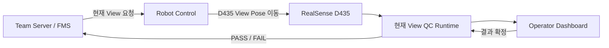
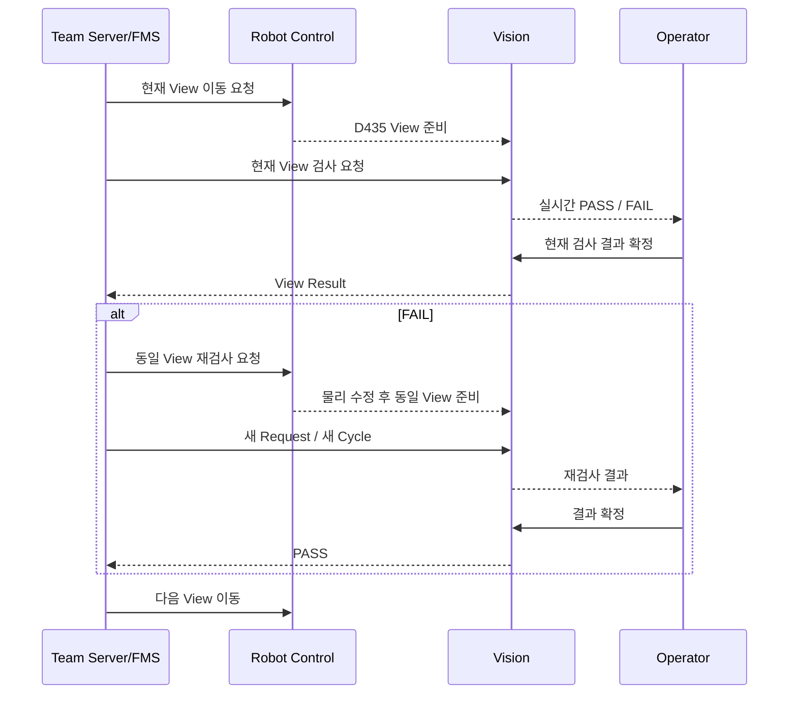
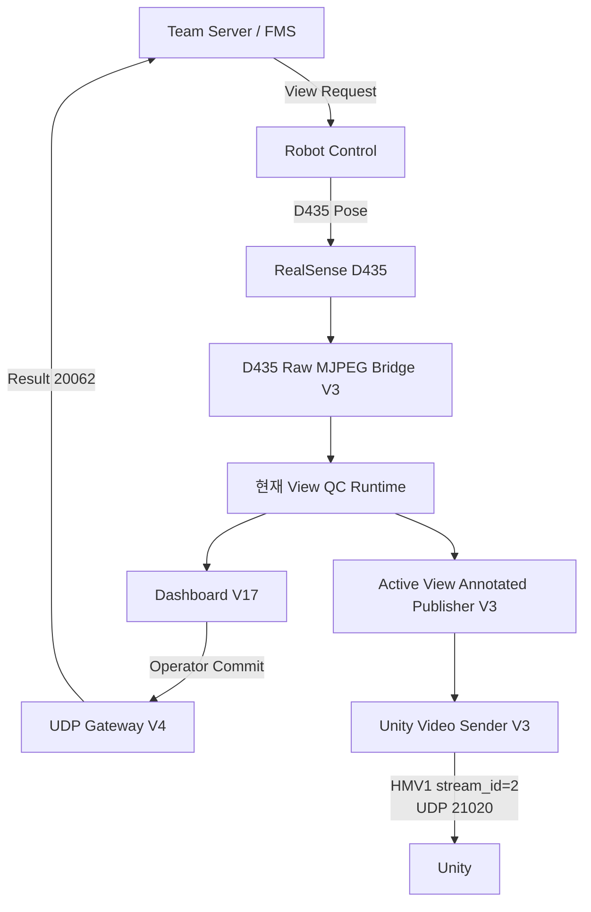

# PRE_ROOF 조립 품질검사

> **지붕 조립 전 구조물의 조립 상태를 RealSense D435의 RGB·Depth 정보로 검사하는 5방향 품질검사 시스템**
> TOP / LEFT / RIGHT / FRONT / BEHIND를 각각 독립된 검사 기준으로 운영하고, FAIL 발생 시 같은 View를 물리적으로 수정한 뒤 다시 검사하는 실제 생산 흐름까지 연결했습니다.

---

## 1. 검사 목적

PRE_ROOF 검사는 지붕을 조립하기 전에 현재 구조물이 정상적으로 조립됐는지 확인하는 공정입니다.

검사 목적은 단순 객체 존재 여부가 아니라 다음과 같은 **조립 상태 이상**을 확인하는 것입니다.

- 구조물 위치 이상
- 조립 누락
- 비정상 구조 형상
- Hole / Shape 이상
- RGB에서 보이는 표면·구조 차이
- Depth에서 확인되는 거리·형상 차이

최종 시스템은 하나의 정면 이미지로 전체를 판정하지 않고, RealSense D435를 다섯 방향으로 이동해 검사합니다.

```text
TOP
LEFT
RIGHT
FRONT
BEHIND
```

---

## 2. 왜 5방향 검사가 필요한가

조립 구조물은 보는 방향에 따라 보이는 구조가 다릅니다.

예를 들어 TOP에서 잘 보이는 Hole과 상면 구조는 FRONT나 BEHIND에서는 충분히 보이지 않을 수 있고, 측면 구조는 LEFT / RIGHT에서 더 명확하게 확인할 수 있습니다.

따라서 다음과 같은 방식으로 설계했습니다.

```text
하나의 공통 검사 기준
X

각 View별 독립 기준
O
```

각 View는 다음 항목을 독립적으로 관리합니다.

- Reference / Golden
- ROI
- Threshold
- Position Tolerance
- RGB 구조 검사 Metric
- Depth 검사 기준
- 현재 View Runtime

---

## 3. D435 입력 구성

PRE_ROOF의 Local Camera는 Intel RealSense D435입니다.

최종 입력 기준은 다음과 같습니다.

| 항목 | 값 |
|:---|:---|
| Color | `640 × 480` |
| Depth | `848 × 480` |
| Depth Align | `false` |
| Spatial Filter | 사용 |
| Temporal Filter | 사용 |
| Hole Filling | 사용 안 함 |
| Emitter | 사용 |

Color Camera Intrinsic 기준:

```text
fx = 605.69
fy = 604.54
cx = 322.92
cy = 245.91
```

Depth를 Color Frame에 강제로 Align하지 않고, 필요한 경우 Camera Intrinsic을 기준으로 좌표 관계를 다루는 구조를 사용했습니다.

---

## 4. Robot Control과 View Pose

D435는 Robot Control이 각 검사 위치로 이동시킵니다.

Vision이 Robot Motion을 직접 제어하지 않고, Server와 Robot Control이 현재 검사 View를 준비하면 Vision은 그 Frame을 검사합니다.



### 최종 View 회전 기준

Robot Control과 D435의 실제 검사 방향에서 사용한 최종 회전 기준은 다음과 같습니다.

| View | 회전 기준 |
|:---|:---:|
| TOP | `0°` |
| LEFT | `180°` |
| RIGHT | `180°` |
| FRONT | `180°` |
| BEHIND | `0°` |

이는 각 View가 Dashboard와 검사 Runtime에서 동일한 방향으로 보이도록 맞추기 위한 운영 기준입니다.

---

## 5. 최종 Runtime 버전

최종 검증에 사용한 PRE_ROOF Runtime은 다음과 같습니다.

| View | 최종 Runtime | Service Port |
|:---|:---:|---:|
| TOP | V7 | `8775` |
| LEFT | V4 | `8777` |
| RIGHT | V8 | `8785` |
| FRONT | V2 | `8787` |
| BEHIND | V5 | `8792` |
| Dashboard | V17 | `8811` |

통합 구성 요소:

```text
TOP V7
LEFT V4
RIGHT V8
FRONT V2
BEHIND V5
Dashboard V17
UDP Gateway V4
D435 Raw MJPEG Bridge V3
Active View Annotated Publisher V3
Unity Video Sender V3
```

---

## 6. 검사 구조

PRE_ROOF 검사는 단순한 하나의 Confidence Score로 판정하지 않습니다.

각 View에서 필요한 구조를 ROI 단위로 확인하고, RGB / Depth 특성에 따라 여러 Metric을 사용합니다.

개념적으로는 다음과 같습니다.

```text
D435 RGB / Depth
        ↓
현재 View 선택
        ↓
View별 Reference / ROI
        ↓
구조 / 위치 / 밝기 / Depth Metric
        ↓
개별 항목 PASS / FAIL
        ↓
현재 View Overall
        ↓
Dashboard
        ↓
Operator Commit
```

---

## 7. View별 독립 기준

### TOP

TOP은 상면 구조와 Hole Pattern, 주요 조립 상태를 확인하는 View입니다.

실물 검증 과정에서 정상 구조물도 몇 px 위치 변화 때문에 불안정해지는 문제가 있어 **구조 검색 허용 범위**를 적용했습니다.

최종 튜닝에서 일부 구조는 일반 검색 범위보다 넓은 Position Tolerance를 사용해 정상 오검출을 줄였습니다.

예를 들어 `COLUMN_2`는 Threshold 자체를 낮추기보다 **위치 허용 범위를 ±15 px로 확장**하는 방향으로 수정했습니다.

핵심 원칙:

```text
정상 구조의 위치 편차
→ Threshold를 무작정 낮추지 않음
→ 필요한 항목의 Position Tolerance 조정
```

---

### LEFT

LEFT는 좌측 조립 구조를 확인합니다.

TOP과 동일한 Threshold를 공유하지 않고 LEFT 전용 Reference와 ROI를 사용합니다.

최종 Runtime:

```text
LEFT V4
Service Port 8777
```

---

### RIGHT

RIGHT는 우측 조립 구조를 확인합니다.

최종 Runtime:

```text
RIGHT V8
Service Port 8785
```

실제 물리 검증에서 정상 / 불량 상태를 확인한 뒤 최종 버전을 고정했습니다.

---

### FRONT

FRONT는 전면 구조를 확인합니다.

최종 Runtime:

```text
FRONT V2
Service Port 8787
```

최종 불량 검증 영상에서도 FRONT의 FAIL ROI를 실제로 확인했습니다.

---

### BEHIND

BEHIND는 후면 구조를 확인합니다.

기존 Reference가 현재 실물 Pose와 맞지 않아 정상 구조가 불안정하게 판정되는 문제가 있었고, **현재 정상 D435 Frame을 기준으로 Reference를 다시 보정**했습니다.

최종 Runtime:

```text
BEHIND V5
Service Port 8792
```

최종 검증에서 사용한 주요 Threshold 기준:

```text
mean = 40
p95  = 120
corr = 0.75
```

Threshold를 바꾸기 전에 실제 정상 Pose의 Reference가 올바른지 먼저 확인하는 방식으로 문제를 해결했습니다.

---

## 8. RGB와 Depth를 함께 사용하는 이유

RGB만으로는 다음 문제가 발생할 수 있습니다.

- 그림자
- 표면 반사
- 색상 변화
- 조명 밝기 변화

Depth는 색상과 무관하게 구조물까지의 거리와 형상을 확인할 수 있기 때문에 RGB와 다른 정보를 제공합니다.

따라서 PRE_ROOF에서는 검사 대상에 따라 RGB와 Depth 정보를 함께 활용합니다.

```text
RGB
→ 색상 / Edge / 구조 / 밝기

Depth
→ 거리 / 형상 / 돌출 / 누락
```

모든 ROI가 반드시 동일한 RGB / Depth Metric을 사용하는 것은 아니며, **View와 검사 대상 특성에 맞춰 필요한 Metric을 선택**합니다.

---

## 9. 정상 오검출 문제

PRE_ROOF 개발에서 가장 큰 문제 중 하나는 **실제로 정상인 구조물이 FAIL로 흔들리는 것**이었습니다.

주요 원인은 다음과 같았습니다.

- Robot Pose의 미세 차이
- D435 Frame 위치 변화
- 그림자
- 반사
- 몇 px 수준의 구조 위치 차이
- Reference와 현재 실물 Pose 차이

이를 해결하기 위해 다음 순서로 접근했습니다.

```text
정상 실물 반복 검사
→ FAIL ROI 확인
→ Reference / Position / Threshold 원인 분리
→ View별 허용 범위 조정
→ 정상 재검증
→ 불량 재검증
```

정상 PASS를 맞추기 위해 Threshold부터 낮추지 않았습니다.

가능하면 먼저 다음 항목을 확인했습니다.

- Reference가 현재 Pose와 맞는가
- ROI 위치가 올바른가
- Position Tolerance가 너무 좁은가
- 조명 / 반사가 원인인가

---

## 10. Physical Validation

최종 PRE_ROOF는 Synthetic이나 저장 이미지 검증으로 끝내지 않고 **실제 조립 구조물을 물리적으로 변경하면서 정상·불량 검증**을 수행했습니다.

검증 방식:

```text
정상 구조물 준비
→ 5방향 검사
→ 정상 PASS 확인

불량 구조물 구성
→ 해당 View 검사
→ FAIL 확인
→ 실제 구조 수정
→ 같은 View 재검사
→ PASS 확인
```

이를 통해 단순 Threshold Test가 아니라 실제 생산 흐름에서 사용할 수 있는지 확인했습니다.

---

## 11. 실제 정상 판정


최종 정상 영상에서는 5개 View 검사가 완료되고 최종 정상 상태가 표시되는 것을 확인할 수 있습니다.

**PRE_ROOF 정상 판정 영상**

https://github.com/user-attachments/assets/4b866fdb-ac78-4951-bcdf-b03d5bad8572

---

## 12. 실제 불량 판정


불량 영상에서는 실제 FAIL ROI와 현재 View 상태, Depth 화면, Dashboard 상태를 함께 확인할 수 있습니다.

**PRE_ROOF 불량 판정 영상**

https://github.com/user-attachments/assets/d1e2b7ba-336d-4712-9728-73fd8633b090

---

## 13. View-by-View 검사 방식

최종 Server 연동은 하나의 Request로 TOP부터 BEHIND까지 5개 View를 한 번에 검사하는 구조가 아닙니다.

**현재 View 하나씩 요청하고 결과를 확정하는 방식**입니다.



---

## 14. FAIL 이후 재검사

FAIL이 발생하면 Vision이 자동으로 다음 View로 진행하지 않습니다.

실제 제조 공정에서 필요한 흐름은 다음과 같습니다.

```text
FAIL 발생
→ Team Server가 동일 View 재검사 결정
→ 물리적인 조립 상태 수정
→ Robot Control이 같은 View Pose 준비
→ 새로운 Request / Cycle 생성
→ Vision 재검사
→ PASS 확인
→ 다음 View 진행
```

이 구조를 통해 **실제 불량 수정 후 재검사**라는 제조 공정의 의미를 유지했습니다.

---

## 15. Operator 역할

Server 주도 검사에서 Operator는 View 순서를 직접 제어하지 않습니다.

Operator의 핵심 동작:

```text
현재 검사 결과 확정
```

역할 분리:

| 구성 요소 | 책임 |
|:---|:---|
| Vision Runtime | 현재 View 검사 |
| Operator | 현재 검사 결과 Commit |
| Team Server/FMS | View 순서 / 재검사 관리 |
| Robot Control | D435 View Pose 이동 |

이렇게 역할을 나누면서 UI가 생산 순서를 임의로 바꾸지 않도록 했습니다.

---

## 16. UDP Gateway

PRE_ROOF Gateway는 Team Server와 UDP로 통신합니다.

| 구분 | Port |
|:---|:---:|
| Vision Request 수신 | `20061` |
| Team Server Result 전송 | `20062` |

최종 Gateway 버전:

```text
UDP Gateway V4
```

Gateway는 Server의 현재 View 요청과 Vision Result를 연결하며, View-by-View 재검사 흐름을 지원합니다.

---

## 17. Dashboard

최종 Dashboard:

```text
Dashboard V17
Port 8811
```

Dashboard에서는 다음 정보를 한 화면에서 확인할 수 있도록 구성했습니다.

- 현재 View
- View별 검사 상태
- Live 검사 결과
- PASS / FAIL
- 현재 검사 결과 확정
- PRE_ROOF Annotated Image
- D435 관련 화면
- 전체 진행 상태

Dashboard는 검사 순서를 직접 소유하지 않고 **현재 Server Request의 검사 상태를 보여주고 Commit하는 역할**에 집중합니다.

---

## 18. D435 Raw MJPEG Bridge

D435 원본 RGB 영상을 Runtime / Dashboard 측에서 사용할 수 있도록 Raw MJPEG Bridge를 구성했습니다.

최종 버전:

```text
D435 Raw MJPEG Bridge V3
Port 8820
```

이 Bridge는 Robot Control PC에서 제공되는 D435 영상을 Vision Runtime에서 사용할 수 있도록 연결하는 역할을 합니다.

---

## 19. Active View Annotated Publisher

PRE_ROOF 검사 결과 영상은 현재 활성 View의 Annotated Image를 ROS2 Topic으로 Publish합니다.

최종 버전:

```text
PRE_ROOF Active View Annotated Publisher V3
```

대표 출력:

```text
/vision/pre_roof/annotated_image
```

최종 영상 기준:

```text
1280 × 720
BGR8
step = 3840
```

이 Topic은 Unity PRE_ROOF 영상 전송의 입력으로 사용됩니다.

---

## 20. Unity 영상 전송

PRE_ROOF Annotated Image는 Unity에 HMV1 Stream으로 전달합니다.

```text
/vision/pre_roof/annotated_image
→ JPEG Encode
→ HMV1
→ stream_id=2
→ UDP 21020
→ Unity
```

최종 기준:

| 항목 | 값 |
|:---|:---:|
| Stream ID | `2` |
| UDP Port | `21020` |
| HMV1 Header | `32 bytes` |
| Chunk Payload | `≤ 1200 bytes` |
| Frame | `1280 × 720` |

로컬 HMV1 E2E에서 Datagram 최대 크기와 JPEG Reassembly / Decode까지 확인했습니다.

---

## 21. 최종 PRE_ROOF 데이터 흐름



---

## 22. 최종 검증 결과

| 검증 항목 | 결과 |
|:---|:---:|
| D435 RGB 입력 | PASS |
| D435 Depth 입력 | PASS |
| TOP V7 | PASS |
| LEFT V4 | PASS |
| RIGHT V8 | PASS |
| FRONT V2 | PASS |
| BEHIND V5 | PASS |
| Dashboard V17 | PASS |
| 정상 구조물 5방향 실물 검사 | PASS |
| 불량 구조물 실물 검사 | PASS |
| FAIL → 동일 View 재검사 → PASS | PASS |
| UDP Gateway Server 연동 | PASS |
| `/vision/pre_roof/annotated_image` | PASS |
| Unity HMV1 stream_id `2` | PASS |
| Unity UDP `21020` | PASS |

---

## 23. 해결한 핵심 문제

| 문제 | 해결 |
|:---|:---|
| View마다 보이는 구조가 다름 | 5개 View Runtime 분리 |
| 정상 구조가 몇 px 차이로 FAIL | Position Tolerance / Search 범위 조정 |
| Reference와 현재 Pose 불일치 | 정상 실물 Frame 기준 Reference 재보정 |
| 조명 / 반사로 RGB가 흔들림 | View별 Threshold / Metric 분리 |
| RGB만으로 구조 판단이 어려움 | D435 Depth 정보 병행 |
| FAIL 후 다음 공정 흐름 불명확 | Server 주도 동일 View 재검사 |
| Operator가 순서를 제어하면 상태 꼬임 | Operator는 Commit만 수행 |
| Unity에 ROS2 Image 직접 전달 어려움 | Active View Publisher + HMV1 UDP |

---

## 24. 최종 구조 요약

```text
Team Server / FMS
        ↓
현재 View Request
        ↓
Robot Control
        ↓
D435 View Pose
        ↓
RGB / Depth
        ↓
현재 View Runtime
        ↓
Dashboard
        ↓
Operator Commit
        ↓
UDP Gateway V4
        ↓
PASS / FAIL Result
        ↓
Team Server

동시에

현재 View Annotated Image
        ↓
ROS2 /vision/pre_roof/annotated_image
        ↓
HMV1 stream_id=2
        ↓
Unity UDP 21020
```

PRE_ROOF는 **각 View의 구조 차이를 독립적으로 검사하고, 물리적 불량 수정 후 동일 View 재검사까지 생산 흐름에 연결**했습니다.

---

## 전체 문서 목차

1. [AI Perception / Vision](../README.md)
2. [프로젝트 개요](01_project_overview.md)
3. [시스템 아키텍처](02_system_architecture.md)
4. [입고 자재 검사](03_incoming_inspection.md)
5. [Factory View](04_factory_view.md)
6. **현재 문서 — PRE_ROOF 조립 품질검사**
7. [서버·로봇·Unity 연동](06_integration.md)
8. [검증 결과](07_validation.md)
9. [문제 해결 과정](08_problem_solving.md)
10. [프로젝트 구조](09_project_structure.md)
