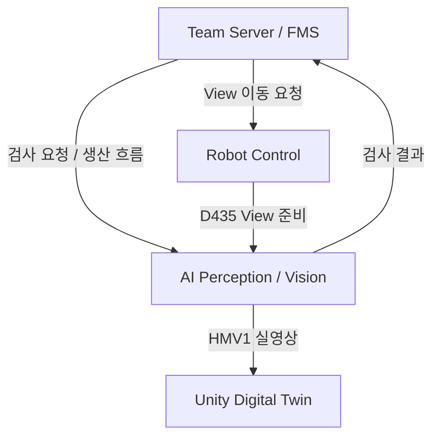
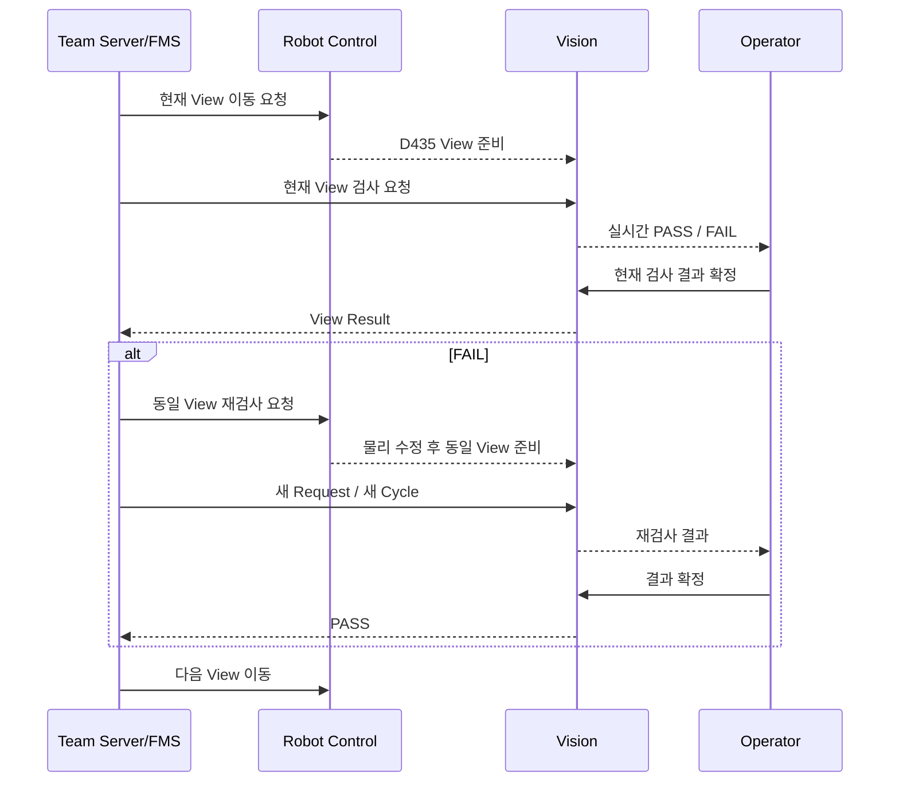
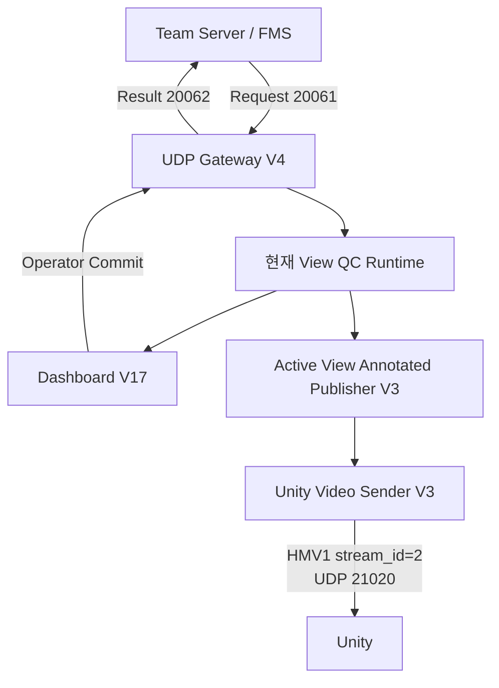
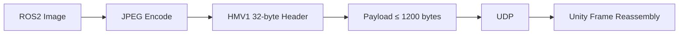

# 서버·로봇·Unity 연동

> **Vision 결과와 실영상을 Team Server/FMS, Robot Control, Unity에 연결하는 통합 인터페이스**
> Incoming Inspection, PRE_ROOF QC, Factory View의 외부 시스템 연동 방식을 정리했습니다.

---

## 1. 연동 구조

Vision은 독립적으로 검사만 수행하는 것이 아니라, 실제 생산 흐름 안에서 다음 시스템과 연결됩니다.

- **Team Server / FMS**: 검사 요청, 생산 순서, 재검사 흐름 관리
- **Robot Control**: FR5 제어, D435 View Pose 이동
- **Unity Digital Twin**: Vision 실영상 표시
- **Vision Runtime**: 현재 검사 결과 생성 및 영상 Publish



핵심은 **검사 결과의 소유권과 생산 순서의 소유권을 분리**한 것입니다.

```text
Vision
= 현재 검사 결과 생성

Team Server / FMS
= 공정 순서 / 재검사 관리

Robot Control
= 실제 로봇 / 카메라 이동

Unity
= 실영상 / 상태 시각화
```

---

## 2. Incoming Inspection 연동

Incoming Inspection은 생산 시작 전 HOUSE A / HOUSE B 자재 상태를 검사합니다.

### 기본 흐름

```text
Team Server Request
        ↓
Vision Request 수신
        ↓
ACK
        ↓
실제 Incoming 검사
        ↓
PASS / FAIL Result
        ↓
Team Server
```

대표 포트:

| 구분 | Port |
|:---|:---:|
| Incoming Request | `20051` |
| Incoming Result | `20052` |

---

## 3. ACK와 Result 분리

Incoming 연동에서 중요하게 구분한 항목은 `ACK`와 `Result`입니다.

```text
ACK
= Request가 정상적으로 도착했고
  Vision Transaction이 수락됐다는 의미

Result
= 실제 검사가 완료된 뒤
  생성된 최종 검사 결과
```

이 둘을 분리하지 않으면 Server가 단순 요청 수신을 검사 완료로 잘못 해석할 수 있습니다.

따라서 통신 의미를 다음과 같이 분리했습니다.

```text
Request Received
≠
Inspection Completed
```

검사 Transaction과 상태는 SQLite 기반으로 관리해 요청과 결과의 상관관계를 추적할 수 있도록 구성했습니다.

---

## 4. PRE_ROOF 연동

PRE_ROOF는 Incoming과 달리 한 번의 Request로 전체 5방향을 자동 검사하지 않습니다.

최종 방식은 **View-by-View Server 주도 검사**입니다.



대표 포트:

| 구분 | Port |
|:---|:---:|
| PRE_ROOF Request 수신 | `20061` |
| PRE_ROOF Result 전송 | `20062` |

최종 Gateway:

```text
UDP Gateway V4
```

---

## 5. PRE_ROOF에서 Server가 관리하는 항목

PRE_ROOF에서는 Server가 다음 항목을 관리합니다.

- 현재 검사 View
- 다음 검사 View
- FAIL 이후 동일 View 재검사 여부
- 새로운 Request ID / Cycle
- 전체 생산 진행 상태

Vision은 Server가 요청한 현재 View만 검사합니다.

```text
Server
→ "FRONT 검사"

Vision
→ FRONT Runtime 검사
→ PASS / FAIL 반환
```

Vision이 임의로 `LEFT → RIGHT → FRONT` 순서를 바꾸지 않도록 책임을 분리했습니다.

---

## 6. Operator 역할

Operator Dashboard는 생산 순서를 직접 제어하지 않습니다.

Server 주도 최종 흐름에서 Operator의 핵심 동작은 다음입니다.

```text
현재 검사 결과 확정
```

역할 분리:

| 구성 요소 | 책임 |
|:---|:---|
| Vision Runtime | 현재 View 실시간 검사 |
| Operator | 현재 결과 Commit |
| Team Server/FMS | View 순서 / 재검사 |
| Robot Control | D435 View Pose 이동 |

이 구조를 통해 UI의 수동 조작 때문에 생산 순서와 Server 상태가 어긋나는 문제를 줄였습니다.

---

## 7. Robot Control 연동

PRE_ROOF에서 D435는 Robot Control 측에서 물리적으로 이동합니다.

Vision은 Robot Motion Planning을 직접 수행하지 않습니다.

### 역할

```text
Team Server
→ 현재 View 결정

Robot Control
→ D435를 해당 View Pose로 이동

Vision
→ 현재 RGB / Depth Frame 검사
```

이 구조를 통해 Vision과 Robot Motion을 독립적으로 검증할 수 있도록 했습니다.

---

## 8. PRE_ROOF 최종 연결 구성

최종 PRE_ROOF 통합 구성 요소는 다음과 같습니다.

```text
TOP V7
LEFT V4
RIGHT V8
FRONT V2
BEHIND V5
Dashboard V17
UDP Gateway V4
D435 Raw MJPEG Bridge V3
Active View Annotated Publisher V3
Unity Video Sender V3
```

### 연결 흐름



---

## 9. Unity 영상 전송 구조

Vision은 Unity에 세 종류의 실영상을 전달합니다.

| 영상 | Stream ID | UDP Port |
|:---|---:|---:|
| Incoming Inspection | `1` | `21010` |
| PRE_ROOF QC | `2` | `21020` |
| Factory View | `3` | `21030` |

공통 전송 방식:

```text
ROS2 Image
→ JPEG Encode
→ HMV1 Header
→ UDP Chunk
→ Unity Reassembly
```

---

## 10. HMV1 구조

HMV1은 Vision에서 Unity로 실시간 영상을 전달하기 위해 사용한 경량 UDP 영상 프로토콜입니다.

최종 기준:

| 항목 | 값 |
|:---|:---:|
| Header | `32 bytes` |
| Payload | `≤ 1200 bytes` |
| Transport | UDP |
| Compression | JPEG |

처리 흐름:



---

## 11. 왜 Chunk 방식이 필요한가

ROS2 Image 한 Frame은 UDP Datagram 하나에 그대로 넣기에는 너무 큽니다.

따라서 다음처럼 Frame을 나눠 보냅니다.

```text
Frame
→ JPEG
→ Chunk 0
→ Chunk 1
→ Chunk 2
→ ...
→ Unity에서 Frame ID 기준 재조립
```

HMV1은 실시간 모니터링을 우선한 구조이므로 다음 기능은 사용하지 않습니다.

- ACK 기반 재전송
- 누락 Packet 재요청
- 파일 전송 보장

최신 영상 Frame을 빠르게 보여주는 것이 우선입니다.

---

## 12. Incoming 영상 연동

Incoming Inspection의 Annotated Image는 Unity Stream 1로 전달합니다.

```text
Incoming Annotated Image
→ JPEG
→ HMV1 stream_id=1
→ UDP 21010
→ Unity
```

이 영상에서는 실제 자재 검사 ROI와 정상·불량 상태를 확인할 수 있습니다.

---

## 13. PRE_ROOF 영상 연동

PRE_ROOF는 현재 활성 View의 Annotated Image를 Unity에 전달합니다.

대표 ROS2 Topic:

```text
/vision/pre_roof/annotated_image
```

최종 기준:

```text
1280 × 720
BGR8
step = 3840
```

전송 흐름:

```text
/vision/pre_roof/annotated_image
→ JPEG
→ HMV1 stream_id=2
→ UDP 21020
→ Unity
```

로컬 HMV1 E2E 검증에서 다음 항목을 확인했습니다.

- HMV1 Header
- Chunk 분할
- Datagram 최대 크기
- Frame Reassembly
- JPEG Decode
- 최종 1280×720 Frame

---

## 14. Factory View 영상 연동

Factory View는 공장 전체 모니터링 영상입니다.

대표 ROS2 Topic:

```text
/vision/factory_camera/image_view
```

전송 흐름:

```text
Factory View ROS2 Image
→ JPEG
→ HMV1 stream_id=3
→ UDP 21030
→ Unity
```

Factory View는 AI 검사 결과가 아니라 Unity의 공장 전체 실영상 패널에 사용합니다.

---

## 15. Factory View 운영 주체 변경

Factory View는 초기에는 Vision PC에서 실행했지만 최종 운영 구조에서는 Robot Control PC에서 실행할 수 있도록 분리했습니다.

```text
Logitech C270
→ Robot Control PC
→ Factory View Publisher
→ Unity Video Sender
→ Unity PC
```

이 변경의 목적은 Factory View 때문에 Vision PC를 항상 유지하지 않아도 되도록 하는 것입니다.

---

## 16. Factory View 인계 패키지

Robot Control PC로 전달하기 위한 Factory View 인계 패키지를 별도로 구성했습니다.

```text
factory_view_robot_control_v1.tar.gz
```

SHA256:

```text
90c7a6f50540c9629e9c509c365268ce2ce4920cc7c311036d03282971d4c1ad
```

포함 요소:

- Factory View Publisher
- Unity Video Sender
- 최종 Camera Config
- Start Script
- Stop Script
- Verify Script
- README

---

## 17. 최종 네트워크 역할

대표 네트워크 역할은 다음과 같습니다.

| 시스템 | 역할 |
|:---|:---|
| Vision PC | Incoming / PRE_ROOF Vision Runtime |
| Robot Control PC | FR5 / D435 / Factory View 운영 가능 |
| Team Server PC | 검사 Request / 생산 흐름 / 재검사 |
| Unity PC | Digital Twin / Vision 실영상 |

Factory View 인계 기준:

```text
Robot Control PC : 192.168.20.10
Unity PC         : 192.168.20.29
Factory View UDP : 21030
ROS_DOMAIN_ID    : 90
```

PRE_ROOF / Incoming Vision Runtime은 별도 Vision 환경에서 운영하며, 각 시스템은 UDP와 ROS2 Interface를 통해 연결됩니다.

---

## 18. 통합 Interface 요약

| 기능 | Source | Destination | 방식 |
|:---|:---|:---|:---|
| Incoming Request | Team Server | Vision | UDP `20051` |
| Incoming Result | Vision | Team Server | UDP `20052` |
| PRE_ROOF Request | Team Server | Vision | UDP `20061` |
| PRE_ROOF Result | Vision | Team Server | UDP `20062` |
| Incoming Video | Vision | Unity | HMV1 `1 / 21010` |
| PRE_ROOF Video | Vision | Unity | HMV1 `2 / 21020` |
| Factory View | Robot Control / Vision | Unity | HMV1 `3 / 21030` |
| PRE_ROOF View 이동 | Team Server | Robot Control | Team Robot Interface |
| D435 Frame | Robot Control | Vision | Vision Input Path |

---

## 19. E2E 검증

최종 연동에서는 단순 Port Open만 확인하지 않고 실제 흐름을 검증했습니다.

### Incoming

```text
Server Request
→ ACK
→ 실제 검사
→ Result
→ Annotated Image
→ Unity
```

### PRE_ROOF

```text
Server View Request
→ Robot View 이동
→ Vision 검사
→ Operator Commit
→ Result
→ FAIL 시 동일 View 재검사
→ PASS 후 다음 View
```

### Factory View

```text
C270
→ ROS2
→ HMV1
→ Unity
```

---

## 20. 최종 검증 결과

| 검증 항목 | 결과 |
|:---|:---:|
| Incoming Request / ACK / Result | PASS |
| Incoming Unity HMV1 | PASS |
| PRE_ROOF Request / Result | PASS |
| PRE_ROOF View-by-View Flow | PASS |
| FAIL → 동일 View 재검사 → PASS | PASS |
| PRE_ROOF Annotated Image | PASS |
| PRE_ROOF Unity HMV1 | PASS |
| Factory View ROS2 Publish | PASS |
| Factory View Unity UDP `21030` | PASS |
| Factory View Robot Control 인계 패키지 | PASS |

---

## 21. 해결한 핵심 통합 문제

| 문제 | 해결 |
|:---|:---|
| Request 수신과 검사 완료 의미 혼동 | ACK / Result 분리 |
| PRE_ROOF 전체 5방향을 한 번에 묶는 구조 | View-by-View Server 주도 방식으로 변경 |
| FAIL 후 실제 수정·재검사 의미 부족 | 동일 View 새 Request / Cycle 재검사 |
| Operator가 공정 순서를 제어할 위험 | Operator는 현재 결과 Commit만 수행 |
| ROS2 Image를 Unity에서 직접 사용 어려움 | HMV1 JPEG Chunked UDP |
| Factory View 때문에 Vision PC 의존 | Robot Control PC 실행 패키지로 분리 |

---

## 22. 최종 구조 요약

```text
[검사 결과]
Team Server
    ↕
Incoming / PRE_ROOF Vision Runtime

[카메라 이동]
Team Server
    ↓
Robot Control
    ↓
D435 View Pose

[실영상]
Incoming  → HMV1 stream 1 → Unity
PRE_ROOF  → HMV1 stream 2 → Unity
Factory   → HMV1 stream 3 → Unity
```

최종 통합의 핵심은 **Vision이 모든 시스템을 직접 제어하는 구조가 아니라, 각 시스템의 책임을 분리한 상태에서 명확한 Interface로 연결한 것**입니다.

---

## 전체 문서 목차

1. [AI Perception / Vision](../README.md)
2. [프로젝트 개요](01_project_overview.md)
3. [시스템 아키텍처](02_system_architecture.md)
4. [입고 자재 검사](03_incoming_inspection.md)
5. [Factory View](04_factory_view.md)
6. [PRE_ROOF 조립 품질검사](05_pre_roof_qc.md)
7. **현재 문서 — 서버·로봇·Unity 연동**
8. [검증 결과](07_validation.md)
9. [문제 해결 과정](08_problem_solving.md)
10. [프로젝트 구조](09_project_structure.md)
