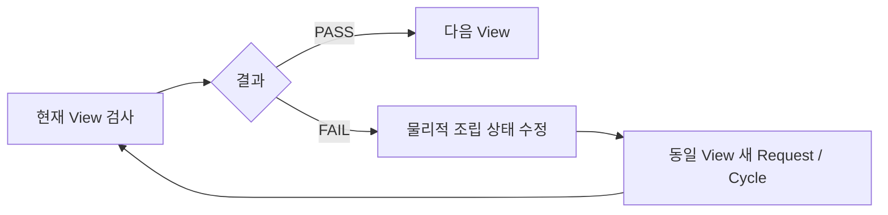

# 검증 결과

> **AI Perception / Vision의 최종 검증 항목과 실제 확인 근거**
> Incoming Inspection, Factory View, PRE_ROOF QC, Server/Unity 연동의 검증 항목과 확인 근거를 정리했습니다.

---

## 1. 검증 기준

Vision 검증은 프로그램 실행 여부뿐 아니라 실물 검사, 통신, 영상 전송을 구분해 확인했습니다.

최종 검증은 다음 다섯 종류로 구분했습니다.

| 구분 | 의미 |
|:---|:---|
| **실물 검증** | 실제 자재·구조물을 정상/불량 상태로 구성하고 판정 확인 |
| **런타임 검증** | 최종 Runtime / Topic / Dashboard가 의도한 상태로 동작하는지 확인 |
| **인터페이스 검증** | Request / ACK / Result 등 시스템 간 메시지 흐름 확인 |
| **영상 전송 검증** | ROS2 Image → HMV1 → UDP → Reassembly / Decode 흐름 확인 |
| **인계 검증** | 독립 실행 패키지, 설정, 파일 무결성 확인 |

이 구분을 통해 **모델 성능, 실제 장비 동작, 통신, 영상 전송을 서로 다른 검증 항목으로 관리**했습니다.

---

## 2. 전체 검증 요약

| 영역 | 검증 항목 | 결과 |
|:---|:---|:---:|
| Incoming | Camera → ROS2 | PASS |
| Incoming | Auto Alignment | PASS |
| Incoming | HOUSE A 정상 실물 검사 | PASS |
| Incoming | HOUSE A 불량 실물 검사 | PASS |
| Incoming | HOUSE B 정상 실물 검사 | PASS |
| Incoming | HOUSE B 불량 실물 검사 | PASS |
| Incoming | Request / ACK / Result 흐름 | PASS |
| Incoming | Unity HMV1 영상 | PASS |
| Factory View | C270 Capture / FFmpeg 보정 | PASS |
| Factory View | ROS2 Image Publish | PASS |
| Factory View | Unity UDP `21030` 전송 | PASS |
| Factory View | Robot Control 인계 Archive 생성 / 무결성 | PASS |
| PRE_ROOF | D435 RGB / Depth 입력 | PASS |
| PRE_ROOF | TOP V7 | PASS |
| PRE_ROOF | LEFT V4 | PASS |
| PRE_ROOF | RIGHT V8 | PASS |
| PRE_ROOF | FRONT V2 | PASS |
| PRE_ROOF | BEHIND V5 | PASS |
| PRE_ROOF | Dashboard V17 | PASS |
| PRE_ROOF | 정상 구조물 실물 검사 | PASS |
| PRE_ROOF | 불량 구조물 실물 검사 | PASS |
| PRE_ROOF | FAIL → 동일 View 재검사 → PASS | PASS |
| PRE_ROOF | Unity HMV1 영상 | PASS |

---

## 3. Incoming Inspection 실물 검증

Incoming Inspection은 HOUSE A / HOUSE B 각각 정상과 불량 상태를 실제로 구성해 검증했습니다.

검증 시나리오:

```text
HOUSE A 정상
HOUSE A 불량
HOUSE B 정상
HOUSE B 불량
```

### HOUSE A

| 정상 판정 | 불량 판정 |
|:---:|:---:|
|  |  |

**HOUSE A 정상 판정 영상**

https://github.com/user-attachments/assets/d4fe6eab-78e1-4c12-b795-b144971dad1f

**HOUSE A 불량 판정 영상**

https://github.com/user-attachments/assets/1475b359-8920-4c33-a93a-550d2caf4a83

### HOUSE B

| 정상 판정 | 불량 판정 |
|:---:|:---:|
|  |  |

**HOUSE B 정상 판정 영상**

https://github.com/user-attachments/assets/8568c3e3-7e25-4f02-8cb6-c659a05fa915

**HOUSE B 불량 판정 영상**

https://github.com/user-attachments/assets/5fd878ed-f8ff-4fef-872c-ecb6a15aa08e

---

## 4. Incoming 검사에서 확인한 항목

실물 검증에서는 단순 전체 PASS / FAIL 화면만 확인하지 않고 다음 항목을 함께 확인했습니다.

- RTSP 영상 수신
- FFmpeg Decode
- ROS2 Image Publish
- Auto Alignment
- 검사 Mode 적용
- YOLO Detection
- Slot / ROI 상태
- 전체 검사 결과
- Annotated Image
- Server 연동 결과
- Unity 영상 출력

검사 결과가 정상적으로 보여도 입력 Pipeline이나 Alignment가 잘못된 상태라면 최종 검증으로 인정하지 않았습니다.

---

## 5. Incoming Auto Alignment 검증

Auto Alignment는 작업대의 위치 변화로 ROI가 흔들리는 문제를 해결하기 위해 적용했습니다.

검증 흐름:

```text
Raw Frame
→ Fixed Structure Anchor
→ ECC Alignment
→ Alignment Gate
→ Aligned Frame
→ Inspection
```

검증에서는 다음을 확인했습니다.

- 고정 구조 Anchor가 정상 검출되는지
- Alignment 이후 검사 ROI가 대상 위치와 맞는지
- 허용 범위를 벗어난 Frame을 그대로 검사하지 않는지
- 동일 자재 반복 검사에서 판정 안정성이 개선되는지

결과:

```text
Auto Alignment = PASS
```

---

## 6. Incoming Server 인터페이스 검증

Incoming Inspection은 Team Server와 Request / ACK / Result 의미를 분리해 연동했습니다.

대표 Port:

| 구분 | Port |
|:---|:---:|
| Request | `20051` |
| Result | `20052` |

확인한 의미:

```text
ACK
= Request 수신 / Transaction 수락

Result
= 실제 검사 완료 후 최종 결과
```

검증 목적은 단순 UDP Packet 수신이 아니라 **요청 수신 상태와 검사 완료 상태를 서로 다르게 처리하는 것**입니다.

결과:

```text
Request / ACK / Result = PASS
```

---

## 7. Incoming Unity 영상 검증

Incoming Annotated Image는 HMV1 Stream 1로 Unity에 전달합니다.

```text
Annotated Image
→ JPEG Encode
→ HMV1
→ stream_id=1
→ UDP 21010
→ Unity
```

검증 항목:

- ROS2 Annotated Image 입력
- JPEG Encode
- HMV1 Header
- Chunk 분할
- UDP Datagram
- Frame Reassembly
- 최종 영상 표시

결과:

```text
Incoming HMV1 Video = PASS
```

---

## 8. Factory View 영상 검증

Factory View는 Logitech C270 영상을 공장 전체 모니터링에 맞게 보정한 뒤 ROS2와 Unity로 전달합니다.


검증 항목:

- C270 Device Open
- Stable by-id 사용
- MJPEG `1280×960 @ 30 FPS`
- Camera Control 적용
- Perspective Correction
- Crop / Scale
- Brightness / Contrast / Gamma
- Sharpening
- ROS2 Publish
- Unity HMV1 전송

---

## 9. Factory View ROS2 검증

최종 ROS2 Topic:

```text
/vision/factory_camera/image_view
```

확인 항목:

```text
Logitech C270
→ FFmpeg Filter
→ 1280×960 View
→ ROS2 Image
```

결과:

```text
Factory View ROS2 Publish = PASS
```

---

## 10. Factory View Unity 전송 검증

Factory View는 HMV1 Stream 3으로 전송합니다.

| 항목 | 값 |
|:---|:---:|
| Stream ID | `3` |
| UDP Port | `21030` |
| Header | `32 bytes` |
| Payload | `≤ 1200 bytes` |

전송 흐름:

```text
/vision/factory_camera/image_view
→ JPEG
→ HMV1
→ UDP 21030
→ Unity
```

Vision 측 송신 경로와 UDP Wire 전송을 검증했습니다.

결과:

```text
Factory View HMV1 / UDP 21030 = PASS
```

---

## 11. Factory View 인계 검증

Factory View는 Robot Control PC에서 운영할 수 있도록 실행 패키지를 분리했습니다.

Archive:

```text
factory_view_robot_control_v1.tar.gz
```

SHA256:

```text
90c7a6f50540c9629e9c509c365268ce2ce4920cc7c311036d03282971d4c1ad
```

인계 패키지에는 다음 요소를 포함했습니다.

- Factory View Publisher
- Unity Video Sender
- Camera Config
- Start Script
- Stop Script
- Verify Script
- README

검증 범위는 **인계 Archive 생성과 파일 무결성, 실행 구성 고정**까지입니다.

```text
Handoff Package / SHA256 = PASS
```

> 실제 운영 PC에서의 장기 운전 상태는 별도 운영 단계의 검증 항목이며, 본 문서에서는 Vision 측 인계 패키지 완성과 무결성 검증 범위를 기록합니다.

---

## 12. PRE_ROOF Runtime 검증

PRE_ROOF 최종 Runtime은 다음 버전을 기준으로 검증했습니다.

| View | 최종 Runtime | Port | 결과 |
|:---|:---:|---:|:---:|
| TOP | V7 | `8775` | PASS |
| LEFT | V4 | `8777` | PASS |
| RIGHT | V8 | `8785` | PASS |
| FRONT | V2 | `8787` | PASS |
| BEHIND | V5 | `8792` | PASS |
| Dashboard | V17 | `8811` | PASS |

각 View는 다른 Reference / ROI / Threshold / Metric을 사용하기 때문에 개별적으로 검증했습니다.

---

## 13. PRE_ROOF 정상 실물 검증

정상 구조물을 실제 검사 위치에서 5방향으로 확인했습니다.


확인 항목:

- TOP
- LEFT
- RIGHT
- FRONT
- BEHIND
- View별 PASS
- Dashboard 진행 상태
- 최종 정상 판정

**PRE_ROOF 정상 판정 영상**

https://github.com/user-attachments/assets/4b866fdb-ac78-4951-bcdf-b03d5bad8572

결과:

```text
Normal Physical Validation = PASS
```

---

## 14. PRE_ROOF 불량 실물 검증

불량 구조물을 실제로 구성해 FAIL이 발생하는지 확인했습니다.


확인 항목:

- 실제 불량 상태 구성
- 해당 View의 FAIL
- FAIL ROI 표시
- Depth / RGB 상태
- Dashboard 상태
- 결과 Commit

**PRE_ROOF 불량 판정 영상**

https://github.com/user-attachments/assets/d1e2b7ba-336d-4712-9728-73fd8633b090

결과:

```text
Defect Physical Validation = PASS
```

---

## 15. 동일 View 재검사 검증

PRE_ROOF의 핵심 검증 중 하나는 단순 FAIL 검출이 아니라 **실제 수정 후 동일 View를 다시 검사하는 것**입니다.

검증 흐름:



검증 기준:

```text
FAIL
→ 물리적 수정
→ 같은 View 재검사
→ PASS
→ 다음 View
```

결과:

```text
FAIL → Same View Reinspection → PASS = PASS
```

---

## 16. PRE_ROOF Operator 검증

Server 주도 흐름에서 Operator는 다음 동작만 수행합니다.

```text
현재 검사 결과 확정
```

Operator가 직접 다음 View를 선택하거나 검사 순서를 바꾸지 않는지 확인했습니다.

역할 분리:

| 구성 요소 | 검증된 책임 |
|:---|:---|
| Vision Runtime | 현재 View 검사 |
| Operator | 현재 결과 Commit |
| Team Server/FMS | View 순서 / 재검사 |
| Robot Control | D435 View 이동 |

이 구조는 실제 FAIL 재검사 시 Server와 UI 상태가 어긋나는 문제를 줄이기 위해 적용했습니다.

---

## 17. PRE_ROOF Gateway 검증

최종 Gateway:

```text
UDP Gateway V4
```

대표 Port:

| 구분 | Port |
|:---|:---:|
| Request 수신 | `20061` |
| Result 전송 | `20062` |

확인 항목:

- View Request 수신
- 현재 View 전달
- Operator Commit
- Result 생성
- 동일 View 재요청
- 새 Request / Cycle 처리

결과:

```text
PRE_ROOF Gateway Flow = PASS
```

---

## 18. PRE_ROOF Annotated Image 검증

현재 활성 View 결과는 ROS2 Annotated Image로 Publish합니다.

대표 Topic:

```text
/vision/pre_roof/annotated_image
```

확인한 최종 Frame 기준:

```text
width  = 1280
height = 720
encoding = bgr8
step = 3840
```

결과:

```text
PRE_ROOF Annotated Image = PASS
```

---

## 19. PRE_ROOF Unity HMV1 검증

PRE_ROOF 영상은 HMV1 Stream 2로 전달합니다.

| 항목 | 값 |
|:---|:---:|
| Stream ID | `2` |
| UDP Port | `21020` |
| Header | `32 bytes` |
| Payload | `≤ 1200 bytes` |

로컬 HMV1 E2E에서 다음을 확인했습니다.

- Header 생성
- JPEG Encode
- Chunk 분할
- Datagram 크기
- Frame Reassembly
- JPEG Decode
- 1280×720 Frame 복원

결과:

```text
PRE_ROOF HMV1 Local E2E = PASS
```

---

## 20. RGB / Depth 입력 검증

PRE_ROOF에서는 D435의 Color와 Depth를 각각 확인했습니다.

최종 입력 기준:

```text
Color : 640×480
Depth : 848×480
```

확인 항목:

- RGB Frame 수신
- Depth Frame 수신
- Filter 설정
- View Runtime 입력
- RGB / Depth 기반 검사 Metric

결과:

```text
D435 RGB = PASS
D435 Depth = PASS
```

---

## 21. 정상 오검출 개선 검증

정상 구조물이 몇 px 위치 차이 또는 조명 변화로 FAIL이 되는 문제를 해결한 뒤 반복 검증했습니다.

대표 사례:

### TOP

- 구조 검색 범위 조정
- `COLUMN_2` Position Tolerance `±15 px`
- Threshold를 무작정 낮추지 않고 위치 허용 범위를 조정

### BEHIND

- 현재 정상 Pose 기준 Reference 재보정
- 최종 주요 Threshold:
  - `mean = 40`
  - `p95 = 120`
  - `corr = 0.75`

검증 기준:

```text
정상 PASS 유지
+
실제 불량 FAIL 유지
```

두 조건을 동시에 만족하는지 확인했습니다.

---

## 22. 영상 검증 자료

최종 문서에서 확인할 수 있는 실제 검증 영상은 총 6개입니다.

| 번호 | 검증 영상 |
|:---:|:---|
| 1 | HOUSE A 정상 판정 |
| 2 | HOUSE A 불량 판정 |
| 3 | HOUSE B 정상 판정 |
| 4 | HOUSE B 불량 판정 |
| 5 | PRE_ROOF 정상 판정 |
| 6 | PRE_ROOF 불량 판정 |

영상은 README와 각 기능 문서의 관련 설명 위치에 바로 배치해, 별도 미디어 폴더를 찾지 않아도 확인할 수 있도록 구성했습니다.

---

## 23. 검증 결과 해석

본 프로젝트에서 `PASS`는 모든 기능이 같은 방식으로 검증됐다는 의미가 아닙니다.

예를 들어:

```text
HOUSE A 정상 / 불량
= 실제 실물 검사 영상 기반 PASS

PRE_ROOF 정상 / 불량
= 실제 구조물 Physical Validation 기반 PASS

HMV1
= Frame Encode / Chunk / UDP / Reassembly / Decode 기반 PASS

Factory View 인계
= Archive / Config / SHA256 무결성 기반 PASS
```

따라서 검증 결과는 **검증 종류와 근거를 함께 기록**했습니다.

---

## 24. 최종 검증 결론

최종 Vision 시스템은 다음 세 단계에서 각각 다른 방식의 검증을 통과했습니다.

```text
Incoming Inspection
→ 실제 자재 정상 / 불량 검증

Factory View
→ 실제 카메라 영상 / ROS2 / UDP 검증

PRE_ROOF
→ 실제 구조물 정상 / 불량 / 재검사 검증
```

그리고 이 세 파이프라인을 다음 인터페이스로 연결했습니다.

```text
Team Server / FMS
Robot Control
Unity Digital Twin
```

**AI 모델의 오프라인 성능뿐 아니라 실제 카메라·실물 구조·재검사 흐름·영상 전송까지 시스템 단위로 검증**했습니다.

---

## 전체 문서 목차

1. [AI Perception / Vision](../README.md)
2. [프로젝트 개요](01_project_overview.md)
3. [시스템 아키텍처](02_system_architecture.md)
4. [입고 자재 검사](03_incoming_inspection.md)
5. [Factory View](04_factory_view.md)
6. [PRE_ROOF 조립 품질검사](05_pre_roof_qc.md)
7. [서버·로봇·Unity 연동](06_integration.md)
8. **현재 문서 — 검증 결과**
9. [문제 해결 과정](08_problem_solving.md)
10. [프로젝트 구조](09_project_structure.md)
