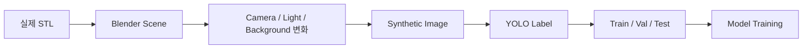
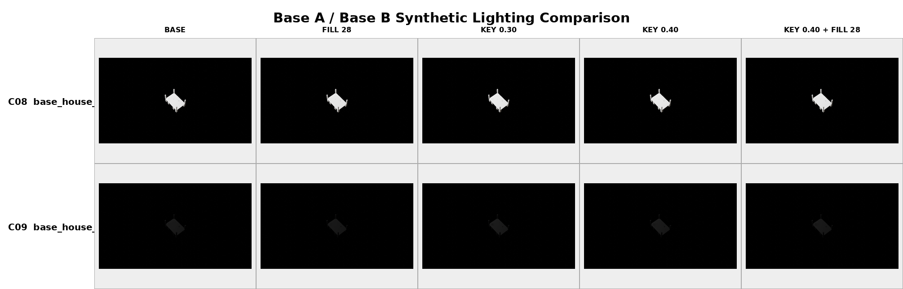
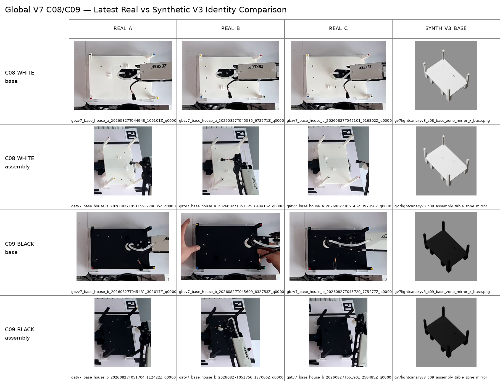
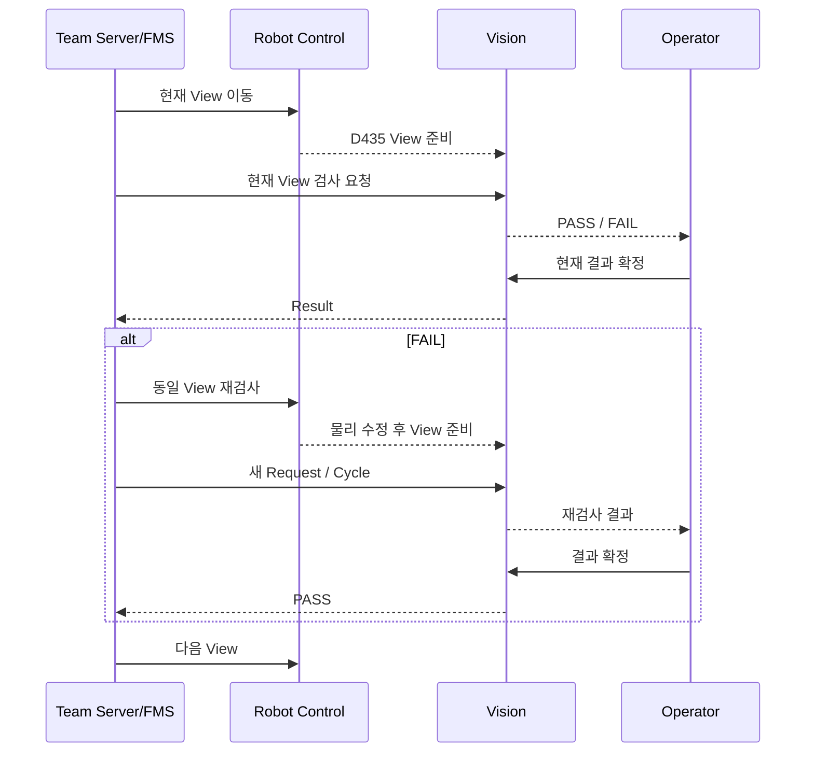
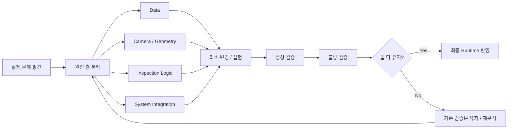

# 문제 해결 과정

> **실제 공장 환경에서 Vision이 흔들린 원인을 분석하고, 데이터·카메라·검사 로직·시스템 연동을 반복 개선한 과정**
> 프로젝트 진행 중 발생한 문제를 `문제 → 원인 분석 → 시도와 한계 → 해결 → 검증` 순서로 기록했습니다.

---

## 1. 문제 해결 접근 방식

프로젝트에서 Vision 문제는 하나의 모델이나 Threshold만 수정해서 해결되지 않았습니다.

실제 문제를 다음 네 층으로 나누어 분석했습니다.

```text
Data
→ 학습 데이터가 실제 환경을 충분히 반영하는가?

Camera / Geometry
→ 실제 설치 각도·거리·조명·왜곡이 안정적인가?

Inspection Logic
→ ROI / Reference / Threshold / Position Tolerance가 적절한가?

System Integration
→ 검사 결과가 Server / Robot / Unity 흐름과 일관되게 연결되는가?
```

문제가 발생하면 가장 먼저 어느 층의 문제인지 분리한 뒤 수정했습니다.

---

## 2. 실물 학습 데이터 부족

### 문제

프로젝트 초기에 실제 부품을 충분히 촬영하기 어려웠습니다.

필요한 조합은 단순 클래스별 한 장이 아니라 다음 조건까지 포함했습니다.

- 다양한 부품 클래스
- 거리
- 카메라 각도
- 조명 방향
- 밝기
- 배경
- HOUSE A / HOUSE B 차이
- Base / Hole / Slot 형상 차이

실물 촬영만으로 모든 조합을 확보하면 시간과 비용이 크게 증가합니다.

### 원인 분석

실제 자동화 공정용 모델은 학습 이미지 수뿐 아니라 **카메라가 실제로 볼 수 있는 조건의 다양성**이 중요했습니다.

따라서 단순 Copy / Augmentation만으로는 부족하다고 판단했습니다.

### 해결

실제 STL Asset을 Blender에 불러와 Synthetic Dataset을 자동 생성하는 Pipeline을 구축했습니다.



Synthetic 데이터는 개발 단계마다 실제 카메라 검증 결과를 반영해 계속 보강했습니다.

최종 데이터 계보는 여러 버전과 보강 단계를 합쳐 **누적 약 5만 장 규모**까지 확장했습니다.

### 검증

초기 Synthetic Full V1에서는 19개 클래스 기준 대규모 데이터를 생성해 YOLO11n Baseline을 학습했고, Synthetic Validation에서는 높은 성능을 확인했습니다.

하지만 이 결과를 최종 실환경 성능으로 간주하지 않고 이후 실제 카메라 검증으로 넘어갔습니다.

### 조명·재질 보강 예시

Base A / Base B는 실제 출력 색상과 반사 특성이 달라 조명 방향, Fill, Key 조건을 바꾼 Synthetic Canary를 별도로 생성해 비교했습니다.



### 실물과 Synthetic 비교

Synthetic 형상이 실제 부품의 색상, 슬롯, 홀 패턴과 얼마나 일치하는지 실카메라 이미지와 직접 비교했습니다.




---

## 3. Synthetic에서는 잘 되는데 실제 카메라에서 흔들리는 문제

### 문제

Synthetic Validation에서는 높은 성능이 나왔지만 실제 카메라 영상에서는 일부 클래스의 Confidence와 판정 안정성이 떨어졌습니다.

### 원인

Synthetic과 실제 환경 사이에는 다음 차이가 있었습니다.

| Synthetic | 실제 환경 |
|:---|:---|
| 이상적인 Material | 3D 출력물 표면 반사 |
| 통제된 조명 | 공장 조명 / 그림자 |
| 고정된 Camera Pose | 실제 설치 높이 / 각도 편차 |
| CAD 기준 색상 | 실제 WHITE / BLACK 출력색 |
| Clean Background | 작업대 / 설비 / 주변 물체 |
| CAD Hole | 실물 Hole / 자석 표현 |

즉 문제는 모델 구조보다 **Domain Gap**이었습니다.

### 초기 접근의 한계

Synthetic 데이터 수를 늘리는 것만으로는 실제 반사와 조명 조건이 자동으로 해결되지 않았습니다.

### 해결

실카메라 실패 조건을 데이터 설계에 다시 반영했습니다.

```text
Synthetic Training
→ Real Camera Validation
→ Failure Case 분석
→ Lighting / Geometry / Physical Diversity 추가
→ Fine-Tuning
→ 다시 Real Camera Validation
```

특히 다음 요소를 강화했습니다.

- Lighting Variation
- Raking Light
- Camera Geometry
- 실제 색상
- 거리 / 각도
- 실물 Physical Data
- 반사와 표면 상태

### 결과

Synthetic Dataset을 "한 번 만들고 끝나는 데이터"가 아니라 **실카메라 실패를 다시 반영하는 반복 개선 데이터**로 운영했습니다.

---

## 4. HOUSE A / HOUSE B Base가 비슷하게 보이는 문제

### 문제

`base_house_a`와 `base_house_b`는 전체 크기와 상면 형상이 유사해 단순 외곽 Shape만으로 구분하기 어려웠습니다.

### 분석

두 Base의 차이를 다시 실물과 STL 기준으로 분석했습니다.

#### HOUSE A

- WHITE
- 내부 벽 조립용 추가 Slot / Groove
- HOUSE A 고유의 Top Hole Pattern

#### HOUSE B

- BLACK
- 다른 내부 구조
- HOUSE B 고유의 Top Hole Pattern

### 한계

처음에는 작은 Slot 하나만 핵심 차이라고 보기 쉬웠지만, 실제 RGB에서는 작은 Feature가 거리·반사·해상도에 따라 불안정할 수 있었습니다.

### 해결

하나의 Feature에 의존하지 않고 다음 특징을 함께 반영했습니다.

```text
Color
+ Slot Layout
+ Top Hole Pattern
+ Overall Shape
```

또한 HOUSE B 실물 출력색이 BLACK으로 변경된 뒤 Synthetic 색상 정책도 함께 수정했습니다.

### 결과

Base A/B 구분 기준을 단일 Feature가 아닌 **복수의 시각적 구조 특징**으로 재정의했습니다.

---

## 5. 작업대 위치가 조금만 움직여도 ROI가 흔들리는 문제

### 문제

Incoming Inspection에서 카메라 자체는 고정되어 있어도 작업대나 검사 대상 위치가 매번 완전히 동일하지 않았습니다.

몇 px 수준의 변화로도 다음 문제가 생겼습니다.

- ROI가 대상에서 벗어남
- Hole / Slot 비교 위치 변화
- 정상 자재가 FAIL로 판정
- 같은 자재의 반복 검사 결과 변화

### 원인

검사 Runtime은 ROI가 고정되어 있는데 실제 Frame 좌표가 조금씩 움직이는 것이 원인이었습니다.

### 잘못된 접근 가능성

검사 Threshold를 낮추면 일시적으로 PASS가 늘 수 있지만, 실제 불량까지 PASS할 위험이 있습니다.

### 해결

Threshold를 먼저 완화하는 대신 **Frame 자체를 검사 기준 좌표로 정렬**했습니다.

```text
Raw Frame
→ Fixed Structure Anchor
→ ECC Alignment
→ Alignment Gate
→ Aligned Frame
→ Inspection
```

검사 대상 자재를 Anchor로 사용하지 않고, 자재가 누락되어도 유지되는 **작업대 고정 구조**를 기준으로 사용했습니다.

### 결과

ROI가 실제 대상 위치와 더 안정적으로 맞도록 만들고, Alignment 허용 범위를 벗어난 Frame은 검사하지 않도록 Gate를 적용했습니다.

---

## 6. 정상 자재의 작은 위치 차이 때문에 FAIL이 발생하는 문제

### 문제

PRE_ROOF에서는 정상 구조물인데도 Robot Pose나 Camera Frame이 몇 px만 달라지면 FAIL이 발생했습니다.

### 원인

- 미세한 Robot Pose 차이
- D435 Frame 위치 변화
- Reference와 현재 Pose의 차이
- 그림자
- 반사
- 너무 좁은 Position Tolerance

### 해결 원칙

정상 PASS를 만들기 위해 Threshold를 무작정 낮추지 않았습니다.

다음 순서로 원인을 분리했습니다.

```text
1. Reference가 현재 정상 Pose와 맞는가?
2. ROI가 올바른가?
3. Position Tolerance가 너무 좁은가?
4. Lighting / Reflection 문제인가?
5. 마지막으로 Threshold가 적절한가?
```

### TOP 사례

TOP Runtime에서는 일반 구조 검색 허용 범위를 적용하고, 특정 구조물은 실제 정상 Pose의 편차가 더 커 별도로 조정했습니다.

`COLUMN_2`는 Threshold를 낮추는 대신 **Position Tolerance를 ±15 px로 확대**했습니다.

```text
정상 구조의 위치 편차
→ Threshold 완화 X
→ Search / Position Tolerance 조정 O
```

### 결과

정상 구조를 PASS시키면서 실제 불량 검출 기준을 과도하게 느슨하게 만들지 않는 방향으로 조정했습니다.

---

## 7. Reference 자체가 현재 실물 Pose와 맞지 않는 문제

### 문제

BEHIND View에서 정상 구조가 반복적으로 불안정한 판정을 보였습니다.

### 원인 분석

처음에는 Threshold가 너무 엄격한지 확인했지만, 실제 원인은 **기존 Reference와 현재 정상 D435 Pose 사이의 차이**였습니다.

### 해결

현재 정상 구조를 실제 D435 Pose에서 다시 촬영해 Reference를 재보정했습니다.

최종 BEHIND Runtime:

```text
BEHIND V5
Port 8792
```

주요 최종 Threshold:

```text
mean = 40
p95  = 120
corr = 0.75
```

### 결과

Threshold 조정보다 먼저 Reference와 실제 Pose의 일치 여부를 확인해야 한다는 기준을 확립했습니다.

---

## 8. 하나의 공통 기준으로 5방향을 검사하기 어려운 문제

### 문제

TOP / LEFT / RIGHT / FRONT / BEHIND는 보이는 구조와 조명 조건이 서로 달랐습니다.

하나의 공통 Reference와 Threshold를 사용하면 특정 View에서는 정상인데 다른 View에서는 오검출이 발생했습니다.

### 해결

5개 View를 독립 Runtime으로 분리했습니다.

| View | 최종 Runtime |
|:---|:---|
| TOP | V7 |
| LEFT | V4 |
| RIGHT | V8 |
| FRONT | V2 |
| BEHIND | V5 |

각 View는 다음을 독립적으로 관리합니다.

- Reference
- ROI
- Threshold
- Position Tolerance
- RGB Metric
- Depth Metric

### 결과

"하나의 검사 알고리즘을 모든 방향에 강제로 적용"하는 대신, **같은 구조 원칙을 유지하되 각 View의 물리적 특성에 맞게 Profile을 분리**했습니다.

---

## 9. RGB만으로는 조립 형상을 안정적으로 판단하기 어려운 문제

### 문제

RGB는 사람이 보기에는 직관적이지만 조명과 반사의 영향을 많이 받았습니다.

### 원인

- 그림자
- 표면 반사
- 밝기 변화
- WHITE / BLACK Material 차이

### 해결

RealSense D435의 Depth 정보를 함께 사용했습니다.

```text
RGB
→ 색상 / Edge / 구조 / 밝기

Depth
→ 거리 / 형상 / 돌출 / 누락
```

모든 검사 ROI에 동일한 Metric을 강제하지 않고, 각 검사 대상에 필요한 RGB / Depth 정보를 선택했습니다.

### 결과

색상 정보와 구조적 거리 정보를 분리해 사용할 수 있는 기반을 만들었습니다.

---

## 10. FAIL을 검출해도 실제 생산 흐름이 이어지지 않는 문제

### 문제

Vision이 `FAIL`을 출력하는 것만으로는 실제 제조 공정이 완성되지 않습니다.

실제로 필요한 동작은 다음입니다.

```text
FAIL 발견
→ 실제 조립 상태 수정
→ 같은 위치 다시 검사
→ PASS
→ 다음 위치 진행
```

### 초기 구조의 한계

한 Request에서 전체 5 View를 연속 처리하면, 중간 View가 FAIL이어도 재검사 Cycle과 실제 Robot 이동 상태를 명확히 관리하기 어려웠습니다.

### 해결

최종 PRE_ROOF 흐름을 **Server 주도 View-by-View 방식**으로 변경했습니다.



### 결과

실제 불량품을 수정한 뒤 같은 View에서 PASS를 확인하고 다음 View로 진행하는 **제조 재검사 의미**를 구현했습니다.

---

## 11. Operator가 공정 순서를 직접 제어하면 상태가 꼬일 수 있는 문제

### 문제

Vision Dashboard에서 Operator가 다음 View 이동까지 직접 제어하면 Team Server가 가진 생산 상태와 UI 상태가 달라질 가능성이 있습니다.

### 해결

Server 주도 최종 Flow에서는 Operator 기능을 명확히 제한했습니다.

```text
Operator
= 현재 검사 결과 확정

Team Server
= View 순서 / 재검사 관리
```

### 결과

검사 순서의 Source of Truth를 Team Server로 고정하고, Dashboard는 현재 요청의 검사와 Commit에 집중하도록 역할을 분리했습니다.

---

## 12. ROS2 Image를 Unity에서 바로 사용할 수 없는 문제

### 문제

ROS2 Image는 Unity가 그대로 받을 수 있는 전송 포맷이 아니며, 한 Frame 크기도 UDP Datagram 하나에 넣기에는 너무 큽니다.

### 해결

HMV1 JPEG Chunked UDP 구조를 사용했습니다.

```text
ROS2 Image
→ JPEG Encode
→ HMV1 32-byte Header
→ Payload ≤ 1200 bytes
→ UDP Chunk
→ Unity Frame Reassembly
```

최종 Stream:

| 영상 | Stream ID | Port |
|:---|---:|---:|
| Incoming | `1` | `21010` |
| PRE_ROOF | `2` | `21020` |
| Factory View | `3` | `21030` |

### 검증

PRE_ROOF 로컬 E2E에서는 다음을 확인했습니다.

- Header
- Chunk 분할
- Datagram 크기
- Frame Reassembly
- JPEG Decode
- `1280×720` 복원

### 결과

ROS2 내부 영상과 Unity 표시 사이에 독립된 경량 영상 전송 계층을 만들었습니다.

---

## 13. 공장 전체 화면이 왜곡되고 작게 보이는 문제

### 문제

Factory View용 Logitech C270을 실제 위치에 설치한 뒤 기본 영상은 다음 문제가 있었습니다.

- 원근 왜곡
- 불필요한 주변 영역
- 공장 중심 영역이 작음
- 조명과 밝기 차이
- 멀리 있는 설비 경계가 흐림

### 해결

하드웨어 Camera Control과 FFmpeg Filter를 함께 적용했습니다.

```text
C270
→ Camera Control
→ Perspective
→ Crop
→ Scale
→ Brightness / Contrast / Gamma
→ Sharpening
→ ROS2
```

주요 보정:

```text
Perspective Correction
Crop = 1170:860:100:50
Scale = 1280:960
Brightness = 0.060
Contrast = 1.04
Gamma = 1.045
Saturation = 0.98
Unsharp = 7:7:0.65:5:5:0.0
```

### 결과

AI 판정을 위한 영상과 별개로 **사람이 공장 전체를 보기 좋은 전용 Global Overview**를 확보했습니다.

---

## 14. 하나의 카메라로 모든 역할을 처리하기 어려운 문제

### 문제

초기에는 "Global Camera"라는 하나의 개념으로 여러 역할을 설명했지만, 실제로는 요구되는 시야가 서로 달랐습니다.

### 분석

| 역할 | 요구 조건 |
|:---|:---|
| Incoming Inspection | 자재를 충분히 크게 보고 AI / ROI 검사 |
| Factory View | 공장 전체를 넓게 모니터링 |
| PRE_ROOF | 근접 RGB / Depth 구조 검사 |

### 해결

최종 시스템을 세 카메라 역할로 분리했습니다.

```text
Incoming Inspection Camera
Factory View Camera
RealSense D435
```

### 결과

문서와 Runtime의 책임을 명확하게 분리하고, 하나의 카메라 설정 변경이 다른 검사 목적에 영향을 주지 않도록 했습니다.

---

## 15. Factory View 때문에 Vision PC를 계속 유지해야 하는 문제

### 문제

Factory View가 Vision PC에서만 실행되면 단순 모니터링 영상 때문에 Vision PC가 항상 필요해집니다.

### 해결

Factory View Publisher와 Unity Sender, Config, Start / Stop / Verify Script를 별도 패키지로 분리했습니다.

```text
factory_view_robot_control_v1.tar.gz
```

SHA256:

```text
90c7a6f50540c9629e9c509c365268ce2ce4920cc7c311036d03282971d4c1ad
```

### 결과

Robot Control PC가 Factory View 실행 주체가 될 수 있도록 인계 구조를 마련했습니다.

Vision 검사 Runtime과 공장 모니터링 Runtime의 운영 책임도 분리할 수 있게 됐습니다.

---

## 16. 실패한 시도를 그대로 적용하지 않는 원칙

프로젝트에서는 모든 실험 결과를 최종 Runtime에 바로 반영하지 않았습니다.

예를 들어 PRE_ROOF TOP에서 구조 검사 방식을 더 변경하는 실험을 진행했지만, 기준 Anchor가 없는 상태를 확인하고 해당 변경은 중단했습니다.

```text
실험
→ 사전 조건 확인 실패
→ 변경 중단
→ 기존 검증 기준 유지
```

즉 "새로운 방법"이라는 이유만으로 적용하지 않고, **현재 검증된 Runtime보다 확실히 나은지 확인될 때만 최종본에 반영**했습니다.

이 원칙은 다음과 같습니다.

```text
실험 성공
+ 정상 검증
+ 불량 검증
= 최종 반영

하나라도 불확실
= 기존 검증본 유지
```

---

## 17. 실물 데이터 수집에서 정적 Burst만 반복한 문제

### 문제

일부 결함 판정 데이터는 같은 위치에서 여러 Frame을 연속으로 저장하는 방식이 많았습니다.

Frame 수는 늘었지만 물리적 다양성은 충분히 늘지 않았습니다.

### 원인

```text
동일 Placement
→ Frame 1
→ Frame 2
→ Frame 3
```

이 데이터는 이미지 수는 3장이지만 실제 물체 Pose 다양성은 거의 1개와 같습니다.

### 개선

실물 데이터를 다음 방식으로 다시 수집했습니다.

```text
제거
→ 재삽입
→ 1~2초 안정화
→ 3 Frame 저장
→ 다음 Placement
```

동일 위치 반복을 피하고, 실제 Translation / Rotation / 삽입 편차가 데이터에 들어가도록 했습니다.

### 결과

단순 Frame 수보다 **Physical Placement Diversity**가 더 중요하다는 기준을 데이터 수집 정책에 반영했습니다.

---

## 18. 문제 해결 결과 요약

| 문제 | 핵심 해결 |
|:---|:---|
| 실물 학습 데이터 부족 | Blender Synthetic Dataset |
| Synthetic ↔ Real Domain Gap | Real Camera Validation 기반 반복 보강 |
| Base A/B 유사성 | Color + Slot + Hole Pattern |
| Incoming ROI 흔들림 | ECC Auto Alignment |
| PRE_ROOF 정상 오검출 | Reference / Position Tolerance 분리 조정 |
| View별 특성 차이 | 5개 독립 Runtime |
| RGB 조명 민감성 | Depth 정보 병행 |
| FAIL 이후 실제 재검사 | Server 주도 View-by-View |
| UI / Server 순서 충돌 | Operator는 Commit만 수행 |
| ROS2 → Unity 영상 | HMV1 JPEG Chunked UDP |
| Factory View 왜곡 | Camera Control + FFmpeg Geometry 보정 |
| Vision PC 의존성 | Factory View Robot Control 인계 |
| 정적 Frame 중심 실물 데이터 | Physical Placement Diversity 강화 |

---

## 19. 최종 문제 해결 흐름

프로젝트 전반에서 사용한 공통 개선 방식은 다음과 같습니다.



**정상과 불량을 동시에 유지하고 실제 시스템 흐름까지 통과한 변경만 최종 반영**했습니다.

---

## 20. 주요 기술 경험

YOLO 모델 학습뿐 아니라 데이터 구축, 실카메라 검증, 공정 연동까지 함께 다뤘습니다.

다음 전체 과정을 반복했습니다.

```text
데이터가 부족함
→ Synthetic Data Pipeline 구축

Synthetic 성능은 좋음
→ 실제 카메라에서 Domain Gap 발견

실환경 판정이 흔들림
→ Camera Geometry / Alignment / Physical Data 개선

정상 구조가 FAIL
→ Reference / Position / Threshold 원인 분리

FAIL은 검출하지만 공정이 이어지지 않음
→ Server 주도 재검사 Flow 설계

ROS2 영상이 Unity에 필요함
→ HMV1 UDP Video Interface 구현

공장 전체 모니터링 역할이 충돌함
→ 3개 Camera Pipeline으로 책임 분리
```

AI 모델, 실제 카메라, 물리 환경, 로봇 공정, 서버 통신, Unity 영상을 함께 다루며 문제를 시스템 단위로 해결했습니다.

---

## 전체 문서 목차

1. [AI Perception / Vision](../README.md)
2. [프로젝트 개요](01_project_overview.md)
3. [시스템 아키텍처](02_system_architecture.md)
4. [입고 자재 검사](03_incoming_inspection.md)
5. [Factory View](04_factory_view.md)
6. [PRE_ROOF 조립 품질검사](05_pre_roof_qc.md)
7. [서버·로봇·Unity 연동](06_integration.md)
8. [검증 결과](07_validation.md)
9. **현재 문서 — 문제 해결 과정**
10. [프로젝트 구조](09_project_structure.md)
