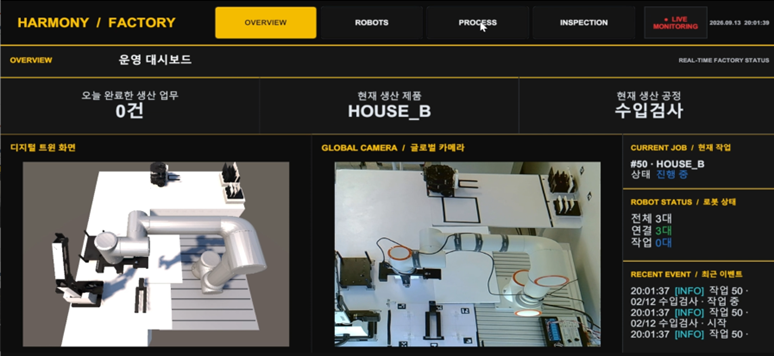
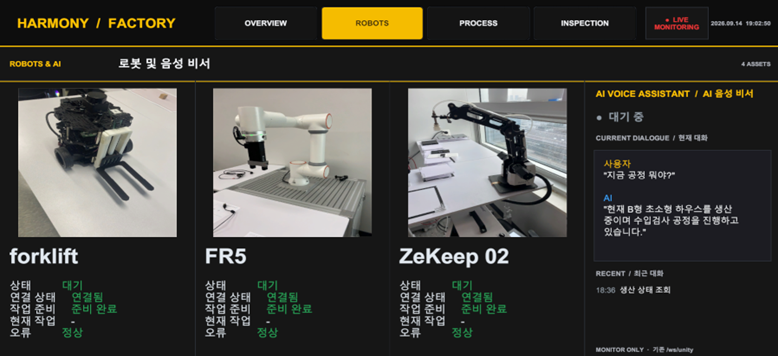
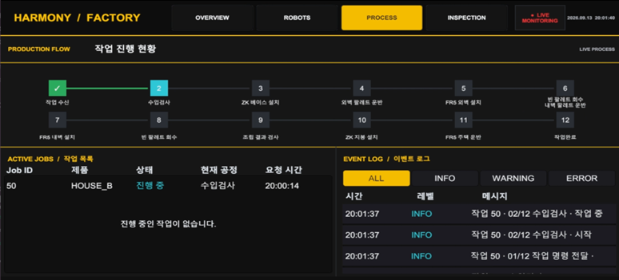
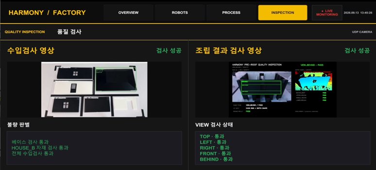

# Control Tower GUI / Unity Digital Twin

AI 기반 조립식 주택 자동화 공장의 Unity 관제 GUI입니다. 서버의 생산·로봇 상태와 검사 결과를 표시하고, 실제 로봇의 관절·위치 데이터를 3D 모델에 반영합니다.

## 프로젝트 정보

| 항목 | 내용 |
| --- | --- |
| 담당 | 김영호 |
| 개발 환경 | Windows / Unity 6000.4.3f1 / C# |
| 렌더링·UI | URP 17.4.0, Unity UI, TextMesh Pro |
| 주요 통신 | WebSocket, HMV1 JPEG Chunked UDP |
| 실행 씬 | `Assets/Scenes/SampleScene.unity` |

## 담당 범위

- OVERVIEW: 생산 현황, 디지털 트윈과 글로벌 카메라 비교
- ROBOTS: Forklift·FR5·ZeKeep 상태와 음성 비서 상태 표시
- PROCESS: 서버 기준 12단계 공정, 작업 목록, 이벤트 이력
- INSPECTION: 수입검사 및 5방향 조립검사 결과·영상 표시
- 디지털 트윈: 관절 단위·부호·영점 변환, 터틀봇 위치 반영, 가상 자재 결합·설치 처리

생산 상태의 기준은 [Server/FMS](https://github.com/eduwing-robotics/ros2-ai-cobot-repo2/blob/main/server_fms_db/README.md)입니다. 실제 로봇 제어는 [포크리프트 모듈](https://github.com/eduwing-robotics/ros2-ai-cobot-repo2/blob/main/forklift_turtlebot3/README.md)과 [FR5·ZeKeep 모듈](https://github.com/eduwing-robotics/ros2-ai-cobot-repo2/blob/main/robot_control_fr5_zekeep/README.md), 검사 판정은 [AI Perception](https://github.com/eduwing-robotics/ros2-ai-cobot-repo2/blob/main/ai_perception/README.md)이 담당합니다. Unity의 가상 자재 설치 완료를 실제 조립 성공으로 간주하지 않습니다.

## GUI 화면

현장 시연 화면입니다. 캡처의 작업 번호·시간·로봇 상태는 촬영 당시 표시값입니다.

### OVERVIEW — 운영 대시보드

생산 제품과 현재 공정, 작업·로봇 상태, 최근 이벤트를 표시합니다. 디지털 트윈과 글로벌 카메라를 나란히 배치해 가상 모델과 현장을 비교합니다.



### ROBOTS — 로봇 및 음성 비서

Forklift·FR5·ZeKeep의 연결, 작업 준비, 현재 작업과 오류 상태를 확인하고 음성 비서의 대화 내용을 표시합니다.



### PROCESS — 작업 진행 현황

서버의 12단계 생산 공정과 작업 목록, 시간·레벨별 이벤트 이력을 표시합니다.



### INSPECTION — 품질 검사

수입검사와 조립 결과 검사 영상을 표시하고, 자재별 판정 및 TOP·LEFT·RIGHT·FRONT·BEHIND 방향별 검사 결과를 확인합니다.



## 로봇별 디지털 트윈 시연

각 로봇의 실제 동작과 Unity 디지털 트윈을 함께 보여주는 대표 시연 영상입니다.

| 영상 | 시연 내용 |
| --- | --- |
| [TurtleBot3 디지털 트윈](https://youtu.be/M-qdN46k0m0) | 주행 위치 반영 및 외벽 팔레트 운반 시연 |
| [ZeKeep 디지털 트윈](https://youtu.be/5Qx_84n0Np0) | 로봇팔 관절 동기화 및 지붕 설치 시연 |
| [FR5 디지털 트윈](https://youtu.be/mnH_ryZHtxQ) | 로봇팔 관절 동기화 및 완성 주택 운반 시연 |

시연용 공정·자재 배치 설정이 포함된 영상입니다. 실제 연동의 구현 범위와 검증 상태는 아래 **구현 범위와 한계**를 참고하세요.

## 프로젝트 열기

1. 저장소를 내려받고 Unity Hub에 **`controltower_gui` 폴더**를 추가합니다. 팀 저장소 최상위 폴더가 아닙니다.
2. Unity `6000.4.3f1`로 엽니다. 첫 실행에는 Package Manager 복원과 에셋 임포트가 필요합니다.
3. `Assets/Scenes/SampleScene.unity`를 엽니다.
4. 서버와 영상 송신기를 실행하고 [연결 설정](docs/02_interfaces_setup.md)을 확인한 뒤 Play를 누릅니다.

`Packages/manifest.json`과 `packages-lock.json`을 함께 보존합니다. ROS-TCP-Connector와 URDF Importer는 Git URL 의존성이므로 Git 설치와 최초 패키지 다운로드 연결이 필요합니다.

## 기본 연결

| 대상 | 주소 / 포트 | 역할 |
| --- | --- | --- |
| Main Server | `ws://192.168.20.20:8000/ws/unity` | 상태·공정·관절 데이터 |
| 수입검사 영상 | UDP 21010 / Stream ID 1 | HMV1 JPEG |
| 조립검사 영상 | UDP 21020 / Stream ID 2 | HMV1 JPEG |
| 글로벌 영상 | UDP 21030 / Stream ID 3 | HMV1 JPEG |

영상 송신 목적지는 **Unity PC의 실제 IP**입니다. 기존 현장 주소는 `192.168.20.29`이며 환경이 달라지면 송신기 설정을 바꿉니다.

## 폴더 구성

```text
controltower_gui/
├── Assets/                 씬, 모델, UI, C# 소스와 .meta
│   ├── Scenes/
│   ├── Script/             Communication / DigitalTwin / UI
│   └── Editor/             Unity 편집기 도구
├── Packages/               패키지 선언과 버전 잠금
├── ProjectSettings/        Unity 설정
├── docs/                   설계·연결·검증·파일 구성
└── README.md
```

Unity 에셋 경로와 GUID를 유지하기 위해 C#을 별도 `src/`로 옮기지 않았습니다. 런타임 설정은 씬 Inspector와 ProjectSettings에 있으며, 실제로 읽지 않는 별도 config 파일을 만들지 않습니다.

## 구현 범위와 한계

로봇팔 자세와 공정 상태 반영은 구현했습니다. 실물 테스트에서 그리퍼가 자재 위치에 도달해도 가상 자재가 결합되지 않는 경우가 있었으며, 자재 조립 동기화는 완료 검증 상태가 아닙니다. 터틀봇은 odometry와 실제 위치 사이에 차이가 남을 수 있습니다.

FR5의 가상 자재는 그리퍼 상태와 공정 순서에 따라 결합·분리합니다. 로봇팔 자세 수신과 자재 상태 처리는 별도 로직이며, 자재 조립 동기화의 최신 수정은 실제 로봇 연동 검증이 필요합니다. 상세 조건과 검증 범위는 [문제 해결·검증](docs/03_troubleshooting_validation.md)을 참고하세요.

터틀봇 위치는 odometry를 바탕으로 표시합니다. 바퀴가 미끄러지면(slip) 바퀴 회전량과 실제 이동량이 달라져 위치 추정 오차가 누적될 수 있습니다. 이때 Unity가 좌표를 정상 수신해도 실제 위치와 차이가 날 수 있습니다. 관찰된 모든 오차의 원인을 slip으로 확정한 것은 아니며, 홈 정렬 결과의 반영과 좌표 변환도 확인 대상입니다.

## Unity에서 터틀봇 수동주행

Unity에서 Raspberry Pi의 `ws://192.168.20.100:8765/manual`에 직접 연결해 실제 터틀봇을 조작합니다. 현장 수동주행 성공을 확인했습니다.

1. Play 상태에서 Game 화면을 클릭해 키보드 입력 포커스를 줍니다.
2. `/` 키로 수동모드를 요청하고 제어권 승인 상태를 확인합니다.
3. `W/S`로 전진·후진, `A/D`로 회전합니다. 방향키도 사용할 수 있습니다.
4. 이동 키를 누르는 동안 주행하며, 키를 놓으면 정지합니다. `Space`로도 정지할 수 있습니다.
5. `/`를 다시 눌러 수동모드를 해제하고 제어권을 반환합니다.

Unity는 전진 속도와 회전 속도 명령을 전송하고, Pi의 명령 중재 노드가 주행 출력을 관리합니다. 수동 제어권 반환만으로 중단된 자동 작업이 재개되지는 않습니다. 이 경로는 주행 제어이며 리프트 조작은 포함하지 않습니다. 상세 프로토콜은 [포크리프트 문서](https://github.com/eduwing-robotics/ros2-ai-cobot-repo2/blob/main/forklift_turtlebot3/docs/unity_manual_websocket.md)를 참고하세요.

## 상세 문서

[문서 목록](docs/README.md)
