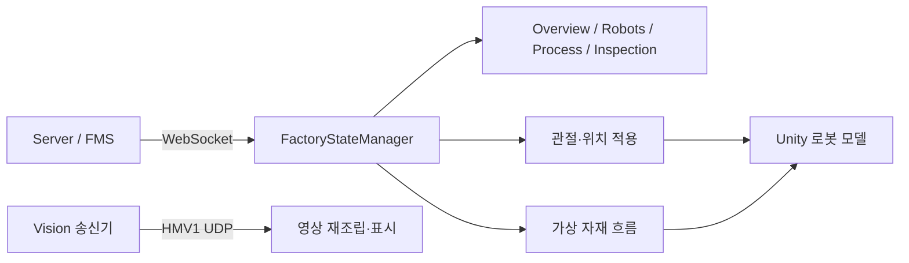

# 구조와 데이터 흐름

## 책임 구분

서버가 작업과 공정의 확정 상태를 관리합니다. Unity는 WebSocket 메시지를 상태 모델에 반영하고 UI와 3D 모델을 갱신합니다. 검사 결과 메시지와 검사 영상은 별도의 수신 경로입니다.

## 주요 파일

경로는 `Assets/Script/` 기준입니다.

| 파일 | 역할 |
| --- | --- |
| `Communication/WebSocket/MainServerWebSocketClient.cs` | Main Server 접속 |
| `Communication/WebSocket/FactoryStateManager.cs` | 메시지 수신과 상태 반영 |
| `Communication/WebSocket/UnityMessageModels.cs` | 데이터 모델 |
| `UI/ProductionProcessUI.cs`, `UI/FactoryOperationCatalog.cs` | 공정 표시 |
| `UI/InspectionPageUI.cs`, `UI/VisionUdpVideoReceiver.cs` | 검사 결과 및 영상 |
| `DigitalTwin/Robots/ZKJointStateApplier.cs` | ZK·FR5 관절, FR5 그리퍼 표시 |
| `DigitalTwin/Robots/ForkliftPoseApplier.cs` | 터틀봇 좌표·회전 반영 |
| `DigitalTwin/Materials/FactoryMaterialFlowController.cs` | 파지·운반·설치 흐름 |
| `DigitalTwin/Materials/HouseAssemblyController.cs` | 제품별 설치 순서와 Socket |
| `DigitalTwin/Materials/RobotCargoMount.cs`, `CarryableObject.cs` | 자재 결합·분리 |

## 가상 조립

FR5 모델의 팔은 수신 관절값을 따릅니다. 벽은 다음 미설치 자재를 고른 뒤 그리퍼 결합을 시도합니다. 기본 외벽 순서는 doorwall, rightwall, backwall, leftwall입니다. 제품별 내벽과 설치 위치는 조립 레이아웃에서 관리합니다.

잡기·놓기 신호에 따른 최신 보정은 거리 제한 없이 결합·설치를 시도하며, 놓기 시 약 0.65초 동안 지정 Socket으로 위치·회전을 보정합니다. 베이스 배치, 예정 자재 순서, 보유 자재 여부 등의 조건은 남아 있습니다. 접촉만으로 설치를 요청하는 경로에는 별도 거리·이동 조건이 있습니다. 이는 시각화 로직으로 실제 로봇의 파지 성공을 증명하지 않습니다.
