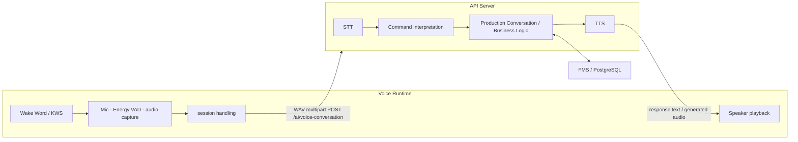
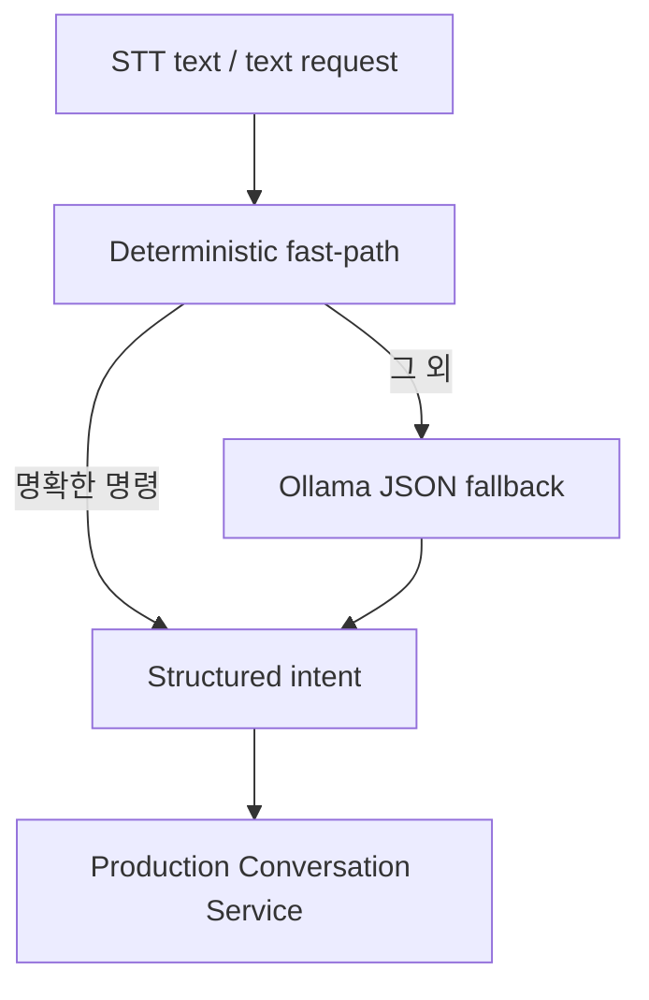

# Voice AI · LLM / STT / TTS

AI 기반 조립식 주택 자동화 공장의 음성 기반 생산 제어·안내 인터페이스입니다. Wake Word로 대화를 시작하고, STT·명령 해석·생산 대화·TTS를 통해 생산 시스템과 연결합니다.

> 이 폴더는 Voice AI 기능의 문서 진입점입니다. 실제 실행 가능한 Runtime source는 production business logic, API, Redis realtime contract와 함께 [server_fms_db](../server_fms_db/README.md)에 통합되어 있습니다. 따라서 이 폴더만 별도로 실행하는 구조는 아닙니다.

## Voice pipeline



Voice Runtime은 microphone, Wake Word, Energy VAD, audio capture, session handling, speaker playback을 담당합니다. 수집한 WAV는 `POST /ai/voice-conversation`으로 전달하며, API Server 내부에서 STT·명령 해석·생산 대화·TTS가 처리됩니다.

## Wake Word와 세션

- 현재 runtime은 `experiments/wakeword_sherpa/keywords.txt`를 사용하며, 설정된 Wake Word는 **헤이 링크(HEY LINK)** 입니다. sherpa-onnx 의존성이 없으면 Wake Word 감지는 비활성화되고 런타임이 이를 알립니다.
- Wake Word 감지 후 VAD로 사용자 발화를 수집합니다.
- 생산 요청의 옵션 확인·최종 승인처럼 추가 응답이 필요한 상태에서는 동일 세션으로 계속 듣습니다.
- 완료·거절·만료 상태 또는 일반 단발성 응답 후에는 Wake Word 대기 상태로 돌아갑니다.

## STT

STT는 `faster-whisper`를 지연 로딩해 사용합니다. WAV, MP3, M4A, FLAC, OGG 입력을 검증하며, 공장 도메인의 주택 모델·지붕·재고·확인 표현을 initial prompt로 제공합니다. 짧은 WAV에서 첫 인식 결과가 비어 있으면 제한된 조건에서 한 번 재시도합니다.

## 명령 해석



명확한 생산 상태 조회·재고 조회·형식이 충분한 생산 요청은 rule-based fast-path로 처리합니다. 애매하거나 자유로운 자연어는 Ollama JSON fallback이 보완합니다. 이 구조는 자주 쓰는 명령의 latency를 줄이고, 명확한 요청의 intent 분류를 안정적으로 유지하기 위한 것입니다.

| Intent | 기능 |
| --- | --- |
| `CREATE_PRODUCTION_REQUEST` | 생산 요청과 옵션·최종 확인 대화 시작 |
| `QUERY_JOB_STATUS` | 현재 생산 상태 조회 |
| `QUERY_INVENTORY` | 재고 조회 |
| `PAUSE_JOB` | 현재 Robot Cell 작업 일시정지 요청 |
| `RESUME_JOB` | 일시정지된 Robot Cell 작업 재개 요청 |
| `CANCEL_JOB` | 생산 취소 의도 표현 |

## 문제 해결 및 개선

Voice AI를 실제 생산 시스템에 적용하는 과정에서 Wake Word 검출, STT 도메인 인식, 명령 처리 지연, 공정 상태 일관성, 자동 TTS 중복 안내 문제를 분석하고 개선했습니다.

### 1. Wake Word 자연 발화 검출 개선

**문제**

영어 GigaSpeech 기반 KWS에 목표 Wake Word인 “헤이 링크(HEY LINK)”를 적용할 때, 한국어식 자연 발화를 같은 영어 keyword로 안정적으로 검출하기 어려운 문제가 있었습니다.

**원인**

`keywords_score`와 `keywords_threshold` 조합을 평가하는 benchmark가 있어 threshold·boosting 조정을 검토했지만, repository에는 이 조정만으로 해결됐다는 결과 artifact가 없습니다. 현재 keyword 파일은 baseline `▁HE Y ▁LI N K`와 다른 token sequence를 별도로 사용합니다.

**해결**

실제 runtime의 `keywords.txt`에는 `▁HA T ING ▁CO U P`, `▁PA IN ING` 등 surrogate token sequence를 등록했습니다. 서로 다른 keyword 목록을 OR로 결합하는 Dual KWS ensemble 실험도 별도 benchmark로 구현했지만, 현재 Voice Runtime은 단일 `keywords.txt`를 사용합니다.

**결과**

사용자에게 노출되는 Wake Word는 “헤이 링크”로 유지하면서 KWS 내부 표현을 분리했습니다. 수치 결과 CSV와 decode trace는 공개 저장소에 포함되어 있지 않아 검출률·오탐률은 여기서 단정하지 않습니다.

### 2. STT 도메인 용어 인식 개선

**문제**

HOUSE_A/HOUSE_B, 지붕 옵션, 재고와 확인 표현처럼 공장 도메인 고유 발화가 범용 STT 문맥만으로는 흔들릴 수 있었습니다.

**원인**

범용 Whisper 모델에는 프로젝트의 주택 모델·지붕·생산 명령 문맥이 기본적으로 포함되어 있지 않습니다.

**해결**

`faster-whisper` 호출에 주택 모델, 지붕, 재고, 확인 표현을 담은 initial prompt를 제공했습니다. 짧은 WAV에서 첫 결과가 비어 있는 경우에는 제한된 조건에서 한 번만 재시도합니다.

**결과**

명령 해석으로 전달되는 텍스트에 프로젝트 도메인 문맥을 제공하고, 짧은 발화의 빈 결과를 별도 오류로 처리하기 전에 재확인합니다. 정확도 수치 결과는 공개 artifact로 확인되지 않아 기재하지 않습니다.

### 3. LLM 의존으로 인한 명령 처리 지연

**문제**

생산 상태 조회나 재고 조회처럼 의미가 명확한 요청까지 매번 LLM을 거치면 불필요한 latency와 응답 변동이 생길 수 있습니다.

**원인**

명확한 command와 자유 자연어를 같은 해석 경로로 처리하면, 단순한 질문도 외부 모델 응답에 의존하게 됩니다.

**해결**

`CommandInterpreter`는 명확한 생산 상태 조회, 재고 조회, 충분히 형식화된 생산 요청을 deterministic fast-path로 먼저 판정하고, 확정하기 어려운 입력만 Ollama JSON fallback으로 전달합니다.

**결과**

자주 쓰는 명령은 짧고 결정적인 경로를 사용하며, 자유 자연어 지원은 fallback으로 유지합니다. 환경별 latency/정확도 결과 artifact가 없으므로 일반화된 수치는 제시하지 않습니다.

### 4. Voice / Unity / TTS의 공정 상태 일관성

**문제**

Voice 상태 조회, Unity 관제, 자동 공정 TTS가 각자 현재 공정을 해석하면 같은 Job을 서로 다른 단계로 안내할 가능성이 있었습니다.

**원인**

세부 JobStep, Delivery, 검사 이벤트는 많지만 상위 공정 표시 authority가 기능별로 분산되면 일관성이 깨질 수 있습니다.

**해결**

서버의 canonical 12단계 PROCESS projection을 single authority로 사용했습니다. Voice 상태 조회는 `process_stage_code`와 display name을 사용하고, Unity는 `/ws/unity` projection을, 자동 TTS는 동일 PROCESS snapshot을 사용합니다.

**결과**

음성 상태 응답, Unity 관제, 공정 진입 안내가 같은 서버 기준의 상위 공정 의미를 공유합니다.

### 5. 자동 TTS 중복 안내 방지

**문제**

하나의 공정에서도 Redis event와 세부 JobStep 변경이 연속 발생하므로, 이벤트 자체를 음성 안내 기준으로 쓰면 같은 공정을 반복 안내할 수 있습니다.

**원인**

realtime event 발생과 PROCESS stage 전환은 동일하지 않습니다. 예를 들어 외벽 설치 동안 여러 Step 변화가 발생할 수 있습니다.

**해결**

Redis event는 최신 production snapshot 재조회 trigger로만 사용합니다. `ProductionAnnouncementDetector`는 `(job_id, "PROCESS_STAGE", stage_code)` 기준으로 이미 안내한 PROCESS stage를 dedupe합니다.

**결과**

같은 PROCESS 단계에서 세부 상태가 바뀌어도 공정 진입 안내는 한 번만 생성됩니다. 품질검사 실패·Robot Cell fault·정지/재개 알림은 별도 이벤트로 유지합니다.

## 지원 발화 예시

| 기능 | 예시 | 처리 |
| --- | --- | --- |
| 생산 요청 | `HOUSE_A 한 채 생산해줘` | 제품·수량·지붕 옵션·확인 대화로 연결 |
| 생산 상태 조회 | `현재 무슨 작업 중이야?` | 서버 PROCESS projection 기반 상태 응답 |
| 재고 조회 | `전체 자재 재고 확인해줘` | inventory query service로 조회 |
| 현재 로봇 작업 일시정지 | `현재 작업 멈춰줘` | Robot Cell 대상 durable pause 요청 생성 |
| 작업 재개 | `작업 다시 시작해줘` | held Robot Cell 작업의 durable resume 요청 생성 |

일시정지/재개 API는 ROS 명령을 직접 호출하지 않고 Job과 ExecutionAttempt에 durable control request/state를 기록합니다. FMS pause/resume coordinator가 Robot Cell control을 조정합니다. TurtleBot transport가 실제 이동 중인 경우 물리 pause는 현재 지원하지 않으며, 요청은 거부되고 그 제한을 응답으로 구분합니다.

## 생산 요청 Multi-turn Conversation

생산 요청은 session별 pending request로 유지됩니다. 요청에 주택 모델·수량·지붕 옵션이 이미 충분히 포함되면 누락 정보 질문을 건너뛰고 재고 preflight와 최종 확인 단계로 진행합니다.

```text
사용자: HOUSE_A 생산해줘
시스템: 지붕을 선택해주세요. 1번 평지붕, 2번 경사지붕입니다.

사용자: 경사지붕으로 해줘
시스템: A형 주택 한 채를 2번 경사지붕으로 제작하는 것이 맞습니까?

사용자: 네
시스템: 생산 요청이 확인되어 생산 작업 1건이 등록되었습니다.
```

지붕 옵션을 받은 직후, 또는 최초 요청에 옵션이 모두 포함된 경우 `ProductionInventoryPreflight`가 실행됩니다. 생산 불가로 판단되면 pending request는 거절되고 최종 확인 단계로 진행하지 않습니다.

최종 승인 시에는 `confirm_and_create_jobs()`가 재고를 다시 검증한 뒤 Production Job을 생성합니다. 승인 직전 재검증에서 재고 부족이나 설정 오류가 발견되면 Job을 만들지 않고 confirmation-ready request를 유지해, 재고·설정 조치 후 다시 시도할 수 있습니다. 사용자가 `아니`라고 답하면 요청은 `REJECTED`로 종료되고 “생산 요청을 진행하지 않겠습니다.”라고 응답합니다.

## 상태 조회와 자동 공정 안내

Voice는 별도의 공정 판정 규칙을 만들지 않습니다. 생산 상태 조회는 서버의 canonical 12단계 PROCESS projection을 사용하며, Unity 관제와 같은 `process_stage_code`와 display name을 기준으로 응답합니다.

Voice Runtime은 Redis event를 최신 snapshot 재조회 신호로만 사용하고, 새 PROCESS stage 진입 시 한 번만 자동 TTS 안내를 생성합니다. 같은 외벽 설치 단계에서 여러 세부 JobStep이 바뀌어도 반복 안내하지 않습니다.

대표 안내 문구:

- `수입검사를 시작합니다.`
- `FR5 외벽 설치 공정을 시작합니다.`
- `조립 결과 검사를 시작합니다.`
- `생산 작업이 완료되었습니다.`

FAILED/CANCELED처럼 PROCESS stage가 없는 상태는 이전 정상 공정을 다시 안내하지 않습니다. 별도 품질검사 실패·Robot Cell fault·정지/재개 알림은 공정 진입 안내와 분리해 처리합니다.

## 성능 및 benchmark

저장소에는 STT, 자연어 명령, conversation, Voice E2E benchmark harness와 dataset이 포함되어 있습니다. 그러나 현재 공개 source에는 요청별 성능 결과값을 확정적으로 재현할 수 있는 결과 artifact가 포함되어 있지 않으므로, 특정 정확도·latency 수치는 이 문서에 기재하지 않습니다. 수치는 고정 benchmark set, 모델, 장비, 환경을 함께 명시해 별도 결과 문서로 관리해야 합니다.

## 실제 source 위치

| 영역 | 구현 위치 |
| --- | --- |
| Voice Runtime | [server_fms_db/voice_runtime/](../server_fms_db/voice_runtime/) |
| Voice API | [api_server/routers/ai.py](../server_fms_db/api_server/routers/ai.py) |
| STT | [stt_service.py](../server_fms_db/api_server/services/stt_service.py) |
| Command Interpreter | [command_interpreter.py](../server_fms_db/api_server/services/command_interpreter.py) |
| LLM fallback | [llm_service.py](../server_fms_db/api_server/services/llm_service.py) |
| Production Conversation | [production_conversation_service.py](../server_fms_db/api_server/services/production_conversation_service.py) |
| TTS | [api_server/services/tts/](../server_fms_db/api_server/services/tts/) |

## 실행 관계

Voice Runtime은 `server_fms_db`를 working directory로 사용해 실행합니다.

```bash
cd server_fms_db
python -m voice_runtime.main
```

API Server와 환경 변수는 [server_fms_db README](../server_fms_db/README.md)의 실행·환경 변수 안내 및 [`.env.example`](../server_fms_db/.env.example)를 함께 확인하세요.

실제 microphone, speaker, Wake Word 모델, Ollama, Whisper와의 연결은 로컬 환경 설정에 따라 달라집니다. API key, 모델 가중치, 녹음 파일은 저장소에 포함하지 않습니다.
