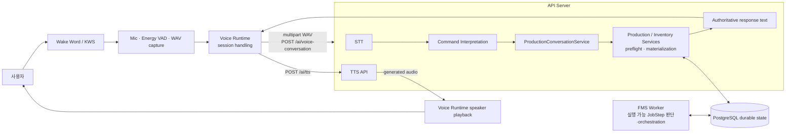
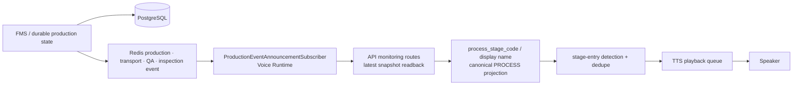
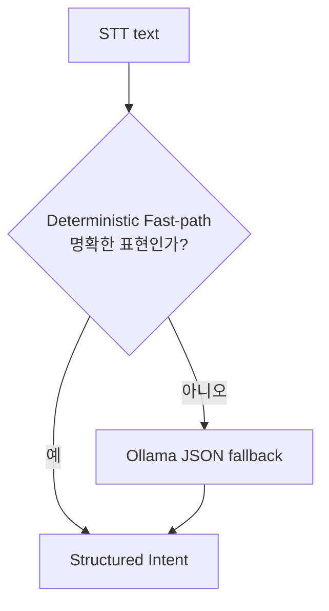
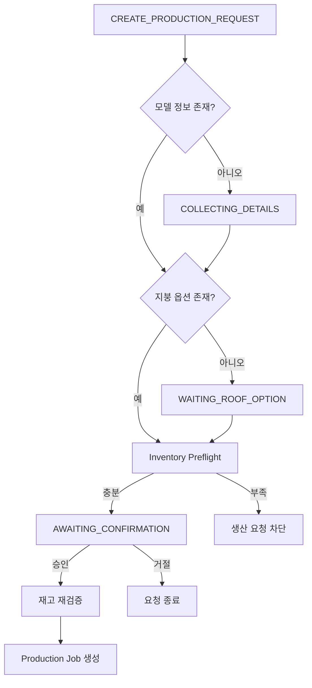

# Voice AI 시스템 아키텍처

이 문서는 음성 기능이 생산 시스템 안에서 연결되는 방식을 설명합니다. 기능 요약과 발화 예시는 [상위 README](../README.md)를 참고하세요.

## 구성과 책임

| 구성 | 실제 책임 |
| --- | --- |
| Voice Runtime | Wake Word/KWS, microphone 입력, Energy VAD, WAV capture, 대화 session 유지, speaker playback, 자동 공정 안내 구독 |
| API Server | `POST /ai/voice-conversation`, STT, 명령 해석, 생산 대화·업무 로직 호출, 응답 텍스트 생성 및 TTS API |
| Server/FMS | Production Job, 재고, 실행 제어 요청, 운반·검사 lifecycle, canonical PROCESS projection의 authority |
| PostgreSQL | Job, JobStep, Delivery, Inspection, ExecutionAttempt, inventory 등 확정 상태와 이력 |
| Redis | production·transport·inspection·error realtime event 전달. Voice Runtime에는 snapshot 재조회 trigger로 사용 |

Voice Runtime과 API Server는 별도 실행 프로세스가 될 수 있지만, 실제 source는 하나의 통합 backend codebase인 [`server_fms_db`](../../server_fms_db/README.md)에 있습니다.

## 사용자 음성 요청 흐름

`voice_runtime/api_client.py`는 원본 WAV를 한 번만 `/ai/voice-conversation`에 전달합니다. STT 결과를 별도 API로 다시 해석하거나 Runtime에서 생산 업무 판단을 재구성하지 않습니다. 응답의 `message`는 Voice Runtime이 재생할 authoritative text입니다.

`ProductionConversationService`는 `ProductionInventoryPreflightService`로 재고를 확인하고, 최종 승인 시 `ProductionRequestMaterializationService.confirm_and_create_jobs()`를 통해 Job을 DB transaction으로 materialize합니다. 이후 FMS Worker가 PostgreSQL의 durable state를 읽어 실행 가능한 JobStep과 후속 orchestration을 판단합니다.

## 자동 공정 안내 흐름

Redis event는 “어느 Job snapshot을 다시 볼지”를 알리는 신호입니다. 현재 공정을 이벤트 종류나 JobStep 배열에서 다시 추론하지 않고, API가 내려주는 `process_stage_code`와 `process_stage_display_name`을 사용합니다.

## Command Interpretation

`CommandInterpreter`는 두 단계로 structured intent를 만듭니다.

현재 intent enum은 다음과 같습니다.

| Intent | 의미 |
| --- | --- |
| `CREATE_PRODUCTION_REQUEST` | 생산 요청 |
| `PAUSE_JOB` | 현재 Robot Cell 작업 일시정지 요청 |
| `RESUME_JOB` | 보류된 Robot Cell 작업 재개 요청 |
| `CANCEL_JOB` | 생산 요청 취소 |
| `QUERY_JOB_STATUS` | 생산 상태 조회 |
| `QUERY_INVENTORY` | 재고 조회 |
| `UNKNOWN` | 추가 확인이 필요한 입력 |

명확한 상태 조회·재고 조회·완전한 생산 요청 형태는 fast-path로 처리할 수 있고, 규칙으로 확정하기 어려운 자유 발화는 Ollama JSON fallback이 처리합니다.

## Production Conversation

생산 요청은 한 번의 명령으로 정보가 충분할 수도 있고, 누락한 모델·지붕 정보를 같은 session에서 이어서 받을 수도 있습니다.

최종 승인 처리 시에도 재고를 다시 검증합니다. 따라서 preflight 이후 재고 상태가 변경된 경우 Production Job을 생성하지 않습니다. 모델과 지붕 옵션이 최초 요청에 모두 있으면 누락 정보 수집 단계를 생략합니다.

## 상태 조회와 자동 TTS의 공통 기준

서버의 `UnityCurrentStageProjectionService.derive_process_stage()`는 12단계 canonical PROCESS projection을 제공합니다. `ProductionStatusQueryService`의 `QUERY_JOB_STATUS`, Unity realtime projection, `ProductionAnnouncementDetector`의 자동 TTS는 이 동일 authority를 사용합니다.

이 방식으로 수입검사, 자재 운반·빈 팔레트 반환, PRE_ROOF 검사, 완성 주택 운반처럼 단일 runnable JobStep만으로 표현하기 어려운 상태도 같은 기준으로 표시·안내합니다.
