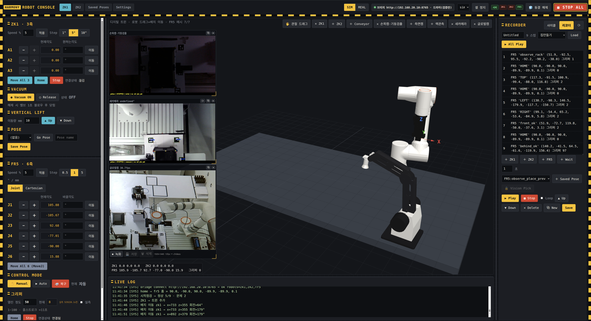
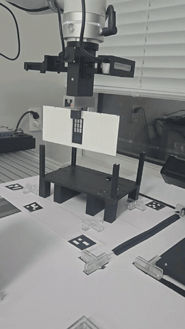
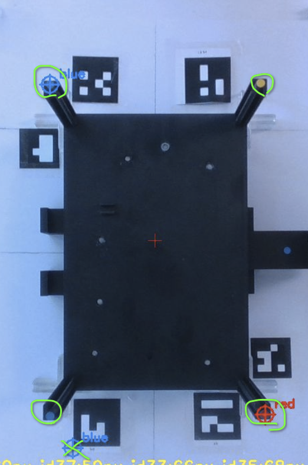
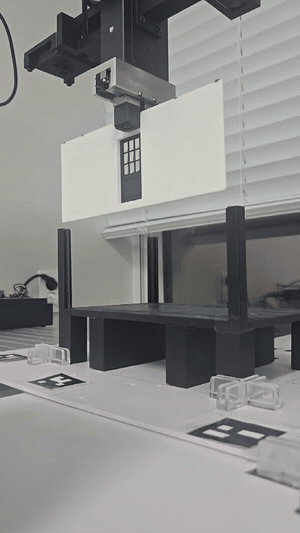

# Robot Control & Vision Alignment — FR5 · ZeKeep 로봇셀 파트

FR5 6축 협동로봇이 벽을 집어 밑판 슬롯에 끼우고, ZeKeep 3축 로봇이 밑판·지붕을 반송하는 로봇셀 스택입니다.
서버(FMS)의 작업 지시 한 줄을 실물 로봇의 0.1 mm 동작으로 바꾸는 계층 전부 — 서버 인터페이스, 셀 오케스트레이션,
벽 삽입 파이프라인, **카메라 2대(손목 D435 · 보조) 기반 정렬 보정(밑판 측정 · 랙 파지 · 정렬 · 하강 감시)**, 운영 콘솔, PLC 로봇 제어 — 를 담당합니다.

담당: 김애리 (팀장) — 로봇 제어 · 비전 보정 · 서버 인터페이스

<p align="center">
  
  <br><em>통합 운영 콘솔 — ZK1·FR5 조그, 카메라 4대, 관절 트윈, 시퀀스 기록/재생을 한 화면에서. 모든 실기 시험이 이 콘솔 위에서 이루어졌다</em>
</p>

## 최종 성과

| 항목 | 결과 | 측정 방법 |
|:---|:---:|:---|
| 벽 전량 삽입 | **5 / 5** · 하강 중 막힘 0건 | 한 회차 다섯 장 전부 삽입, 로그 `── DONE` 기준 |
| 파지 재현 오차 | 1.7 mm → **0.13 mm** | 같은 벽 반복 파지 후 TCP 편차 |
| 정렬 수렴 잔차 | **0.41 mm** | 로봇 최소 실행 이동량(0.5 mm) 아래 = 한계 수렴 |
| 비틀린 밑판에서 삽입 | **−97° · 35 mm** 틀어진 밑판 | 절대좌표 0, 같은 프레임 안의 상대 정렬 |
| ZeKeep 반복 정밀도 | 3.1 mm → **0.55 mm** | 문서·SDK 없는 PLC 로봇, MODBUS-RTU 직결 |
| ZeKeep 105 mm 직하강 | 반경 편차 **±2 mm** | 3축 관절 로봇에서 역기구학 유도로 수직 직선 |
| 사이클당 사람 개입 | **1회** (하강 확인) | 안전상 의도한 설계 |
| 완성품 출하 이송 | 도달 오차 **≤ 0.05 mm** | 포크 손잡이 파지 → 출하지 6단계 이동 |

> "5/5" 는 한 회차에서 다섯 장이 모두 들어갔다는 뜻이지 성공률이 아닙니다. 개발 기간 전체의 정지 기록은
> [docs/05_verification.md](docs/05_verification.md) 에 그대로 적었습니다.

<p align="center">
  
  &nbsp;&nbsp;
  
  <br><em>왼쪽: 든 벽을 밑판 기둥과 상대 정렬해 삽입 · 오른쪽: 매 사이클 밑판 기둥 색점 4점 + ArUco 로 밑판 위치·회전 측정</em>
</p>

## 시스템 구성

```
서버 · FMS ──/cell/execute_task (Action)──▶ cell_orchestrator  ── task → phase 시퀀스 · 상태기계 · 오류코드
           ──/cell/control (Service)────▶       │
           ◀──/cell/status 1Hz ──────────       │ HTTP
           ◀──/fr5/joint_states 30Hz ────       ▼
                                          bridge_server (:8765)  ── FR5 명령 단일 창구 (SDK · 동결 복구 · J6 봉인)
                                                │ Ethernet 192.168.58.2
                                              FR5 6축
   house_cycle (:8776) ── 벽 삽입 파이프라인 · 비전 보정 ── 카메라 4대 (손목 D435 · 보조 · 측면 · 글로벌)
   zk_*.py ── ZeKeep 3축 ── MODBUS-RTU (USB 시리얼) ── 미쓰비시 FX3U PLC
```

- 3계층(작업 · 순서 · 하드웨어)으로 나눠, 로봇이 바뀌어도 상위 계층은 건드리지 않습니다.
- 모의(sim) 어댑터로 전 시퀀스를 먼저 통과시킨 뒤 실물에 투입합니다 (`fr5_adapter_mock_test.py`).
- 통신: CycloneDDS 유니캐스트(`config/cyclonedds_unicast.xml`), 팀 서버 도메인 73 · 글로벌캠 도메인 90.

## 벽 한 장이 들어가기까지

```
① BASE     빈손 관측자세 → 밑판 기둥 색점 4점 + ArUco 고정 자로 위치·회전 측정 (매 사이클)
② RACK     랙 관측 → 벽 색점 중심으로 파지점 계산 → 파지        게이트: 벽 길이 ±2 %, 파지 편차 1.0 mm / 0.7°
③ CARRY    안전 고도 경유 → 슬롯 위 정렬 높이(z_seat + 85)
④ ALIGN    든 벽 색점 ↔ 밑판 고정 특징을 같은 사진에서 비교 → 기준 관계로 수렴   게이트: 정렬 이동 상한
⑤ DESCEND  3 mm 단계 하강 + 든 벽 점 밀림 감시 (카메라를 힘 센서로)          게이트: 밀리면 정지·후퇴
⑥ SEAT     기둥 점으로 안착 판정 → 개방 → 상승 → 다음 벽
⑦ 출하     완성품을 포크 손잡이째 출하지로 (fork_carry)
```

외벽 4장 → 내벽 순서는 물리적 강제입니다. 내벽을 먼저 넣으면 밑판 뎁스 검출이 갈려 기둥을 못 찾습니다.

<p align="center">
  
  <br><em>⑤ DESCEND — 3 mm 단계 하강 중 든 벽 색점의 픽셀 이동을 감시. 벽이 기둥에 걸리면 그리퍼 안에서 밀리는 것이 화면에 보이므로 그 자리에서 정지한다</em>
</p>

## 로봇 2종 역할

| 로봇 | 역할 | 제어 경로 |
|:---|:---:|:---|
| FR5 6축 | 벽 파지 · 운반 · 삽입 · 완성품 출하 | `bridge_server` → Fairino SDK (Ethernet) |
| ZeKeep 3축 ×2 | 밑판 · 지붕 흡착 반송 | `zk_*.py` → MODBUS-RTU → FX3U PLC (USB 시리얼) |

## 폴더 구조

```
robot_control_fr5_zekeep/
├── src/
│   ├── fr5_cycle/          벽 삽입 파이프라인 · 비전 보정 (house_cycle, hover_align, place_calc …)
│   ├── bridge/             FR5 명령 단일 창구 (bridge_server.py, :8765)
│   ├── orchestrator/       서버 계약 구현 — Action/Service/Topic, 상태기계, 오류코드, 모의 어댑터
│   ├── cell_interfaces/    ROS 2 인터페이스 정의 (ExecuteTask.action, CellControl.srv, GetPickPose.srv …)
│   ├── cameras/            카메라 서버 · 글로벌캠 중계 · 자동복구 데몬
│   ├── console/            통합 운영 콘솔 (조그 · 시퀀스 기록/재생 · 관절 트윈 · 카메라 4대)
│   └── zekeep/             ZeKeep 3축 PLC 제어 도구 (9,194줄) · 2호기 세팅 기록
├── scripts/                기동 · 복구 스크립트 (fr5_up, fr5_rescue, start_console, start_factory_view …)
├── config/                 티칭 · 캘리브레이션 결과 — 집 타입별 기준(house_a/house_b), 카메라→로봇 매핑
└── docs/                   01 개요 ~ 07 구조 (문서 목록은 docs/README.md)
```

## 실행 방법

로봇셀 PC 한 대에서 전부 올립니다. FR5 는 전용 유선(192.168.58.x), 팀 서버는 무선(192.168.20.x)입니다.

```bash
# 1. FR5 로봇 스택 — 그리퍼 활성화 → real_robot 순서를 지킨다
./scripts/fr5_up.sh

# 2. 카메라 · 콘솔 · 벽 삽입 사이클 서버
./scripts/start_console.sh

# 3. 서버 계약 노드 (팀 도메인 73, 실물은 exec_mode:=real)
source scripts/team_env.sh
python3 src/orchestrator/cell_orchestrator.py --ros-args -p exec_mode:=real

# 4. 글로벌캠 → Unity 관제 송신 (C270 은 이 스택이 소유한다)
./scripts/start_factory_view.sh

# 5. 브라우저
#    http://<PC>:8000/bf2_robot_console.html   통합 콘솔
#    http://<PC>:8776/                          벽 삽입 사이클 (하강 버튼은 사람이 누른다)
```

| 포트 | 서비스 | 파일 |
|:---|:---:|:---|
| 8765 | FR5 브리지 | `src/bridge/bridge_server.py` |
| 8766 / 8768 / 8771 / 8779 | 손목 D435 / 보조 / 측면 / 글로벌 카메라 | `src/cameras/` |
| 8776 | 벽 삽입 사이클 | `src/fr5_cycle/house_cycle.py` |
| 8773 / 8777 | 단계별 기준점 오버레이 뷰 | `src/fr5_cycle/pillar_view.py` · `ref_view.py` |
| 8000 | 통합 운영 콘솔 | `src/console/bf2_robot_console.html` |

컨트롤러가 동결되면 `scripts/fr5_rescue.sh` (전원 재투입 → 펜던트 알람 Clear 는 사람 → 링크 복구 → 브리지 rescue).

## 핵심 파라미터

| 파라미터 | 값 | 설명 |
|:---|:---:|:---|
| `HOVER_DZ` | 85 (외벽) / 100 (blue_in · yellow_in) / 102 (red_in) | 안착 높이 위 정렬 높이 (mm) |
| `COMBINE_TOL_MM` | 1.5 | 두 카메라 XY 불일치 허용 |
| `ALIGN_MAX_MOVE_TWOCAM_MM` | 15 | 정렬 결과가 슬롯 기준에서 벗어나도 되는 상한 |
| `MIN_EXEC_MM` | 0.8 | 로봇 최소 실행 이동량 — 이보다 작은 보정은 명령하지 않음 |
| `WALL_PAIR_MAX_PX` | 90 | 기준 벽 점 ↔ 측정 벽 점 짝 허용 거리 |
| `JAM_STEP` / `SPD_SLOW` | 3 mm / 1 % | 하강 걸음 · 진입부 속도 |
| `EXPO_SETTLE_S` | 1.4 | 노출 변경 후 프레임 안정 대기 |
| `PRECORR_MAX_MM` | 0 | 파지 편차 선보정 상한 (정렬이 흡수) |
| ZeKeep `D90` / `M301+M21` | — | PLC 모드 레지스터 · 기동 비트 (HMI diff 로 특정) |

## 설계에서 지킨 것

- **절대좌표를 쓰지 않는다** — 밑판은 매 사이클 다른 로봇이 새로 놓는다. 든 벽의 점과 밑판 고정 특징을 한 장의 사진에서 비교해 그 관계가 기준과 같아질 때까지만 움직인다. 카메라가 옮겨져도 살아남는다.
- **자코비안은 문서가 아니라 실측으로** — 로봇을 조그시켜 픽셀 변화를 재서 역행렬을 만든다. 부호는 오차가 0 이 아닌 상태에서만 검증한다.
- **게이트는 통과 장치가 아니라 감지기** — 게이트에 걸리면 완화하지 않고 검출을 보강하거나 사람에게 넘긴다. 완화 3건을 넣었다가 막힌 벽을 계속 누른 뒤 전량 원복했다.
- **로봇을 의심한다** — 0.3 mm 명령은 실행되지 않고도 `started` 로 답한다. 실행 분해능(0.5 mm)을 실측해 검증 기준을 다시 세웠다.
- **카메라를 힘 센서로** — 힘·토크 센서 없이 3 mm 단계 하강 + 벽 점 밀림 감시로 접촉을 읽는다. 기둥이 먼저 부러지는 경우는 원리적으로 못 잡는다(한계).
- **실패 후 부품 복귀는 사람이** — 로봇이 부품을 랙에 되돌리지 않는다. 문 채 멈추고 상태만 보고한다.

## 상세 문서

[문서 목록](docs/README.md) — 개요 · 아키텍처 · 주요 기능 · 데이터 흐름 · 검증 · 범위 · 구조
