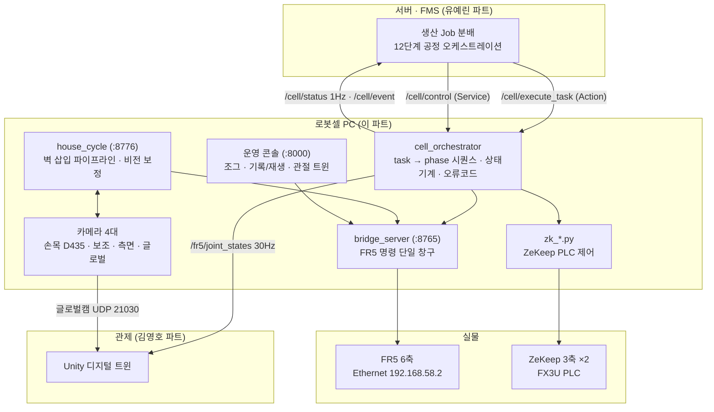

# 02. 시스템 아키텍처

## 3계층 구조

| 계층 | 담당 | 바뀌는 조건 |
|---|---|---|
| 작업 (`cell_orchestrator`) | 서버 계약, task → phase, 상태기계, 오류코드 | 서버 계약이 바뀔 때 |
| 순서 (`house_cycle`, `fork_carry`, `zk_*`) | 벽 한 장을 넣는 단계와 게이트, 비전 보정 | 공정·부품이 바뀔 때 |
| 하드웨어 (`bridge_server`, Fairino SDK, MODBUS) | 실물 명령, 동결 복구, 안전 봉인 | 로봇이 바뀔 때 |

모의(sim) 어댑터로 전 시퀀스를 먼저 통과시킨 뒤 실물 어댑터(`fr5_real_adapter.py`)로 바꿔 끼웁니다.

## 서버 인터페이스 (계약)

| 이름 | 종류 | 방향 | 내용 |
|---|---|---|---|
| `/cell/execute_task` | Action `ExecuteTask` | 서버 → 셀 | task(zone · slot · part_code · req_id) 실행, feedback = phase 진행, result = SUCCESS / E-코드 |
| `/cell/control` | Service `CellControl` | 서버 → 셀 | PAUSE · RESUME · ABORT · RESET (`{ver, cmd, req_id}`) |
| `/cell/status` | Topic 1 Hz | 셀 → 서버 | `cell_state` (IDLE / RUNNING / PAUSED / ERROR …), 현재 phase |
| `/cell/event` | Topic | 셀 → 서버 | 완료 · 오류 이벤트 |
| `/fr5/joint_states` | Topic 30 Hz | 셀 → 관제 | 관절각 (Unity 디지털 트윈) |
| `/vision/factory_camera/image_view` | Topic (도메인 90) | 셀 → 관제 | 글로벌캠 (C270) |

- 인터페이스 정의: `src/cell_interfaces/` (`ExecuteTask.action`, `CellControl.srv`, `GetPickPose.srv`, `PickCandidate.msg`)
- 일시정지는 phase 경계에서 멈추고 중단한 공정부터 재개, 오류는 원인 조치 후 RESET 확인 뒤 해당 공정부터 재실행 (팀 상태 다이어그램 기준)
- `req_id` 규칙: 통신 재전송은 같은 값, 실제 재실행은 새 값
- 팀 DDS 도메인 73, 유니캐스트 설정 `config/cyclonedds_unicast.xml`

## FR5 명령 경로

콘솔 · 사이클 · 오케스트레이터 모두 **`bridge_server` 한 곳**을 통해서만 FR5 를 움직입니다.

- HTTP `/fr5/move_tcp` (dry_run 선검사 → 실행), `/fr5/gripper`, `/fr5/speed`, `/fr5/stop`, `/status`
- 안전 봉인: J6 대회전(|ΔJ6| > 180°) 거부, 페이로드 등록, 가감속 리미터
- 동결 복구 경로: 전원 재투입 → 펜던트 알람 Clear(사람) → 링크 복구 → `POST /rescue/fr5`
- 명령 충돌(409)은 앞 명령이 끝나길 기다린 뒤 한 번 재시도 (이 명령은 실행되지 않은 상태라 중복 실행이 아님)

## 카메라 4대

| 카메라 | 포트 | 용도 |
|---|---:|---|
| 손목 D435 (RealSense) | 8766 | 밑판 기둥 색점 · ArUco · 랙 벽 색점 · 정렬 · 하강 밀림 감시 · 뎁스 |
| 보조 카메라 (고정) | 8768 | 정렬 교차 측정 (참고) |
| 측면 C270 | 8771 | 삽입 중 벽 밑동 측면 관찰 |
| 글로벌 C270 | 8779 | 셀 탑뷰 — factory_view 스택이 소유, Unity 관제로 송신 |

자동복구 데몬(`cam_autostart.sh`)이 USB 탈락 · 프레임 정지 · 밝기 이상을 감시해 카메라 서버를 재기동하고 화이트밸런스(4600 K)·색점 노출을 복원합니다.

## ZeKeep 제어 경로

제조사 문서·SDK 가 없는 3축 PLC 로봇을 프로토콜 레벨에서 제어합니다.

1. HMI 조작 ↔ 레지스터 diff — 화면 버튼을 하나씩 누르며 M비트 · D레지스터 스냅샷을 비교, 변한 주소만 추출 → 모드 `D90`, 기동 `M301+M21` 특정
2. MODBUS-RTU 직결 — USB 시리얼로 PLC 에 직접 지령, 파이썬에서 자세 · 속도 · 원점 제어
3. 역기구학 직접 유도 — `r = L1·sin(Q2−A2) + L2·cos(Q3−A3)`, r 을 고정하면 3축 관절 로봇에서 수직 직선 운동

한계: 오버슛의 바닥은 통신 지연 150 ms. 조그 제어로 0.5° 이하는 원리적으로 불가. 그 아래는 DDRVA 직접구동 영역이나 목표 무시 위험을 확인한 뒤 봉인.

---

[문서 목록으로](README.md)
