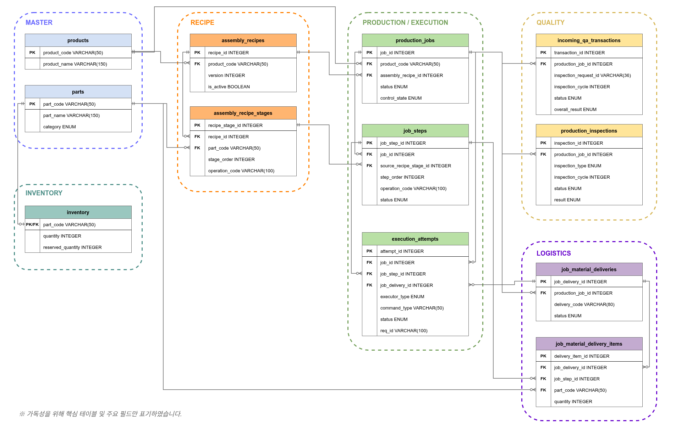
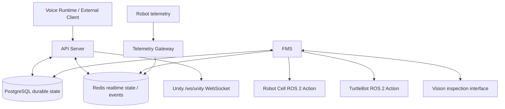

# Server / FMS / DB

AI 기반 조립식 주택 자동화 공장의 통합 backend 모듈입니다. API Server, FMS, Telemetry Gateway, Voice Runtime을 하나의 backend codebase로 관리하며, 각 구성 요소는 독립 실행 프로세스로 운영합니다. PostgreSQL은 생산의 확정 상태를, Redis는 실시간 상태와 이벤트를 담당합니다.

> Voice Runtime의 실제 실행 코드는 이 모듈에 통합되어 있습니다. 음성 명령은 production business logic, API, Redis realtime contract와 직접 연결되므로 별도 복사하지 않습니다. 음성 기능 중심 설명은 [llm_stt_tts/README.md](../llm_stt_tts/README.md)를 참고하세요.

## 담당 범위

- FastAPI API Server와 Production Monitor
- FMS production orchestration 및 Recipe-driven Job/JobStep lifecycle
- PostgreSQL · SQLAlchemy 모델, Alembic migration, 재고·물류·검사 durable state
- Redis 기반 production/transport/inspection realtime event
- ROS 2 Robot Cell · TurtleBot Action adapter 및 Telemetry Gateway
- Vision 수입검사와 조립 결과 품질검사 연동
- Unity WebSocket production snapshot/realtime status
- 음성 명령 API(STT · command interpretation · TTS) 및 Voice Runtime

## 구성

| 구성 요소 | 실제 패키지 | 역할 |
| --- | --- | --- |
| API Server | `api_server/` | HTTP API, 음성 요청, production read model, Unity WebSocket, 운영 UI |
| FMS | `fms_server/` | 실행 조건 판단, robot/transport dispatch, 결과 처리, 검사 orchestration |
| Shared domain | `shared/` | 설정, SQLAlchemy 모델, schema, domain service, Redis contract |
| Telemetry Gateway | `telemetry_gateway/` | ROS 2 telemetry 수집과 Redis latest state 전달 |
| Voice Runtime | `voice_runtime/` | Wake Word, VAD, API 대화 요청, TTS 재생, 공정 음성 안내 |
| Migration | `alembic/` | PostgreSQL schema version 관리 |
| Tests | `tests/` | unit, API, fake transport 및 integration regression |

## 핵심 설계 원칙

### Durable State / Realtime 분리

- **PostgreSQL**: `Job`, `JobStep`, `Delivery`, `Inspection`, `ExecutionAttempt`, inventory와 확정된 생산 이력
- **Redis**: 최신 로봇 telemetry와 production / transport / inspection / error realtime event

PostgreSQL은 재시작 후에도 유지되어야 하는 생산 authority이고, Redis는 빠르게 변하는 상태와 이벤트 전달을 위한 realtime 계층입니다.

### State-based Orchestration

FMS는 고정 시간표만 따라가지 않습니다. 현재 `JobStep`, material delivery, inspection, robot execution state 등 durable state를 기준으로 다음 작업의 실행 가능 여부를 판단합니다.

### Single PROCESS Projection

Unity 관제, Voice 생산 상태 조회, 자동 TTS 공정 안내는 모두 서버의 동일한 12단계 PROCESS projection을 사용합니다.

### 상태 복구와 중복 실행 방지

`COMPLETED` / `SUCCEEDED` 이력은 재시작 후에도 보존합니다. `PENDING` 작업은 durable state를 다시 평가할 수 있지만, `RUNNING` / `IN_PROGRESS`처럼 실제 물리 실행 결과가 불확실한 작업은 자동 재전송하지 않습니다. 불확실 상태는 수동 복구 대상으로 남겨 동일 Robot/Transport 명령의 중복 실행을 막습니다.

## 데이터베이스 설계

생산 공정의 현재 상태와 실행 이력을 추적할 수 있도록 PostgreSQL 기반의 관계형 데이터 모델을 구성했습니다.

ERD는 크게 **Master · Inventory · Recipe · Production/Execution · Quality · Logistics** 영역으로 나누어 관리합니다.



> 가독성을 위해 핵심 테이블과 주요 필드만 표시했습니다.

### 주요 데이터 영역

| 영역 | 주요 테이블 | 역할 |
| --- | --- | --- |
| Master | `products`, `parts` | 생산 모델과 부품 기준정보 |
| Inventory | `inventory` | 부품별 현재 수량과 예약 수량 관리 |
| Recipe | `assembly_recipes`, `assembly_recipe_stages` | 제품별 조립 순서와 작업 정의 |
| Production / Execution | `production_jobs`, `job_steps`, `execution_attempts` | 생산 Job, 실제 실행 Step, 로봇/운반 명령 실행 이력 |
| Quality | `incoming_qa_transactions`, `production_inspections` | 자재 수입검사와 조립 결과 품질검사 |
| Logistics | `job_material_deliveries`, `job_material_delivery_items` | 생산 Job별 자재 운반과 팔레트 Delivery 상태 |

### Recipe와 Job 실행 상태 분리

`assembly_recipes`와 `assembly_recipe_stages`는 제품별 생산 순서를 정의하는 기준 정보입니다.

생산 요청이 생성되면 해당 Recipe를 기준으로 Job의 실행 대상이 `job_steps`에 materialize되며, 이후 FMS는 원본 Recipe를 직접 따라가는 것이 아니라 **Job에 저장된 durable state를 기준으로 실행 가능 여부를 판단**합니다.

따라서 Recipe가 이후 수정되더라도 이미 생성된 Job의 실행 이력과 상태는 유지됩니다.

### 실행 이력 추적

`execution_attempts`는 Robot Cell, TurtleBot 등 외부 장비에 전달한 실제 실행 단위를 기록합니다.

하나의 `job_step`에 대해 실행 요청, 결과, `req_id`, executor type 등을 별도로 보존하여 다음을 추적할 수 있습니다.

- 어떤 생산 Job에서 실행됐는지
- 어떤 Step에 대한 명령인지
- 어떤 장비가 수행했는지
- 성공 / 실패 여부
- 동일 작업의 재시도 여부

### 물류와 생산 Step 연결

`job_material_deliveries`는 생산에 필요한 자재 운반 lifecycle을 관리하고,
`job_material_delivery_items`를 통해 실제 부품과 대상 `job_step`을 연결합니다.

이를 통해 단순히 TurtleBot이 이동했는지가 아니라 **어떤 생산 Job의 어떤 자재가 어느 공정을 위해 운반되었는지**를 추적할 수 있습니다.

### 검사 결과의 durable evidence

수입검사는 `incoming_qa_transactions`,
조립 결과 검사는 `production_inspections`에 별도로 저장합니다.

FMS는 검사 결과를 단순 이벤트로 처리하지 않고 PostgreSQL에 저장된 검사 상태를 다음 공정의 Gate로 사용합니다.

예를 들어 조립 결과 품질검사가 PASS되지 않으면 지붕 설치 Step은 실행 가능 상태가 되지 않습니다.

## 시스템 데이터 흐름



FMS는 durable state 갱신 후 production, transport, inspection, error 이벤트를 Redis에 publish하고, API Server는 이를 Unity realtime projection에 반영합니다.

## Production orchestration

Production Job은 고정된 시간 순서가 아니라 현재 `JobStep`, `Delivery`, `Inspection`, `ExecutionAttempt` 상태를 기준으로 다음 공정의 실행 가능 여부를 판단해 진행합니다. 기술적으로는 생성 당시 Recipe snapshot의 `JobStep` frontier를 기준으로 공정 순서를 유지합니다.

| Order | PROCESS | Display |
| ---: | --- | --- |
| 1 | `COMMAND_RECEIVED` | 작업 명령 전달 |
| 2 | `INCOMING_QA` | 수입검사 |
| 3 | `BASE_INSTALL` | Zekeep 베이스 설치 |
| 4 | `OUTER_WALL_DELIVERY` | 외벽 팔레트 운반 |
| 5 | `OUTER_WALL_INSTALL` | FR5 외벽 설치 |
| 6 | `OUTER_RETURN_INNER_DELIVERY` | 외벽 빈 팔레트 회수 / 내벽 팔레트 운반 |
| 7 | `INNER_WALL_INSTALL` | FR5 내벽 설치 |
| 8 | `INNER_WALL_RETURN` | 내벽 빈 팔레트 회수 |
| 9 | `PRE_ROOF_INSPECTION` | 조립 결과 검사 |
| 10 | `ROOF_INSTALL` | Zekeep 지붕 설치 |
| 11 | `HOUSE_OUTBOUND` | FR5 완성 주택 운반 |
| 12 | `COMPLETED` | 작업 완료 |

## 외부 인터페이스

| 대상 | 실제 interface | 책임 |
| --- | --- | --- |
| Unity | `/ws/unity` WebSocket | production snapshot, realtime status, inspection·telemetry projection |
| Robot Cell | ROS 2 `/cell/execute_task` Action | 조립 task dispatch 및 결과 correlation |
| TurtleBot | ROS 2 transport / return-home Action | 팔레트 transport, empty return, return home |
| Vision 수입검사 | FMS-owned v0.2 UDP request / ACK / final result | 수입검사 transaction과 gate evidence |
| Vision 조립 결과 품질검사 | FMS-owned PRE_ROOF v0.2 per-view UDP | TOP·LEFT·RIGHT·FRONT·BEHIND 검사 결과 누적 |

실제 장비 동작은 환경 설정과 FMS 실행 상태에 따라 달라집니다. 테스트는 fake transport·fixture를 사용하며, 운영 환경 설정은 저장소에 포함하지 않습니다.

## 디렉터리 구조

```text
server_fms_db/
├── api_server/           # FastAPI routers, API services, static production monitor
├── fms_server/           # FMS worker, robot/transport/vision adapters
├── shared/               # models, schemas, services, realtime contracts
├── telemetry_gateway/    # ROS 2 telemetry → Redis gateway
├── voice_runtime/        # Mic/Wake Word/VAD/TTS runtime and production announcements
├── alembic/              # migration environment and revisions
├── scripts/              # guarded setup, seed, rehearsal and verification scripts
├── tests/                # regression tests
├── .env.example          # safe environment-variable template
├── alembic.ini
├── pyproject.toml
└── requirements.txt
```

## 환경 변수와 실행

실제 `.env`는 커밋하지 않습니다. `.env.example`을 복사해 개인 환경에서만 값을 설정합니다.

- Database / Redis: `DATABASE_URL`, `POSTGRES_TEST_DATABASE_URL`, `REDIS_URL`
- API / Telemetry: `API_HOST`, `API_PORT`, `TELEMETRY_HOST`, `TELEMETRY_PORT`
- Robot / ROS: `ROS_DOMAIN_ID`, Robot Cell·TurtleBot Action name
- Vision: 수입검사 및 조립 결과 품질검사 endpoint / UDP 설정
- Voice: Ollama, Whisper, TTS provider 설정

```bash
cd server_fms_db
python -m venv .venv
source .venv/bin/activate
pip install -r requirements.txt

python -m uvicorn api_server.main:app
python -m fms_server.main
python -m uvicorn telemetry_gateway.main:app
python -m voice_runtime.main
```

`./scripts/factory_stack.sh`는 API, FMS, telemetry, Voice Runtime을 프로파일별로 시작하는 launcher입니다. 실제 장비·DB에 연결하기 전에는 설정과 대상 DB를 별도로 확인해야 합니다.

## 테스트와 보안

```bash
cd server_fms_db
python -m pytest -qq
```

`postgres_integration`, `redis_integration` marker 테스트는 별도 명시 환경에서만 실행합니다. 실제 Robot Cell, TurtleBot, Vision 장비나 운영 DB를 대상으로 한 명령은 자동 테스트에서 실행하지 않습니다.

실제 `.env`, DB/Redis credential, API key, private certificate, runtime log, DB dump, model weight, 녹음·합성 음성, benchmark 결과는 Git에 포함하지 않습니다. Alembic migration 실행은 환경·DB 대상 확인 후 별도 승인 절차로 수행해야 합니다.
