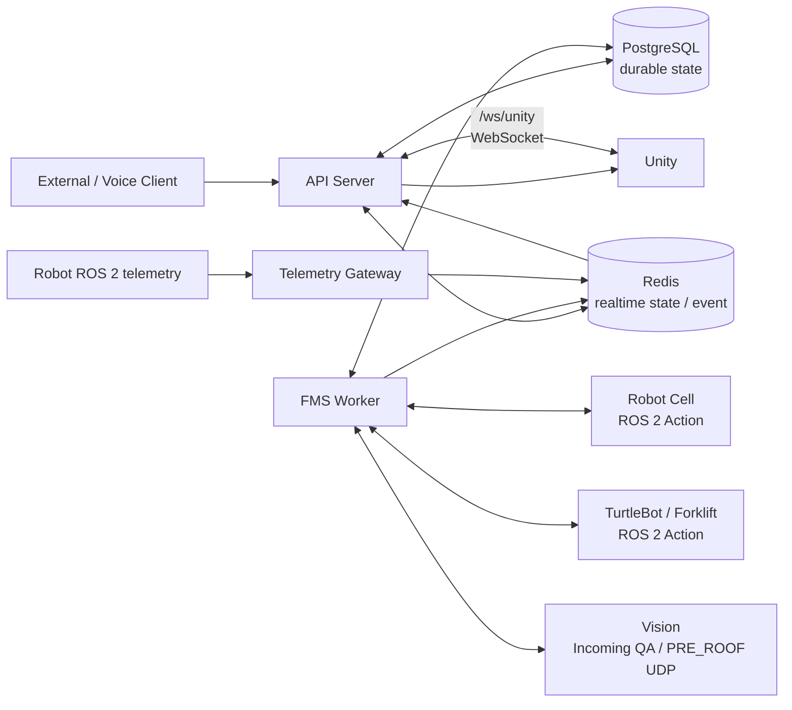
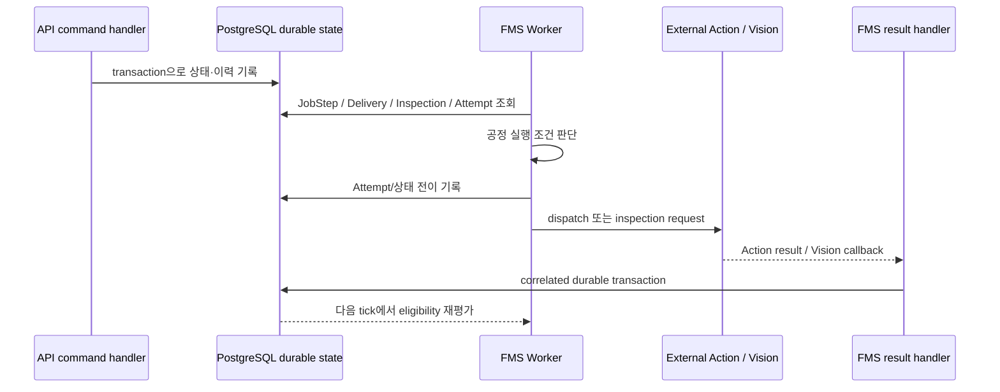

# Server / FMS / DB 시스템 아키텍처

이 문서는 `server_fms_db`의 실행 프로세스와 durable state·realtime 계층·외부 시스템의 연결 관계를 설명합니다.

## 핵심 구성 요소

| 구성 | 실제 책임 |
| --- | --- |
| API Server | FastAPI HTTP API, production read model, Voice API, Production Monitor, Unity `/ws/unity` WebSocket |
| FMS Worker | durable state 기반 공정 실행 조건 판단, Robot Cell·TurtleBot dispatch/result 처리, 검사 orchestration |
| Telemetry Gateway | ROS 2 telemetry 구독, 정규화, Redis latest-value 및 Pub/Sub 전달 |
| Shared domain | SQLAlchemy model, schema, Recipe/재고/물류/검사/domain service, Redis contract |
| PostgreSQL | Production Job, JobStep, ExecutionAttempt, Material Delivery, Inspection, inventory, control request와 실행 이력 |
| Redis | 최신 telemetry, production·transport·inspection·error realtime event, API/Voice refresh trigger |

API Server, FMS Worker, Telemetry Gateway, Voice Runtime은 하나의 backend codebase에 있지만 독립 실행 프로세스로 운영할 수 있습니다. 역할 분리는 availability 보장이 아니라 책임과 I/O 경계를 명확하게 하기 위한 구조입니다.

## 전체 데이터 흐름

Telemetry Gateway는 ROS telemetry를 FMS Worker에 직접 전달하지 않습니다. Gateway는 정규화된 latest value와 Pub/Sub payload를 Redis에 전달하고, API Server의 Unity realtime subscriber가 이를 Unity projection으로 변환합니다.

## PostgreSQL과 Redis의 역할

### PostgreSQL: 생산 authority

PostgreSQL은 재시작 후에도 남아야 하는 확정 상태와 실행 이력을 저장합니다. 예시는 다음과 같습니다.

- Production Job과 Recipe snapshot JobStep
- `ExecutionAttempt`의 dispatch/accept/result 이력
- `JobMaterialDelivery`와 delivery item
- Incoming QA transaction, PRE_ROOF inspection/view request
- 재고 quantity·reservation·movement
- pause/resume control request와 terminal 상태

### Redis: 최신 상태와 realtime 전달

Redis는 durable production database가 아닙니다. 현재 코드에서 Telemetry Gateway는 latest JSON key를 갱신한 뒤 동일 payload를 Pub/Sub channel로 발행합니다. 예를 들어 `telemetry.mobile_robot_pose`, `telemetry.robot_joint_state`, `telemetry.robot_status` channel이 있으며, latest key는 `telemetry:robot:<robot_id>:<kind>` 형태입니다.

FMS와 domain service의 post-commit notifier는 `production.changed`, transport, Incoming QA, production inspection, error 계열 이벤트를 발행합니다. API Server는 이를 받아 DB/read-model projection을 다시 읽고 Unity에 status/snapshot을 전달합니다.

## Durable state 기반 orchestration

즉 FMS는 단순히 이전 callback이 도착했다는 이유만으로 다음 작업을 보내지 않습니다. Recipe snapshot의 순서, 현재 JobStep, Material Delivery, inspection gate, ExecutionAttempt 상태를 durable evidence로 확인한 뒤 다음 실행 가능 여부를 판단합니다.

## Realtime projection

Redis event는 외부 화면의 최종 production authority가 아닙니다. Unity는 `/ws/unity`에서 `production_snapshot`, `production_status`, inspection/transport/telemetry event를 받으며, production status에는 legacy `current_stage_code`와 additive PROCESS projection이 함께 포함됩니다.

Voice의 생산 상태 조회와 자동 공정 TTS도 동일한 server-side PROCESS projection을 사용합니다. 따라서 event 종류 자체나 화면별 임의 JobStep 해석이 아니라 `process_stage_code`, `process_stage_order`, `process_stage_display_name`이 현재 상위 공정을 표현합니다.
