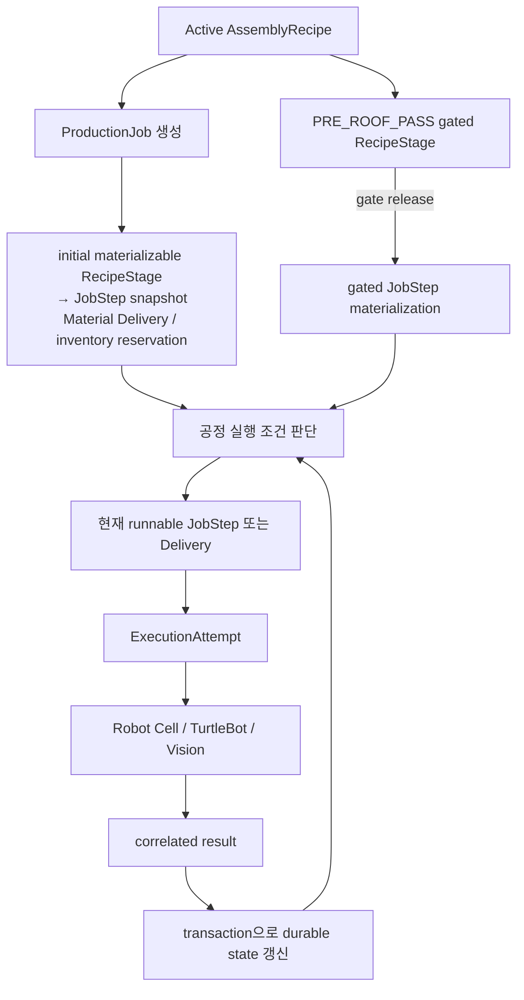

# Production Orchestration과 Lifecycle

이 문서는 Production Job이 Recipe snapshot에서 시작해 FMS Worker의 공정 실행 조건 판단, 외부 실행, 검사, 완료·복구 상태로 이어지는 방식을 설명합니다.

## 핵심 domain model

| 모델/개념 | lifecycle에서 저장하는 의미 |
| --- | --- |
| `AssemblyRecipe` / `AssemblyRecipeStage` | 제품별 immutable Recipe version과 stage order, part·slot·supply·gate 정책 |
| `ProductionJob` | 한 채의 생산 요청, 선택 Recipe snapshot의 기준과 Job-level status/control state |
| `JobStep` | 초기 materializable RecipeStage 또는 gate release 뒤에 snapshot되는 실행 단위. `step_order`와 상태가 frontier를 형성 |
| `ExecutionAttempt` | Robot Cell/Forklift command의 dispatch·accept·result·control 이력 |
| `JobMaterialDelivery` / `JobMaterialDeliveryItem` | transported/manual 자재 공급 batch와 해당 Job-local 자재 구성 |
| `IncomingQATransaction` / `MaterialInspection` | 수입검사 request, ACK, result, item evidence |
| `ProductionInspection` / `ProductionInspectionViewRequest` | PRE_ROOF 검사 cycle과 per-view request/result durable history |
| `Inventory` / `InventoryMovement` | part master identity 기준 on-hand, reservation, consumption·release evidence |

`AssemblyRecipe`는 제품·version별 활성 Recipe를 하나만 둘 수 있고, Production Job은 생성 시 해당 Recipe를 참조합니다. execution gate가 없는 선택 RecipeStage는 JobStep으로 snapshot하고, `PRE_ROOF_PASS`처럼 gate가 있는 stage는 gate가 release될 때 JobStep으로 materialize합니다. 이후 Recipe가 바뀌어도 이미 생성된 Job의 snapshot/history를 다시 작성하지 않습니다.

## 기본 orchestration 흐름



`get_next_step()`은 RUNNING Step을 우선하고, 없을 때 가장 이른 PENDING Step을 선택합니다. 이 frontier 원칙은 later step이 earlier work보다 먼저 dispatch되는 것을 막습니다. Delivery·inspection·operator-ready 등 별도 gate는 `StepReadinessService`와 관련 domain service가 추가로 판단합니다.

## Recipe-driven execution과 PROCESS projection

제품별 세부 조립 순서는 코드에 고정하지 않고 DB의 `AssemblyRecipe`와 `AssemblyRecipeStage`를 authority로 사용합니다. Job 생성 시 active Recipe의 실행 가능한 stage를 durable `JobStep`으로 snapshot하며, FMS는 그 `step_order`와 Delivery·Inspection·ExecutionAttempt gate를 기준으로 다음 runnable work를 판단합니다. `PRE_ROOF_PASS`처럼 execution gate가 있는 stage는 해당 gate가 release된 뒤에만 JobStep으로 materialize됩니다.

따라서 HOUSE_A/HOUSE_B의 벽 설치 순서는 Recipe-driven이며, Recipe가 이후 변경되어도 기존 Production Job의 JobStep snapshot을 다시 작성하지 않습니다. FMS는 생성된 Job-local durable state를 실행 authority로 사용합니다.

canonical 12-stage PROCESS는 Recipe나 Robot/JobStep 실행 순서를 대체하지 않습니다. 여러 JobStep·Delivery·Inspection lifecycle을 Unity 관제, Voice 상태 조회, 자동 TTS에서 일관되게 표현하기 위한 상위 production-state projection입니다.

## Canonical 12-stage PROCESS projection

`UnityCurrentStageProjectionService.derive_process_stage()`는 상세 lifecycle을 바꾸지 않고 상위 표시 단계만 계산합니다.

| Order | Code | Display name |
| ---: | --- | --- |
| 1 | `COMMAND_RECEIVED` | 작업 명령 전달 |
| 2 | `INCOMING_QA` | 수입검사 |
| 3 | `BASE_INSTALL` | Zekeep 베이스 설치 |
| 4 | `OUTER_WALL_DELIVERY` | 외벽 팔레트 운반 |
| 5 | `OUTER_WALL_INSTALL` | FR5 외벽 설치 |
| 6 | `OUTER_RETURN_INNER_DELIVERY` | 외벽 빈 팔레트 회수 / 내벽 팔레트 운반 |
| 7 | `INNER_WALL_INSTALL` | FR5 내벽 설치 |
| 8 | `INNER_WALL_RETURN` | 내벽 빈 팔레트 회수 |
| 9 | `PRE_ROOF_INSPECTION` | 조립 결과 검사 |
| 10 | `ROOF_INSTALL` | Zekeep 지붕 설치 |
| 11 | `HOUSE_OUTBOUND` | FR5 완성 주택 운반 |
| 12 | `COMPLETED` | 작업 완료 |

`FAILED`와 `CANCELED` Job은 정상 PROCESS path를 뜻하지 않으므로 resolver가 `None`을 반환합니다. 이 상태를 `COMPLETED`로 표시하지 않습니다.

## 현재 HOUSE_A / HOUSE_B Recipe 순서

현재 master seed와 wall wire-contract regression은 Vision slot 번호가 아니라 Recipe `stage_order`를 assembly order의 authority로 사용합니다. 두 제품은 모두 BASE → 외벽 4개 → 내벽 → PRE_ROOF gate → ROOF lifecycle을 따릅니다.

| Product | 현재 wall JobStep order | inner wall |
| --- | --- | --- |
| `HOUSE_A` | 출입문 외벽(`blue`) → 좌측 창문 외벽(`yellow`) → 후면 창문 외벽(`red`) → 우측 외벽(`red_s`) → 출입문 내벽(`blue_in`) → 내벽(`yellow_in`) | 2개 |
| `HOUSE_B` | 출입문 외벽(`blue`) → 좌측 창문 외벽(`yellow`) → 후면 창문 외벽(`red`) → 우측 외벽(`red_s`) → 내벽(`red_in`) | 1개 |

괄호의 색 alias는 Robot Cell wire `parts_json[].slot` 값입니다. DB의 canonical `JobStep.slot_code`, `part_code`, Incoming QA slot mapping과는 별도 identity입니다. ROOF stage는 `PRE_ROOF_PASS` execution gate를 가지며, PRE_ROOF PASS 전에는 JobStep으로 materialize되지 않고 dispatch될 수도 없습니다.

## Material Delivery와 empty pallet return

`JobMaterialDelivery`는 Job의 supply group별 자재 공급 lifecycle을 저장합니다. transported delivery의 forward transport가 성공하면 Delivery가 `COMPLETED`가 되고, 해당 pallet의 DROP ownership은 durable transport evidence로 계산됩니다.

empty pallet return은 별도 Delivery row가 아니라 같은 Delivery에 연결된 `ExecutionAttempt`의 `EXECUTE_TRANSPORT_EMPTY_RETURN` command history입니다. policy transport의 logical route는 다음과 같이 resolver가 정합니다.

```text
OUTER_WALLS: RACK1 → DROP
INNER_WALL:  RACK2 → DROP
empty return: 위 forward route의 역방향
```

`RETURN_HOME`은 forward/empty-return과 별도의 Forklift execution attempt로 orchestration됩니다. 이러한 분리는 pallet 회수와 TurtleBot의 홈 복귀를 같은 완료 증거로 혼동하지 않게 합니다.

## Inspection lifecycle

### Incoming QA

Incoming QA는 Job이 생산 단계로 들어가기 전의 material inspection gate입니다. durable `IncomingQATransaction`은 immutable request snapshot, `inspection_request_id`, `inspection_cycle`, ACK evidence, terminal result snapshot을 보관합니다. API/FMS는 필수 inspection mode가 PASS/released 된 뒤에만 preproduction readiness를 허용합니다.

### PRE_ROOF

PRE_ROOF v0.2는 단일 bundled final result가 아니라 view별 lifecycle입니다.

```text
TOP → LEFT → RIGHT → FRONT → BEHIND
```

서버가 durable view request 상태를 보고 다음 view를 선택합니다. 각 `ProductionInspectionViewRequest`는 request id, cycle, ACK/result digest, status, retry, provenance를 저장합니다. 현재 view가 FAIL이면 다음 view로 진행하지 않고 같은 view를 새 request id로 재검사합니다. 다섯 view가 모두 PASS일 때만 PRE_ROOF gate를 release합니다. Vision의 `production_valid`는 provenance metadata이며 이 gate의 입력이 아닙니다.

## Pause, Resume, Cancel

`ProductionJob.control_state`와 Job `status`는 분리됩니다. API/Voice는 `ProductionControlService`를 통해 durable pause/resume request를 기록하며 ROS command를 직접 호출하지 않습니다. FMS `PauseResumeCoordinator`는 Robot Cell status evidence가 matching `HELD` 또는 resumed `EXECUTE`임을 확인한 뒤 request를 settle합니다.

active Forklift/TurtleBot transport에는 물리 pause가 지원되지 않으므로 pause request는 안전하게 거절됩니다. Cancel은 Job-level administrative transition이며 JobStep, Delivery, successful ExecutionAttempt history를 임의로 되돌리지 않습니다. 물리 상태가 남은 terminal pallet은 별도의 recovery evidence가 필요합니다.

## Restart와 recovery 원칙

| durable evidence | restart 후 정책 |
| --- | --- |
| `COMPLETED` / `SUCCEEDED` | 상태와 이력을 보존하고 재실행하지 않음 |
| PENDING + physical attempt 없음 | current eligibility를 다시 평가할 수 있음 |
| RUNNING / active `ExecutionAttempt` | 실제 물리 실행 여부가 불확실하므로 자동 재전송하지 않음 |
| terminal stranded DROP | 기존 forward history를 보존한 채, 승인된 recovery가 empty-return evidence를 기록 |

이 정책의 목적은 재시작 후 동일 Robot Cell 또는 transport physical command가 중복 실행되는 위험을 줄이는 것입니다. 불확실한 active state는 operator/manual recovery 경계로 남습니다.
