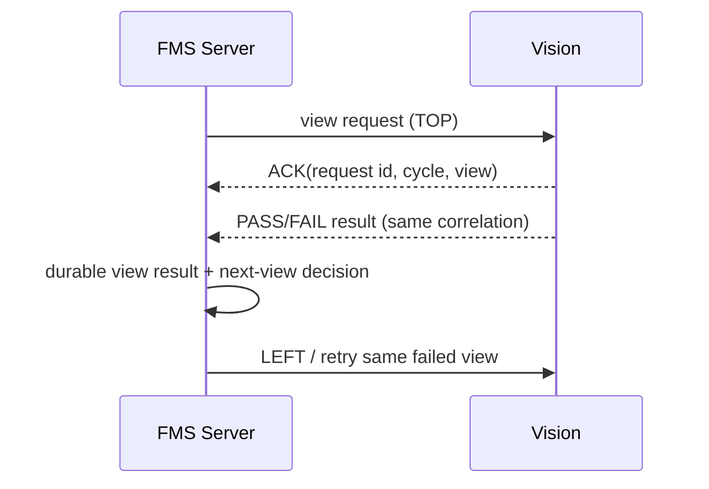
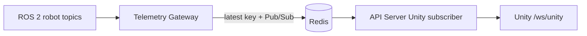

# 외부 시스템 Interface Contract

이 문서는 Server/FMS가 다른 영역과 통신할 때의 verified contract와 authority를 정리합니다. 환경별 host, port, ROS domain, credential은 설정값이며 이 문서의 고정 architecture fact로 다루지 않습니다.

## Unity

| 항목 | 현재 contract |
| --- | --- |
| Transport | WebSocket |
| Endpoint | `/ws/unity` (API Server) |
| 초기 상태 | `production_snapshot` |
| realtime 유형 | `production_status`, transport, Incoming QA, production inspection, telemetry, error, voice runtime event |
| 상위 공정 | `process_stage_code`, `process_stage_order`, `process_stage_display_name` |
| compatibility | 기존 `current_stage_code`는 유지하며 PROCESS projection을 additive field로 제공 |

Unity client의 production realtime endpoint는 API Server `/ws/unity`입니다. Telemetry Gateway의 `/ws/telemetry`는 internal debug route이며 Unity의 최종 realtime route가 아닙니다.

## Robot Cell

| 항목 | 현재 contract |
| --- | --- |
| Transport | ROS 2 Action |
| Action name | `/cell/execute_task` |
| Generated interface | `cell_interfaces/action/ExecuteTask` |
| Goal top-level fields | `ver`, `req_id`, `job_id`, `step_id`, `task_type`, `product`, `parts_json` |
| Result core fields | `status`, `error_code`, `detail`, `completed_json` |

`parts_json`은 JSON array이며 item은 `slot`, `class`, optional `part_code`, optional `zone`을 가집니다. Server의 canonical installation slot은 JobStep/Recipe history에 보존하고, `RobotCellSlotMapper`가 Action boundary에서 Robot Cell wire slot alias로 변환합니다.

Robot Cell result가 `SUCCEEDED`일 때 FMS는 `completed_json`이 요청한 slot 전체를 증명하는지 검증합니다. goal reject, timeout, canceled, malformed result는 성공으로 정규화하지 않습니다. Action timeout은 자동 cancel/retry를 의미하지 않습니다.

## TurtleBot / Forklift

| 항목 | Execute transport | Return home |
| --- | --- | --- |
| Action name (default) | `/forklift/execute_transport` | `/forklift/return_home` |
| Transport | ROS 2 Action | ROS 2 Action |
| Generated interface | `forklift_interfaces/action/ExecuteTransport` | `forklift_interfaces/action/ReturnHome` |
| Goal | `req_id`, `job_id`, `delivery_id`, `pickup_code`, `dropoff_code` | `req_id` |
| Result | `SUCCEEDED` / `FAILED` / `CANCELED`, error/detail | 동일한 normalized outcome |

FMS는 TurtleBot에 physical pose나 marker를 전달하지 않습니다. 위 Action name은 `Settings`의 기본값이며 배포 환경에서 설정으로 바꿀 수 있습니다. `TransportLocationResolver`가 Delivery policy를 logical location으로 해석하며, TurtleBot 측이 실제 navigation pose authority를 갖습니다. 현재 policy mapping은 `OUTER_WALLS → RACK1 → DROP`, `INNER_WALL → RACK2 → DROP`이고 empty return은 역방향 logical route입니다.

## Vision — Incoming QA

Incoming QA v0.2는 FMS-owned UDP Request → ACK → Result transaction입니다.

| 단계 | 핵심 정보 |
| --- | --- |
| Request | `ver`, `message_type=incoming_qa_request`, `inspection_request_id`, `inspection_cycle`, `inspection_mode`, `items[]` |
| Item | `slot_id`, `delivery_item_id`, `expected_part_code`, `expected_class_name`, `expected_quantity` |
| ACK | request id/cycle, `accepted`, `duplicate`, `reason_code` |
| Result | request id/cycle, mode, overall result, item-level result/evidence, Vision provenance |

ACK와 result는 transaction의 `inspection_request_id`와 cycle에 correlate됩니다. UDP source/destination, timeout, retry 설정은 `Settings` 환경 설정으로 주입됩니다. Incoming QA의 request item slot/expected class validation은 Vision recipe mapping을 따르며, physical inspection evidence는 durable transaction 및 MaterialInspection에 기록됩니다.

## Vision — PRE_ROOF

PRE_ROOF v0.2도 UDP이지만 Incoming QA와 별도 lifecycle·schema를 사용합니다.

| 항목 | 현재 contract |
| --- | --- |
| Request type | `pre_roof_view_inspection_request` |
| ACK type | `pre_roof_view_inspection_ack` |
| Result type | `pre_roof_view_inspection_result` |
| View order | `TOP` → `LEFT` → `RIGHT` → `FRONT` → `BEHIND` |
| Correlation | `inspection_request_id`, `inspection_cycle`, `view_name` |
| Gate authority | Server aggregates 5/5 PASS |

서버가 다음 view authority를 가지며, transport retry는 같은 request payload와 request id를 다시 보냅니다. FAIL 재검사는 같은 inspection cycle에서 새 request id로 같은 view를 요청합니다. `production_valid`, runtime version/port는 Vision provenance로 저장될 수 있지만 Roof gate를 열거나 막는 입력은 아닙니다. v0.1 bundled final-result packet은 v0.2 result로 처리하지 않습니다.

## Telemetry

Telemetry Gateway는 FR5·ZeKeep joint/status/ready, Robot Cell `/cell/status`, TurtleBot `mobile_robot_pose`를 ROS 2 subscription으로 수집합니다. payload를 정규화한 뒤 Redis latest value와 channel에 발행합니다. FMS command/result lifecycle과 telemetry path는 분리되어 있으며 telemetry 하나만으로 JobStep을 완료 처리하지 않습니다.
